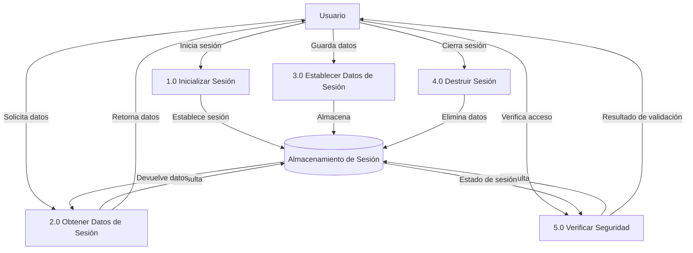

## Module: Session.php

# Análisis Integral del Módulo Session.php

## Módulo/Componente SQL
**Nombre del Módulo**: Session.php
**Tipo**: Clase PHP para gestión de sesiones

## Objetivos Primarios
El módulo Session.php implementa una clase estática que proporciona una interfaz simplificada para la gestión de sesiones en PHP. Su propósito principal es encapsular las operaciones comunes relacionadas con sesiones (inicialización, destrucción, almacenamiento y recuperación de datos) y proporcionar un mecanismo de seguridad básico para validar la existencia de una sesión activa.

## Funciones Críticas, Métodos y Consultas
1. **init()**: Inicializa la sesión con un nombre personalizado definido en la constante SESSION_NAME.
2. **destroy($clave)**: Elimina variables de sesión específicas o destruye completamente la sesión.
3. **set($clave, $valor)**: Almacena un valor en la sesión bajo una clave específica.
4. **get($clave)**: Recupera un valor almacenado en la sesión mediante su clave.
5. **seguridad()**: Verifica si existe una sesión válida comprobando la existencia de 'numeroEmpleado'.

## Variables y Elementos Clave
- **$_SESSION**: Variable superglobal de PHP utilizada para almacenar datos de sesión.
- **SESSION_NAME**: Constante que define el nombre personalizado de la sesión.
- **numeroEmpleado**: Variable de sesión crítica utilizada como indicador de autenticación.
- **$clave, $valor**: Parámetros para manipular datos específicos en la sesión.
- **$bValidaSesion**: Variable booleana que indica si la sesión es válida.

## Interdependencias y Relaciones
- El módulo depende de la constante SESSION_NAME que debe estar definida previamente en el sistema.
- La función JavaScript "MensajeExpiraSesion()" es invocada cuando una sesión expira, lo que indica una dependencia con algún script JavaScript externo.
- El método seguridad() verifica específicamente la existencia de 'numeroEmpleado', lo que sugiere una relación con un sistema de autenticación de empleados.

## Operaciones Principales vs. Auxiliares
**Operaciones Principales**:
- Inicialización de sesión (init)
- Validación de seguridad (seguridad)
- Almacenamiento y recuperación de datos (set, get)

**Operaciones Auxiliares**:
- Destrucción de variables de sesión específicas o completas (destroy)
- Validaciones de existencia de claves

## Secuencia Operacional/Flujo de Ejecución
1. La sesión se inicializa mediante Session::init()
2. Los datos se almacenan en la sesión con Session::set()
3. Los datos se recuperan según sea necesario con Session::get()
4. La validación de seguridad se realiza periódicamente con Session::seguridad()
5. Cuando es necesario, se eliminan variables específicas o se destruye la sesión con Session::destroy()

## Aspectos de Rendimiento y Optimización
- El código es simple y directo, sin operaciones complejas que puedan afectar el rendimiento.
- El uso de métodos estáticos evita la necesidad de instanciar la clase, lo que puede mejorar ligeramente el rendimiento.
- No hay manejo de excepciones, lo que podría ser un área de mejora para la robustez del código.

## Reusabilidad y Adaptabilidad
- La clase está diseñada como un componente reutilizable para la gestión de sesiones.
- El enfoque estático facilita su uso en cualquier parte del sistema sin necesidad de instanciación.
- La dependencia de SESSION_NAME y la verificación específica de 'numeroEmpleado' limitan parcialmente su adaptabilidad a otros contextos sin modificaciones.

## Uso y Contexto
- Este módulo se utiliza probablemente en un sistema de información empresarial donde los empleados inician sesión.
- La clase proporciona una capa de abstracción sobre las funciones nativas de sesión de PHP.
- Se implementa en un patrón de diseño de tipo "fachada" para simplificar la interacción con las sesiones.

## Suposiciones y Limitaciones
**Suposiciones**:
- Se asume que SESSION_NAME está definido antes de llamar a init().
- Se asume la existencia de una función JavaScript MensajeExpiraSesion().
- Se asume que 'numeroEmpleado' es el identificador principal para validar una sesión activa.

**Limitaciones**:
- No incluye mecanismos avanzados de seguridad como regeneración de ID de sesión.
- La validación de seguridad está estrechamente acoplada a una variable específica ('numeroEmpleado').
- No maneja excepciones ni proporciona mensajes de error detallados.
- La salida de JavaScript directamente en el método seguridad() mezcla lógica de presentación con lógica de negocio, lo que podría dificultar el mantenimiento.
## Flow Diagram [via mermaid]

