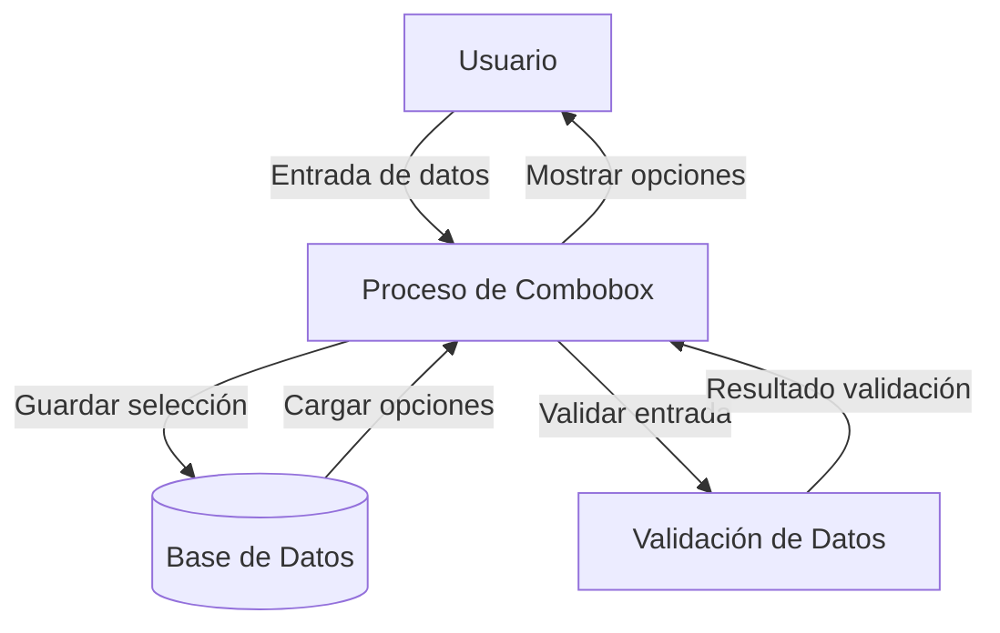
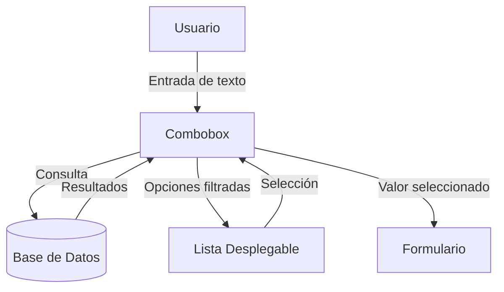

## Module: bootstrap-combobox.js

# Análisis Integral del Módulo bootstrap-combobox.js

## Nombre del Componente
**bootstrap-combobox.js** - Un módulo JavaScript que implementa un componente de combobox para Bootstrap.

## Objetivos Primarios
Este módulo tiene como objetivo principal proporcionar una funcionalidad de combobox mejorada para Bootstrap, combinando las características de un campo de entrada (input) y un menú desplegable (select). Permite a los usuarios tanto seleccionar opciones de una lista como ingresar texto libre, mejorando la experiencia de usuario en formularios web.

## Funciones y Métodos Críticos
- **combobox()**: Método principal que inicializa el combobox en un elemento select.
- **lookup()**: Busca y muestra opciones basadas en el texto ingresado.
- **eventSupported()**: Verifica si un tipo de evento es compatible con el navegador.
- Manejo de eventos: `blur`, `keypress`, `keyup`, `keydown`, `click`, `mouseover`.

## Variables y Elementos Clave
- **$source**: El elemento select original.
- **$container**: Contenedor del combobox.
- **$element**: El campo de entrada (input).
- **$button**: Botón para limpiar o mostrar opciones.
- **$target**: Campo oculto para almacenar el valor seleccionado.
- **$menu**: Menú desplegable con opciones.

## Interdependencias y Relaciones
- Depende de jQuery para manipulación del DOM y gestión de eventos.
- Integración con Bootstrap para estilos y comportamientos visuales.
- Interactúa con elementos HTML existentes (select) para transformarlos en combobox.

## Operaciones Principales vs. Auxiliares
**Operaciones Principales:**
- Transformación de un select en un combobox interactivo.
- Gestión de selección de elementos del menú.
- Sincronización de valores entre el input, select y campo oculto.

**Operaciones Auxiliares:**
- Manejo de eventos de teclado para navegación.
- Gestión de estados visuales (seleccionado, deshabilitado).
- Copiado de atributos del select original al nuevo input.

## Secuencia Operacional
1. Inicialización del combobox a partir de un elemento select.
2. Creación de estructura DOM (contenedor, input, botón, menú).
3. Configuración de manejadores de eventos.
4. Respuesta a interacciones del usuario (escritura, clic, navegación por teclado).
5. Actualización de valores y estados visuales según las acciones del usuario.

## Aspectos de Rendimiento y Optimización
- Verificación condicional de soporte de eventos para evitar registros innecesarios.
- Uso de temporizadores para operaciones como ocultar el menú.
- Potencial área de mejora: optimización de la búsqueda en listas grandes.

## Reutilización y Adaptabilidad
- Alta reutilización gracias a su implementación como plugin de jQuery.
- Adaptable a diferentes versiones de Bootstrap (opción bsVersion).
- Personalizable mediante opciones y atributos HTML (placeholder, required, class).

## Uso y Contexto
- Se utiliza en formularios web para mejorar la experiencia de selección.
- Especialmente útil cuando se necesita tanto selección de lista como entrada libre.
- Se implementa mediante la sintaxis jQuery: `$('select').combobox()`.

## Suposiciones y Limitaciones
- Asume la disponibilidad de jQuery y Bootstrap en el entorno.
- Requiere un elemento select como base para funcionar.
- Puede tener limitaciones de rendimiento con listas muy extensas.
- La compatibilidad con versiones específicas de Bootstrap debe gestionarse mediante la opción bsVersion.
- Asume ciertos comportamientos de navegador para eventos de teclado.
## Flow Diagram [via mermaid]

## Module: bootstrap-combobox.js

# Análisis Integral del Módulo bootstrap-combobox.js

## Nombre del Módulo/Componente
**bootstrap-combobox.js v1.1.8** - Un plugin de jQuery que implementa un componente de interfaz de usuario tipo combobox (combinación de campo de texto y lista desplegable).

## Objetivos Primarios
El propósito principal de este módulo es proporcionar una funcionalidad de combobox mejorada para Bootstrap, permitiendo a los usuarios seleccionar elementos de una lista desplegable o introducir texto libre. Combina la flexibilidad de un campo de entrada con la estructura de un menú desplegable, mejorando la experiencia de usuario en formularios web.

## Funciones, Métodos y Consultas Críticas
- **Constructor `Combobox`**: Inicializa el componente y configura sus propiedades.
- **`setup()`**: Crea la estructura HTML del combobox.
- **`parse()`**: Analiza las opciones del elemento select original.
- **`select()`**: Maneja la selección de un elemento del menú desplegable.
- **`show()`/`hide()`**: Controlan la visibilidad del menú desplegable.
- **`lookup()`/`process()`**: Buscan y procesan elementos basados en la entrada del usuario.
- **`render()`**: Genera el HTML para los elementos del menú desplegable.
- **`toggle()`**: Alterna entre mostrar/ocultar el menú o limpiar la selección.

## Variables y Elementos Clave
- **`$source`**: El elemento select original que se transforma.
- **`$element`**: El campo de entrada de texto visible.
- **`$target`**: Campo oculto que almacena el valor seleccionado.
- **`$menu`**: El menú desplegable con opciones.
- **`$button`**: El botón que activa el desplegable.
- **`map`**: Objeto que mapea el texto visible con los valores reales.
- **`source`**: Array con los textos de las opciones disponibles.

## Interdependencias y Relaciones
- Depende de jQuery para manipulación del DOM y gestión de eventos.
- Está diseñado para integrarse con Bootstrap (versiones 2 o 4).
- Interactúa con elementos HTML existentes (select) y crea nuevos elementos para la interfaz.
- Mantiene sincronizados varios elementos DOM (campo visible, campo oculto, elemento original).

## Operaciones Principales vs. Auxiliares
**Operaciones Principales:**
- Transformación del select en combobox.
- Gestión de selección de elementos.
- Filtrado de opciones según la entrada del usuario.

**Operaciones Auxiliares:**
- Transferencia de atributos del elemento original.
- Gestión del desplazamiento en el menú.
- Manejo de eventos de teclado y ratón.
- Resaltado de coincidencias en la búsqueda.

## Secuencia Operativa/Flujo de Ejecución
1. Inicialización del componente al llamar a `$.fn.combobox`.
2. Configuración y renderizado inicial del combobox.
3. Establecimiento de manejadores de eventos.
4. Ciclo de interacción del usuario:
   - Entrada de texto → Filtrado de opciones → Visualización de coincidencias.
   - Navegación por teclado o ratón → Selección de elemento → Actualización de valores.
   - Clic en botón → Alternancia de estado (mostrar/ocultar/limpiar).

## Aspectos de Rendimiento y Optimización
- Implementa caché de elementos DOM para evitar búsquedas repetitivas.
- Utiliza delegación de eventos para mejorar la eficiencia.
- El algoritmo de ordenación prioriza coincidencias al inicio de la cadena.
- Podría optimizarse para conjuntos de datos grandes implementando paginación o carga diferida.
- La función `fixMenuScroll()
## Flow Diagram [via mermaid]

