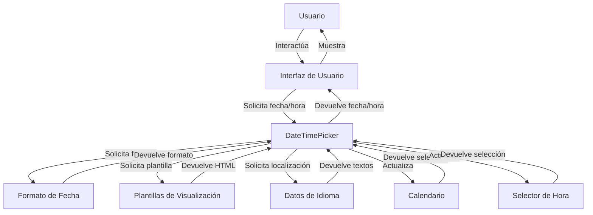

## Module: bootstrap-datetimepicker.min.js

# Análisis Integral del Módulo bootstrap-datetimepicker.min.js

## Nombre del Módulo/Componente SQL
**bootstrap-datetimepicker.min.js** - Un componente JavaScript para la selección de fecha y hora basado en Bootstrap.

## Objetivos Primarios
Este módulo proporciona una interfaz gráfica interactiva para que los usuarios seleccionen fechas y horas en formularios web. Permite la integración con Bootstrap y ofrece una experiencia de usuario consistente para la entrada de datos temporales. El componente maneja la lógica de visualización del calendario, selección de tiempo y validación de entradas.

## Funciones, Métodos y Consultas Críticas
- **DateTimePicker (constructor)**: Inicializa el selector de fecha y hora.
- **init()**: Configura las opciones iniciales y construye el widget.
- **show()**: Muestra el selector en la interfaz.
- **hide()**: Oculta el selector.
- **setValue()/getValue()**: Establece y recupera el valor de fecha/hora.
- **setDate()/getDate()**: Métodos para manipular la fecha seleccionada.
- **update()**: Actualiza la visualización del selector según el valor actual.
- **fillDate()/fillTime()**: Rellena las vistas de fecha y hora con los valores correspondientes.
- **formatDate()/parseDate()**: Convierte entre objetos Date y cadenas de texto formateadas.

## Variables y Elementos Clave
- **options**: Configuración del componente (pickDate, pickTime, format, etc.).
- **_date**: Almacena la fecha/hora seleccionada actualmente.
- **viewDate**: Fecha que se muestra en el calendario.
- **widget**: Elemento DOM que contiene la interfaz del selector.
- **format**: Patrón de formato para la visualización y análisis de fechas.
- **startDate/endDate**: Límites para las fechas seleccionables.
- **dateFormatComponents**: Definiciones para los componentes de formato (dd, MM, yyyy, etc.).

## Interdependencias y Relaciones
- Depende de **jQuery** para manipulación del DOM y gestión de eventos.
- Integración con **Bootstrap** para estilos y comportamientos visuales.
- Utiliza el objeto global **Date** de JavaScript para el manejo interno de fechas.
- Se relaciona con elementos de formulario HTML (inputs) para capturar y mostrar valores.

## Operaciones Core vs. Auxiliares
**Operaciones Core:**
- Renderizado del calendario y selector de tiempo.
- Manejo de selección de fecha/hora.
- Conversión entre formatos de fecha.

**Operaciones Auxiliares:**
- Validación de entradas.
- Formateo visual de componentes.
- Gestión de eventos del DOM.
- Manejo de máscaras de entrada.

## Secuencia Operacional/Flujo de Ejecución
1. Inicialización del componente con opciones configuradas.
2. Construcción del widget visual (calendario y/o selector de tiempo).
3. Adjunción de manejadores de eventos para interacción del usuario.
4. Al interactuar, se capturan eventos y se actualizan los valores internos.
5. Se actualiza la visualización según las selecciones del usuario.
6. Al confirmar, se formatea el valor y se actualiza el elemento de formulario asociado.

## Aspectos de Rendimiento y Optimización
- El código está minificado para reducir el tamaño de descarga.
- Utiliza delegación de eventos para mejorar el rendimiento en la gestión de interacciones.
- Implementa caching de elementos DOM frecuentemente utilizados.
- Posibles mejoras: reducir la manipulación repetitiva del DOM y optimizar los cálculos de fechas.

## Reusabilidad y Adaptabilidad
- Alta reusabilidad gracias a su diseño como plugin de jQuery.
- Adaptable mediante numerosas opciones de configuración (formato, idioma, modo de visualización).
- Personalizable a través de CSS para adaptarse a diferentes diseños.
- Soporta internacionalización mediante configuración de idiomas.

## Uso y Contexto
- Se utiliza en formularios web donde se requiere entrada de fecha/hora.
- Aplicable en sistemas de reservas, calendarios, planificadores y cualquier aplicación que necesite captura de información temporal.
- Se implementa típicamente asociándolo a campos de entrada mediante JavaScript:
  ```javascript
  $('#datetimepicker').datetimepicker({options});
  ```

## Suposiciones y Limitaciones
- Asume la disponibilidad de jQuery y Bootstrap en el entorno.
- Requiere soporte de JavaScript moderno en el navegador.
- Las fechas se manejan en UTC internamente, lo que puede causar problemas con zonas horarias si no se gestiona adecuadamente.
- La personalización visual está limitada por la estructura HTML generada.
- El formato de fecha debe seguir patrones específicos reconocidos por el componente.
- No maneja nativamente eventos recurrentes o rangos de fechas complejos.
## Flow Diagram [via mermaid]

