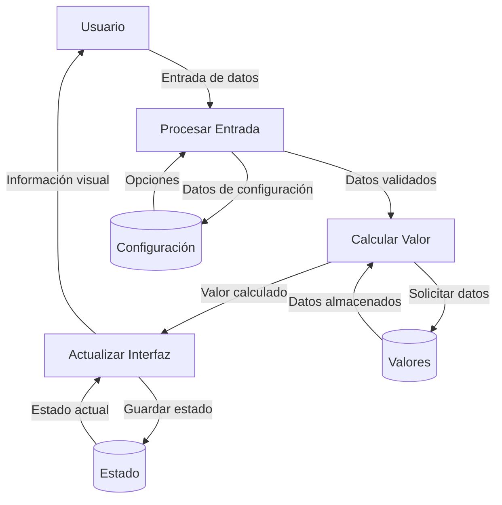

## Module: bootstrap-slider.js

# Análisis Integral del Módulo bootstrap-slider.js

## Nombre del Módulo/Componente SQL
**bootstrap-slider.js** - Un componente JavaScript para crear controles deslizantes interactivos.

## Objetivos Primarios
El módulo proporciona una implementación de control deslizante (slider) personalizable para interfaces web. Permite a los desarrolladores crear controles deslizantes interactivos con diversas opciones de configuración, como rangos, marcas, etiquetas y diferentes estilos visuales. Está diseñado para integrarse con Bootstrap, pero puede funcionar de manera independiente.

## Funciones, Métodos y Consultas Críticas
- **Constructor `Slider`**: Inicializa un nuevo control deslizante con las opciones proporcionadas.
- **`setValue`**: Establece el valor del control deslizante y actualiza la interfaz visual.
- **`getValue`**: Recupera el valor actual del control deslizante.
- **`enable`/`disable`/`toggle`**: Controlan el estado de activación del control deslizante.
- **`on`/`off`**: Métodos para vincular y desvincular manejadores de eventos.
- **`refresh`/`relayout`**: Actualizan la representación visual del control deslizante.
- **`destroy`**: Elimina el control deslizante y restaura el elemento original.
- **Métodos de escala**: `_toValue` y `_toPercentage` para convertir entre valores y porcentajes.

## Variables y Elementos Clave
- **`this._state`**: Objeto que mantiene el estado interno del control deslizante (valor, habilitado, arrastre, etc.).
- **`this.options`**: Configuración del control deslizante (min, max, paso, orientación, etc.).
- **Elementos DOM**: `sliderElem`, `handle1`, `handle2`, `trackLow`, `trackSelection`, `trackHigh`, `tooltip`.
- **Escalas**: `SliderScale.linear` y `SliderScale.logarithmic` para diferentes tipos de comportamiento.

## Interdependencias y Relaciones
- **jQuery**: Puede funcionar con o sin jQuery. Si jQuery está disponible, se integra con su sistema de eventos y plugins.
- **Bridget**: Utiliza un patrón puente para convertir la clase en un plugin jQuery cuando está disponible.
- **Bootstrap**: Diseñado para integrarse visualmente con Bootstrap, aunque no es una dependencia obligatoria.
- **AMD/CommonJS**: Compatible con diferentes sistemas de módulos (AMD, CommonJS) o como variable global.

## Operaciones Core vs. Auxiliares
**Operaciones Core:**
- Inicialización y renderizado del control deslizante
- Manejo de eventos de arrastre y clic
- Cálculo de valores basados en la posición
- Actualización visual del control deslizante

**Operaciones Auxiliares:**
- Formateo y validación de valores
- Gestión de tooltips
- Manejo de eventos de teclado para accesibilidad
- Utilidades para manipulación de DOM y clases CSS

## Secuencia Operacional/Flujo de Ejecución
1. **Inicialización**: Se crea una instancia de Slider con opciones.
2. **Construcción del DOM**: Se generan los elementos necesarios (pistas, manijas, tooltips).
3. **Configuración de eventos**: Se vinculan los manejadores de eventos para mouse/touch.
4. **Interacción del usuario**: Al interactuar, se calculan nuevos valores basados en la posición.
5. **Actualización visual**: Se actualizan las posiciones de los elementos DOM.
6. **Disparo de eventos**: Se notifica a los oyentes sobre los cambios de valor.

## Aspectos de Rendimiento y Optimización
- Reutiliza manejadores de eventos para evitar múltiples instancias.
- Implementa cálculos eficientes para la conversión entre valores y porcentajes.
- Minimiza las operaciones DOM agrupando actualizaciones visuales.
- Potenciales mejoras: Podría beneficiarse de la implementación de throttling/debouncing en eventos de movimiento.
- El manejo de muchas marcas (ticks) podría afectar el rendimiento en dispositivos de baja potencia.

## Reusabilidad y Adaptabilidad
- Altamente configurable a través de numerosas opciones.
- Soporta diferentes orientaciones (horizontal/vertical).
- Adaptable a diferentes escalas (lineal/logarítmica).
- Compatible con diferentes sistemas de módulos (UMD).
- Puede funcionar con o sin jQuery, aumentando su versatilidad.

## Uso y Contexto
- Se utiliza para crear controles deslizantes interactivos en formularios web.
- Aplicaciones comunes: selección de rangos, ajustes de valores numéricos, filtros.
- Se puede implementar como un plugin jQuery o como un componente JavaScript independiente.
- Ejemplo de uso básico: `new Slider('#mySlider', {min: 0, max: 100})` o `$('#mySlider').slider({min: 0, max: 100})`.

## Suposiciones y Limitaciones
- **Suposiciones**:
  - El DOM está completamente cargado antes de la inicialización.
  - Los estilos CSS necesarios están disponibles.
  - Los valores proporcionados son numéricos y dentro de los rangos esperados.
  
- **Limitaciones**:
  - La personalización visual depende en gran medida de CSS externo.
  - El rendimiento puede degradarse con muchas marcas o en dispositivos móviles antiguos.
  - La accesibilidad podría mejorarse con más atributos ARIA.
  - No tiene soporte nativo para valores no numéricos o discretos.
## Flow Diagram [via mermaid]

