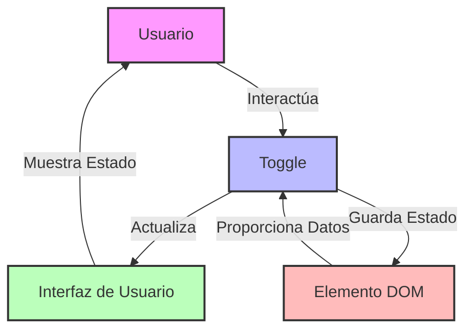

## Module: bootstrap-toggle.js

# Análisis Integral del Módulo bootstrap-toggle.js

## Nombre del Componente
**bootstrap-toggle.js** (versión 2.2.0) - Un plugin de jQuery para Bootstrap

## Objetivos Primarios
Este módulo proporciona una implementación mejorada de interruptores de tipo toggle (conmutador) para Bootstrap, transformando los checkboxes estándar HTML en interruptores estilizados con estados visuales "On" y "Off". Su propósito principal es mejorar la experiencia de usuario ofreciendo controles de alternancia más atractivos y personalizables.

## Funciones y Métodos Críticos
- **Toggle (constructor)**: Inicializa el componente toggle con opciones personalizadas.
- **render()**: Construye la estructura DOM del toggle y aplica los estilos.
- **toggle()**: Alterna entre los estados on/off.
- **on()**: Activa el toggle.
- **off()**: Desactiva el toggle.
- **enable()**: Habilita el toggle para interacción.
- **disable()**: Deshabilita el toggle.
- **update()**: Actualiza el estado visual basado en las propiedades del elemento.
- **trigger()**: Maneja los eventos de cambio.
- **destroy()**: Elimina el toggle y restaura el checkbox original.
- **Plugin()**: Función de inicialización del plugin jQuery.

## Variables y Elementos Clave
- **$element**: El checkbox original que se transforma.
- **options**: Configuración del toggle (on, off, onstyle, offstyle, size, etc.).
- **$toggle**: El contenedor principal del toggle.
- **$toggleOn/$toggleOff**: Elementos para los estados activado/desactivado.
- **$toggleHandle**: El "mango" deslizante del toggle.
- **$toggleGroup**: Grupo que contiene los elementos del toggle.
- **Toggle.DEFAULTS**: Valores predeterminados para la configuración.

## Interdependencias y Relaciones
- Depende de jQuery como biblioteca base.
- Está diseñado para integrarse con Bootstrap, utilizando sus clases de estilo.
- Interactúa con elementos checkbox HTML existentes, transformándolos visualmente.
- Mantiene sincronizado el estado del checkbox original con la representación visual.

## Operaciones Core vs. Auxiliares
**Core:**
- La transformación del checkbox en un toggle visual (render).
- El manejo de los estados on/off y la sincronización con el checkbox.

**Auxiliares:**
- Funciones de habilitación/deshabilitación.
- Manejo de eventos.
- Configuración de dimensiones y estilos.
- Limpieza y destrucción del componente.

## Secuencia Operacional
1. Inicialización del plugin para checkboxes con atributo data-toggle.
2. Construcción del DOM del toggle mediante render().
3. Aplicación de estilos y dimensiones.
4. Configuración del estado inicial (on/off).
5. Establecimiento de manejadores de eventos para interacciones.
6. Respuesta a interacciones del usuario mediante toggle(), on(), off().
7. Actualización del estado visual y del checkbox subyacente.

## Aspectos de Rendimiento y Optimización
- Utiliza jQuery para manipulaciones DOM, lo que puede afectar el rendimiento en aplicaciones grandes.
- Calcula dimensiones basadas en contenido, lo que puede causar reflows.
- Permite especificar dimensiones fijas para evitar cálculos dinámicos.
- Maneja eficientemente los eventos para evitar múltiples disparos.

## Reusabilidad y Adaptabilidad
- Altamente personalizable mediante opciones (texto, colores, tamaños).
- Soporta configuración vía atributos data-* en HTML.
- Puede aplicarse a cualquier checkbox existente.
- Implementa el patrón de plugin jQuery para consistencia con otros componentes.
- Incluye mecanismo noConflict para evitar conflictos con otros plugins.

## Uso y Contexto
- Se utiliza para mejorar la experiencia de usuario en formularios.
- Ideal para configuraciones binarias (sí/no, activado/desactivado).
- Se aplica automáticamente a checkboxes con el atributo data-toggle="toggle".
- Puede ser inicializado manualmente mediante JavaScript.
- Común en paneles de administración, configuraciones de usuario y formularios interactivos.

## Suposiciones y Limitaciones
- Asume la disponibilidad de jQuery y Bootstrap en el proyecto.
- Requiere que los elementos objetivo sean checkboxes válidos.
- Las personalizaciones avanzadas de estilo pueden requerir CSS adicional.
- El rendimiento puede verse afectado en páginas con muchos toggles.
- No está diseñado para funcionar sin JavaScript habilitado.
- La accesibilidad depende de la implementación correcta de los atributos ARIA.
## Flow Diagram [via mermaid]

