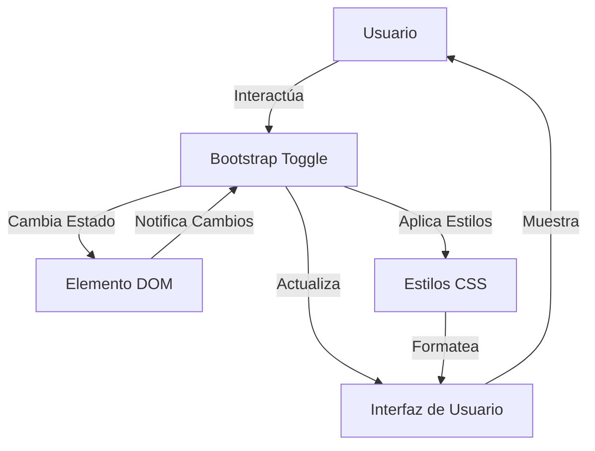

## Module: bootstrap-toggle.min.js

# Análisis Completo del Módulo bootstrap-toggle.min.js

## Nombre del Módulo/Componente SQL
**Bootstrap Toggle** (bootstrap-toggle.min.js) - Versión 2.2.0

## Objetivos Primarios
Este módulo es un plugin de jQuery para Bootstrap que transforma los checkboxes HTML estándar en interruptores toggle estilizados. Su propósito principal es mejorar la experiencia de usuario proporcionando una interfaz visual más atractiva e intuitiva para los elementos de tipo checkbox, permitiendo personalizar su apariencia y comportamiento.

## Funciones, Métodos y Consultas Críticas
- **Constructor `c`**: Inicializa el componente toggle con las opciones proporcionadas.
- **`render()`**: Crea la estructura DOM del toggle y aplica los estilos correspondientes.
- **`toggle()`**: Alterna el estado del toggle entre activado y desactivado.
- **`on()`**: Activa el toggle.
- **`off()`**: Desactiva el toggle.
- **`enable()`**: Habilita el toggle para interacción del usuario.
- **`disable()`**: Deshabilita el toggle para interacción del usuario.
- **`update()`**: Actualiza el estado visual del toggle basado en el estado del checkbox subyacente.
- **`trigger()`**: Dispara el evento change en el elemento checkbox.
- **`destroy()`**: Elimina el toggle y restaura el checkbox original.

## Variables y Elementos Clave
- **`$element`**: Referencia al checkbox original.
- **`options`**: Configuración del toggle (on, off, onstyle, offstyle, size, style, width, height).
- **`$toggle`**: El contenedor principal del toggle.
- **`$toggleOn`**: Elemento que muestra el estado "activado".
- **`$toggleOff`**: Elemento que muestra el estado "desactivado".
- **`$toggleGroup`**: Grupo que contiene los elementos del toggle.
- **`_onstyle`** y **`_offstyle`**: Clases CSS para los estados activado y desactivado.

## Interdependencias y Relaciones
- Depende de **jQuery** como biblioteca base.
- Integrado con **Bootstrap** para estilos y comportamientos.
- Se aplica a elementos `<input type="checkbox">` existentes en el DOM.
- Interactúa con el sistema de eventos del navegador para manejar clics y cambios de estado.

## Operaciones Core vs. Auxiliares
**Operaciones Core:**
- Renderizado del toggle (`render()`)
- Cambio de estado (`toggle()`, `on()`, `off()`)
- Actualización visual (`update()`)

**Operaciones Auxiliares:**
- Habilitación/deshabilitación (`enable()`, `disable()`)
- Gestión de eventos (`trigger()`)
- Limpieza de recursos (`destroy()`)
- Inicialización automática de toggles al cargar la página

## Secuencia Operacional/Flujo de Ejecución
1. **Inicialización**: Al cargar la página, se buscan todos los checkboxes con el atributo `data-toggle="toggle"`.
2. **Construcción**: Para cada checkbox encontrado, se crea una instancia del toggle.
3. **Renderizado**: Se genera la estructura DOM del toggle y se aplican los estilos.
4. **Interacción**: El usuario puede interactuar con el toggle, cambiando su estado.
5. **Actualización**: Cada cambio de estado actualiza tanto el toggle visual como el checkbox subyacente.
6. **Eventos**: Se disparan eventos de cambio que pueden ser capturados por otros componentes.

## Aspectos de Rendimiento y Optimización
- El código está minificado para reducir el tamaño de descarga.
- Utiliza delegación de eventos para manejar toggles añadidos dinámicamente.
- Calcula dimensiones óptimas basadas en el contenido si no se especifican.
- Reutiliza elementos DOM existentes en lugar de crear nuevos en cada actualización.

## Reusabilidad y Adaptabilidad
- Altamente personalizable a través de atributos data o opciones JavaScript.
- Se puede aplicar a cualquier checkbox existente sin modificar la estructura HTML original.
- Permite configurar textos, colores, tamaños y estilos para adaptarse a diferentes diseños.
- Proporciona una API pública para manipular programáticamente los toggles.

## Uso y Contexto
- Se utiliza en formularios web para mejorar la experiencia de usuario con checkboxes.
- Común en paneles de configuración, ajustes de aplicaciones y formularios de preferencias.
- Se puede implementar declarativamente (con atributos HTML) o programáticamente (con JavaScript).
- Ejemplos de uso:
  ```html
  <!-- Uso declarativo -->
  <input type="checkbox" data-toggle="toggle" data-on="Sí" data-off="No">
  
  <!-- Uso programático -->
  <input id="toggle-example" type="checkbox">
  <script>
    $(function() {
      $('#toggle-example').bootstrapToggle();
    });
  </script>
  ```

## Suposiciones y Limitaciones
- **Suposiciones**:
  - jQuery y Bootstrap están cargados previamente en la página.
  - Los elementos checkbox existen en el DOM antes de inicializar los toggles.
  - El navegador soporta las características CSS utilizadas para los efectos visuales.

- **Limitaciones**:
  - No es compatible con navegadores muy antiguos que no soporten CSS3.
  - Requiere jQuery, lo que puede ser una limitación en proyectos modernos que evitan esta dependencia.
  - El tamaño y apariencia pueden no ser consistentes en todos los dispositivos si no se configuran correctamente.
  - No proporciona soporte nativo para accesibilidad (ARIA), aunque hereda algunas características del checkbox subyacente.
## Flow Diagram [via mermaid]

