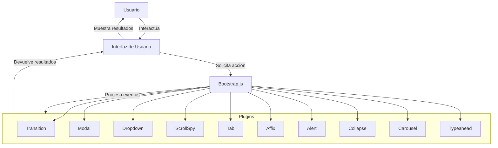
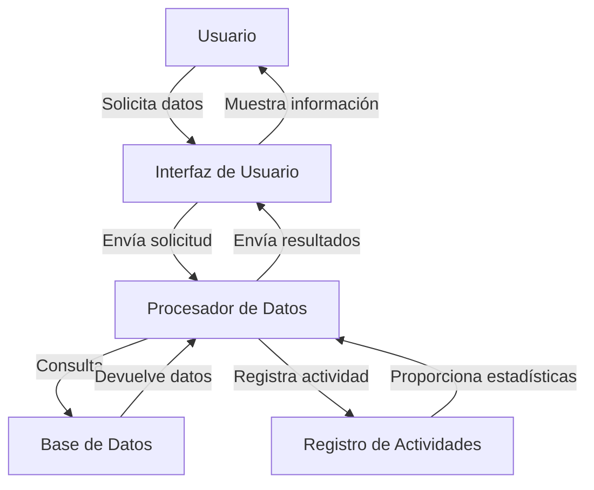

## Module: bootstrap.min.js

# Análisis Integral del Módulo bootstrap.min.js

## Módulo/Componente SQL
**Nombre del Módulo**: bootstrap.min.js

## Objetivos Primarios
Este módulo es la versión minificada de Bootstrap.js, una biblioteca JavaScript desarrollada por Twitter. Su propósito principal es proporcionar funcionalidad interactiva a los componentes de la interfaz de usuario de Bootstrap, permitiendo manipulaciones dinámicas del DOM sin necesidad de escribir código JavaScript personalizado. El módulo implementa comportamientos como despliegue de modales, menús desplegables, carruseles y otros elementos de interfaz.

## Funciones, Métodos y Consultas Críticas
El módulo contiene varios plugins esenciales:
- **bootstrap-transition.js**: Gestiona efectos de transición CSS3
- **bootstrap-modal.js**: Controla ventanas modales interactivas
- **bootstrap-dropdown.js**: Maneja menús desplegables
- **bootstrap-scrollspy.js**: Actualiza navegación basada en posición de desplazamiento
- **bootstrap-tab.js**: Implementa navegación por pestañas
- **bootstrap-affix.js**: Fija elementos al desplazarse la página
- **bootstrap-alert.js**: Gestiona mensajes de alerta descartables
- **bootstrap-collapse.js**: Controla elementos plegables/desplegables
- **bootstrap-carousel.js**: Implementa presentaciones de diapositivas
- **bootstrap-typeahead.js**: Proporciona autocompletado en campos de texto

## Variables y Elementos Clave
- **$element**: Referencia jQuery al elemento DOM que se está manipulando
- **options**: Objeto de configuración que contiene parámetros personalizables
- **isShown/shown**: Variables de estado para controlar visibilidad
- **$menu, $backdrop**: Referencias a elementos DOM auxiliares
- **events**: Manejadores de eventos como "click", "keyup", "show", "hide"
- **transition**: Objeto que gestiona efectos de transición CSS

## Interdependencias y Relaciones
- Dependencia principal de jQuery (window.jQuery)
- Interacción entre componentes mediante eventos personalizados
- Uso del sistema de delegación de eventos de jQuery
- Implementación del patrón de diseño "Constructor" para cada plugin
- Integración con el sistema de transiciones CSS3 cuando está disponible

## Operaciones Principales vs. Auxiliares
**Operaciones principales**:
- Mostrar/ocultar componentes (show/hide)
- Manejar interacciones del usuario (click, hover)
- Gestionar estados de componentes (active, open, in)

**Operaciones auxiliares**:
- Detección de soporte para transiciones
- Validación de opciones y parámetros
- Gestión de eventos del teclado
- Posicionamiento de elementos emergentes

## Secuencia Operativa/Flujo de Ejecución
1. Inicialización de plugins mediante selectores data-api
2. Detección de eventos de usuario (click, hover, keypress)
3. Aplicación de clases CSS para cambios visuales
4. Ejecución de transiciones si están soportadas
5. Disparo de eventos personalizados (shown, hidden)
6. Limpieza y restauración del estado original cuando es necesario

## Aspectos de Rendimiento y Optimización
- Código minificado para reducir tamaño de descarga
- Uso de delegación de eventos para reducir listeners
- Detección condicional de soporte para transiciones
- Implementación de temporizadores para evitar múltiples ejecuciones
- Uso de namespaces en eventos para evitar conflictos

## Reusabilidad y Adaptabilidad
- Implementación de método noConflict() para evitar conflictos con otras bibliotecas
- Patrón de diseño de plugin jQuery que permite encadenamiento
- Opciones configurables mediante atributos data-* o JavaScript
- Capacidad para extender funcionalidad mediante prototipos
- API consistente entre componentes (show, hide, toggle)

## Uso y Contexto
El módulo se utiliza en sitios web que implementan el framework Bootstrap para:
- Crear interfaces interactivas sin escribir JavaScript personalizado
- Implementar componentes UI comunes como modales, pestañas y carruseles
- Proporcionar retroalimentación visual mediante animaciones y transiciones
- Facilitar la navegación y mejorar la experiencia de usuario
- Implementar patrones de diseño responsive

## Suposiciones y Limitaciones
- Requiere jQuery como dependencia
- Asume estructura HTML específica según documentación de Bootstrap
- Rendimiento óptimo en navegadores modernos con soporte para CSS3
- Algunas funcionalidades dependen de atributos data-* específicos
- La versión minificada dificulta la depuración de problemas
- Posibles conflictos con otras bibliotecas JavaScript si no se usa noConflict()
- Limitaciones de accesibilidad en algunos componentes si no se implementan correctamente
## Flow Diagram [via mermaid]

## Module: bootstrap.min.js

# Análisis Integral del Módulo Bootstrap.min.js

## Nombre del Módulo/Componente SQL
**Bootstrap.min.js** - Versión 4.0.0-alpha.4

## Objetivos Primarios
Este módulo es la versión minificada de la biblioteca JavaScript de Bootstrap, diseñada para proporcionar funcionalidad interactiva a los componentes de la interfaz de usuario de Bootstrap. Su propósito principal es implementar comportamientos dinámicos como despliegue de menús desplegables, modales, tooltips, carruseles y otros componentes de UI sin requerir que los desarrolladores escriban JavaScript personalizado.

## Funciones, Métodos y Consultas Críticas
El módulo contiene varios componentes JavaScript esenciales:
- **Alert**: Maneja la funcionalidad de cierre de alertas
- **Button**: Gestiona estados de botones y grupos de botones
- **Carousel**: Controla la navegación y animación de carruseles
- **Collapse**: Maneja la expansión/contracción de elementos
- **Dropdown**: Implementa menús desplegables
- **Modal**: Controla ventanas modales
- **Scrollspy**: Actualiza navegación basada en posición de desplazamiento
- **Tab**: Gestiona la funcionalidad de pestañas
- **Tooltip**: Implementa tooltips
- **Popover**: Extiende tooltips para mostrar contenido más complejo

## Variables y Elementos Clave
- **jQuery**: Dependencia crítica para el funcionamiento
- **Tether**: Biblioteca requerida para tooltips y popovers
- **Selectores DOM**: Elementos como `.dropdown`, `.modal`, `.carousel` que son objetivos de la funcionalidad
- **Configuraciones por defecto**: Objetos que definen el comportamiento predeterminado de cada componente
- **Eventos**: Sistema de eventos personalizado (`show`, `shown`, `hide`, `hidden`, etc.)

## Interdependencias y Relaciones
- **Dependencia de jQuery**: Requiere jQuery v1.9.1 o superior pero inferior a v4.0.0
- **Dependencia de Tether**: Necesaria para tooltips y popovers
- **Interacción DOM**: Manipula elementos HTML mediante selectores
- **Sistema de eventos**: Utiliza eventos personalizados para comunicación entre componentes
- **Integración CSS**: Trabaja en conjunto con las clases CSS de Bootstrap

## Operaciones Core vs. Auxiliares
**Operaciones Core:**
- Inicialización de componentes
- Manejo de eventos de usuario (clic, hover, etc.)
- Manipulación de clases CSS para efectos visuales
- Transiciones y animaciones

**Operaciones Auxiliares:**
- Verificación de dependencias
- Validación de configuraciones
- Gestión de compatibilidad del navegador
- Limpieza y disposición de recursos

## Secuencia Operacional/Flujo de Ejecución
1. Verificación de dependencias (jQuery)
2. Definición de utilidades y funciones de soporte
3. Implementación de cada componente como plugin de jQuery
4. Configuración de eventos de inicialización automática mediante atributos data-*
5. Delegación de eventos para manejar interacciones del usuario
6. Ejecución de transiciones/animaciones cuando corresponda
7. Limpieza de recursos cuando los componentes son destruidos

## Aspectos de Rendimiento y Optimización
- **Código minificado**: Reduce el tamaño de archivo para carga más rápida
- **Delegación de eventos**: Utiliza delegación para reducir el número de manejadores de eventos
- **Transiciones optimizadas**: Usa transiciones CSS cuando están disponibles
- **Inicialización bajo demanda**: Los componentes se inicializan solo cuando son necesarios
- **Detección de capacidades**: Verifica si el navegador soporta ciertas características

## Reusabilidad y Adaptabilidad
- **Sistema de plugins**: Cada componente es un plugin de jQuery independiente
- **Configuración personalizable**: Todos los componentes aceptan opciones de configuración
- **API pública**: Métodos expuestos para control programático
- **Eventos personalizados**: Permite integración con código personalizado
- **Patrón de diseño modular**: Facilita la extensión o modificación de componentes

## Uso y Contexto
Este módulo se utiliza en sitios web y aplicaciones que implementan Bootstrap como framework de UI. Se incluye típicamente después de jQuery y antes de cualquier JavaScript personalizado. Los componentes se activan mediante:
- Atributos data-* en HTML (ej. `data-toggle="modal"`)
- Inicialización programática (ej. `$('#myModal').modal('show')`)
- Eventos automáticos en carga de página para elementos con atributos específicos

## Suposiciones y Limitaciones
**Suposiciones:**
- Presencia de jQuery en la versión correcta
- Inclusión de los archivos CSS de Bootstrap
- Estructura HTML que sigue las convenciones de Bootstrap
- Disponibilidad de Tether para tooltips y popovers

**Limitaciones:**
- Versión alpha (4.0.0-alpha.4), no recomendada para producción
- Dependencia de jQuery limita su uso en frameworks modernos basados en componentes
- Posibles conflictos con otras bibliotecas que modifican el prototipo de jQuery
- Rendimiento puede degradarse en páginas con muchos componentes interactivos
- No está optimizado para aplicaciones de una sola página (SPA)
## Flow Diagram [via mermaid]

