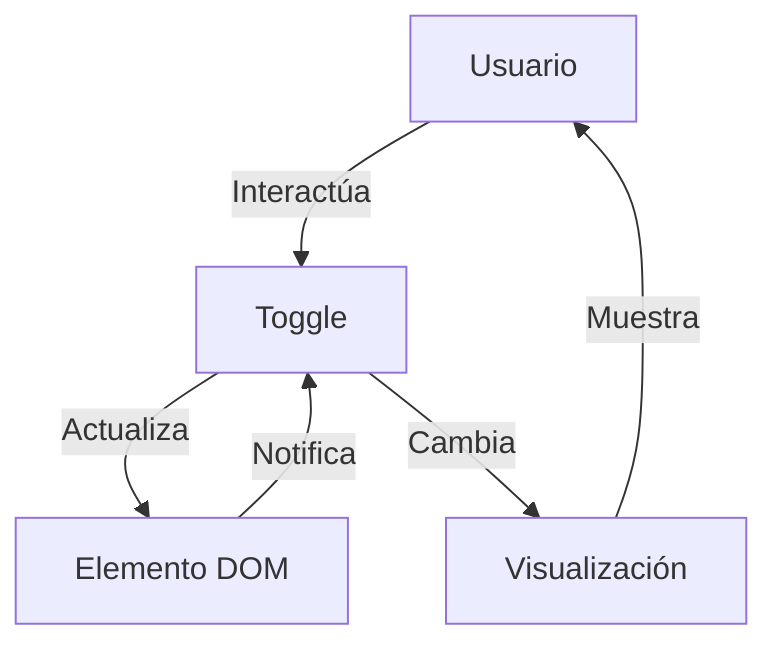

## Module: bootstrap2-toggle.js

# Análisis Integral del Módulo bootstrap2-toggle.js

## Nombre del Componente
**bootstrap2-toggle.js** - Un plugin de jQuery para Bootstrap 2 que transforma checkboxes en interruptores toggle estilizados.

## Objetivos Primarios
Este módulo tiene como objetivo principal transformar los elementos checkbox HTML estándar en interruptores toggle visualmente atractivos y personalizables, manteniendo la funcionalidad original del checkbox mientras mejora significativamente la experiencia del usuario con una interfaz más intuitiva y estilizada.

## Funciones y Métodos Críticos
- **Toggle (constructor)**: Inicializa el componente toggle con opciones personalizadas.
- **render()**: Construye la estructura DOM del toggle y aplica los estilos.
- **toggle()**: Alterna el estado del interruptor entre encendido y apagado.
- **on()**: Activa el interruptor (checked = true).
- **off()**: Desactiva el interruptor (checked = false).
- **enable()**: Habilita el interruptor para interacción del usuario.
- **disable()**: Deshabilita el interruptor para prevenir interacción.
- **update()**: Actualiza el estado visual basado en las propiedades del checkbox.
- **trigger()**: Dispara eventos de cambio y configura listeners.
- **destroy()**: Elimina el toggle y restaura el checkbox original.
- **Plugin()**: Función de inicialización del plugin jQuery.

## Variables y Elementos Clave
- **$element**: El checkbox original que se transforma.
- **options**: Configuración del toggle (on, off, onstyle, offstyle, size, etc.).
- **$toggle**: El contenedor principal del toggle.
- **$toggleOn**: Elemento que representa el estado "encendido".
- **$toggleGroup**: Grupo que contiene los elementos del toggle.
- **$toggleOff**: Elemento que representa el estado "apagado".
- **$toggleHandle**: El "mango" deslizante del interruptor.

## Interdependencias y Relaciones
- Depende de jQuery como biblioteca base.
- Diseñado específicamente para Bootstrap 2, utilizando sus clases y estilos.
- Interactúa con elementos checkbox existentes, manteniendo su funcionalidad mientras modifica su apariencia.
- Se integra con el sistema de eventos de Bootstrap para manejar cambios de estado.

## Operaciones Core vs. Auxiliares
**Core:**
- La transformación del checkbox en toggle (render).
- El manejo de estados on/off y la sincronización con el checkbox original.

**Auxiliares:**
- Configuración de opciones y valores predeterminados.
- Manejo de eventos.
- Funciones de habilitación/deshabilitación.
- Limpieza y destrucción del componente.

## Secuencia Operacional
1. Inicialización del plugin en checkboxes seleccionados.
2. Obtención de opciones de configuración (desde atributos data o valores predeterminados).
3. Renderizado del toggle con la estructura DOM apropiada.
4. Aplicación de estilos y dimensiones.
5. Configuración del estado inicial basado en el checkbox.
6. Establecimiento de manejadores de eventos para interacciones del usuario.
7. Respuesta a eventos de clic alternando estados.

## Aspectos de Rendimiento y Optimización
- Utiliza jQuery para manipulaciones DOM, lo que puede ser menos eficiente que JavaScript nativo.
- Calcula dimensiones basadas en contenido, lo que puede causar reflows.
- Permite especificar dimensiones explícitas para evitar cálculos dinámicos.
- Maneja eventos de manera eficiente mediante delegación.

## Reusabilidad y Adaptabilidad
- Altamente personalizable a través de opciones y atributos data.
- Permite configurar textos, colores, tamaños y estilos.
- Puede aplicarse a cualquier checkbox en la página.
- Proporciona una API pública para control programático.
- Implementa patrón noConflict para evitar conflictos con otros plugins.

## Uso y Contexto
- Se utiliza para mejorar la experiencia de usuario en formularios y paneles de control.
- Ideal para configuraciones binarias (sí/no, activado/desactivado).
- Se aplica automáticamente a checkboxes con el atributo `data-toggle="toggle"`.
- Puede ser controlado programáticamente mediante la API de jQuery.
- Comúnmente usado en paneles de administración, configuraciones de usuario y formularios interactivos.

## Suposiciones y Limitaciones
- Asume que Bootstrap 2 está cargado en la página.
- Requiere jQuery como dependencia.
- Diseñado específicamente para Bootstrap 2, no compatible directamente con Bootstrap 3 o 4.
- No es responsivo por defecto, aunque permite configuración de tamaño.
- Las dimensiones calculadas automáticamente pueden no ser óptimas para todos los casos de uso.
- No proporciona soporte para estados intermedios o múltiples opciones.
## Flow Diagram [via mermaid]

