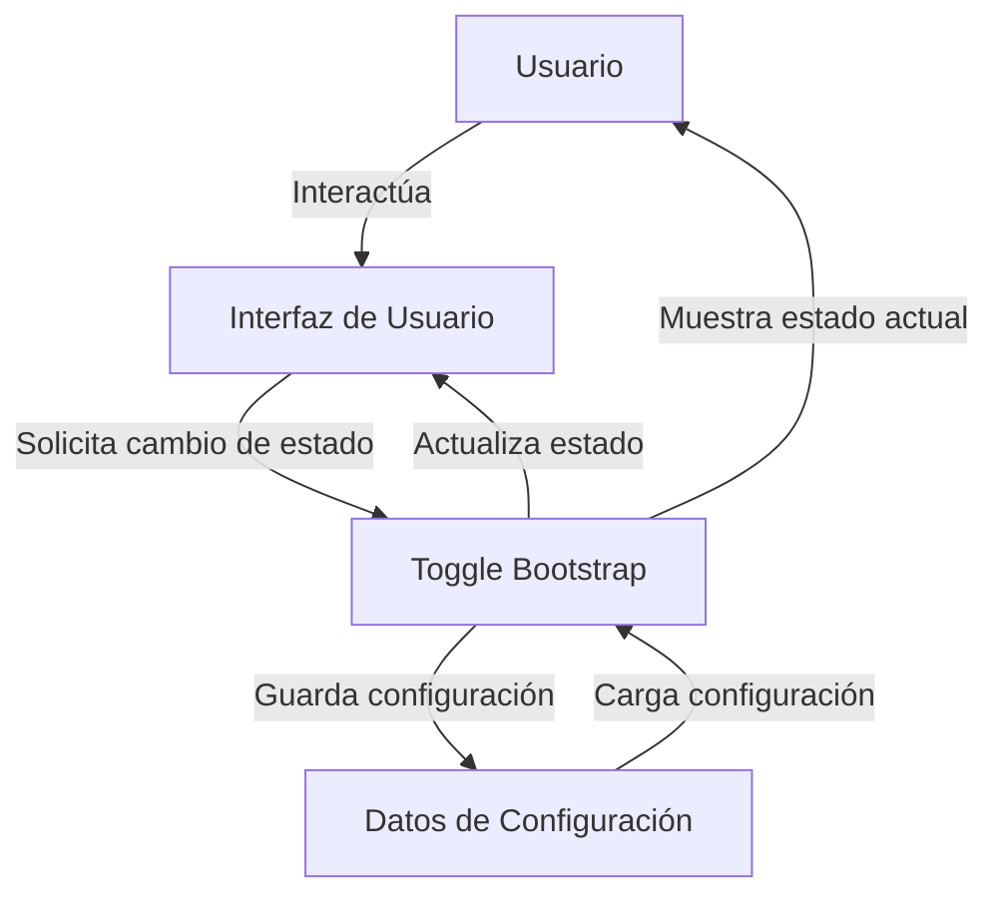

## Module: bootstrap2-toggle.min.js

# Análisis Completo del Módulo bootstrap2-toggle.min.js

## Nombre del Módulo/Componente SQL
**Bootstrap Toggle (bootstrap2-toggle.min.js)** - Versión 2.2.0

## Objetivos Primarios
Este módulo es una extensión de JavaScript para Bootstrap 2 que transforma los checkboxes HTML estándar en interruptores toggle estilizados. Su propósito principal es mejorar la experiencia de usuario proporcionando una interfaz visual más atractiva e intuitiva para los elementos de tipo checkbox, permitiendo personalizar su apariencia y comportamiento.

## Funciones, Métodos y Consultas Críticas
- **Constructor `c`**: Inicializa el componente toggle con las opciones proporcionadas.
- **`render()`**: Crea la estructura DOM del toggle y aplica los estilos correspondientes.
- **`toggle()`**: Alterna el estado del checkbox entre activado y desactivado.
- **`on()`/`off()`**: Métodos para activar o desactivar explícitamente el toggle.
- **`enable()`/`disable()`**: Habilita o deshabilita la interacción con el toggle.
- **`update()`**: Actualiza el estado visual del toggle basado en el estado del checkbox.
- **`trigger()`**: Maneja los eventos de cambio asociados al toggle.
- **`destroy()`**: Elimina el toggle y restaura el checkbox original.

## Variables y Elementos Clave
- **`$element`**: Referencia al checkbox original.
- **`options`**: Configuración del toggle (on, off, onstyle, offstyle, size, etc.).
- **`$toggle`**: El elemento DOM que contiene toda la estructura del toggle.
- **`$toggleOn`/$`toggleOff`**: Elementos que representan los estados activado/desactivado.
- **`$toggleGroup`**: Contenedor de los elementos internos del toggle.
- **`_onstyle`/`_offstyle`**: Clases CSS para los estados activado/desactivado.

## Interdependencias y Relaciones
- Depende de jQuery para la manipulación del DOM y gestión de eventos.
- Está diseñado específicamente para funcionar con Bootstrap 2, utilizando sus clases y estilos.
- Se integra con el sistema de formularios HTML, reemplazando visualmente los checkboxes estándar.

## Operaciones Core vs. Auxiliares
**Operaciones Core:**
- Renderizado del toggle (`render()`)
- Cambio de estado (`toggle()`, `on()`, `off()`)
- Actualización visual basada en el estado (`update()`)

**Operaciones Auxiliares:**
- Habilitación/deshabilitación del toggle (`enable()`, `disable()`)
- Gestión de eventos (`trigger()`)
- Limpieza y destrucción (`destroy()`)
- Auto-inicialización de toggles basados en atributos data-*

## Secuencia Operacional/Flujo de Ejecución
1. **Inicialización**: Al cargar la página, se buscan todos los checkboxes con el atributo `data-toggle="toggle"` y se transforman en toggles.
2. **Renderizado**: Se crea la estructura DOM del toggle y se aplican los estilos correspondientes.
3. **Interacción**: El usuario puede interactuar con el toggle, cambiando su estado.
4. **Actualización**: Cuando cambia el estado, se actualizan las clases CSS y se disparan los eventos correspondientes.
5. **Propagación**: Los cambios en el toggle se reflejan en el checkbox original, manteniendo la compatibilidad con formularios.

## Aspectos de Rendimiento y Optimización
- El código está minificado para reducir el tamaño del archivo y mejorar los tiempos de carga.
- Utiliza delegación de eventos para manejar toggles creados dinámicamente.
- Calcula dimensiones óptimas basadas en el contenido o en valores especificados por el usuario.
- Reutiliza elementos DOM en lugar de recrearlos durante las actualizaciones de estado.

## Reusabilidad y Adaptabilidad
- Altamente personalizable a través de opciones y atributos data-*.
- Se puede aplicar a cualquier checkbox existente sin modificar la estructura HTML original.
- Permite personalizar textos, colores, tamaños y comportamientos.
- Proporciona una API pública para interactuar programáticamente con los toggles.

## Uso y Contexto
- Se utiliza en interfaces de usuario para mejorar la experiencia con opciones binarias (sí/no, activado/desactivado).
- Común en paneles de configuración, formularios de preferencias y ajustes de aplicaciones.
- Se puede implementar declarativamente (mediante atributos HTML) o programáticamente (mediante JavaScript).
- Ejemplos de uso:
  ```html
  <!-- Implementación declarativa -->
  <input type="checkbox" data-toggle="toggle" data-on="Activado" data-off="Desactivado">
  
  <!-- Implementación programática -->
  <input id="toggle-example" type="checkbox">
  <script>
    $(function() {
      $('#toggle-example').bootstrapToggle();
    });
  </script>
  ```

## Suposiciones y Limitaciones
- **Suposiciones**:
  - jQuery está disponible en el entorno.
  - Bootstrap 2 está incluido en la página.
  - Los navegadores soportan las características CSS utilizadas.

- **Limitaciones**:
  - Específico para Bootstrap 2, no compatible directamente con versiones posteriores.
  - Requiere jQuery, lo que puede ser una limitación en proyectos modernos que evitan esta dependencia.
  - Al estar minificado, es difícil de depurar o modificar sin acceso al código fuente original.
  - No incluye soporte nativo para accesibilidad (ARIA), lo que podría requerir implementación adicional.
## Flow Diagram [via mermaid]

