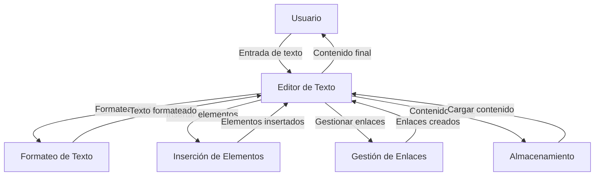

## Module: bootstrap3-wysihtml5.all.min.js

# Análisis Completo del Módulo bootstrap3-wysihtml5.all.min.js

## Módulo/SQL Component Name
Este es un módulo JavaScript llamado **bootstrap3-wysihtml5.all.min.js**, que es una versión minificada del editor WYSIWYG (What You See Is What You Get) para Bootstrap 3. Es una biblioteca de edición de texto enriquecido que integra el editor wysihtml5 con la interfaz de usuario de Bootstrap 3.

## Primary Objectives
El objetivo principal de este módulo es proporcionar un editor de texto enriquecido completo que permite a los usuarios formatear texto en páginas web sin necesidad de conocer HTML. Facilita la creación de contenido con formato como texto en negrita, cursiva, listas, enlaces, imágenes y más, a través de una interfaz gráfica amigable basada en Bootstrap 3.

## Critical Functions, Methods, and Queries
Las funciones y métodos críticos incluyen:

1. **wysihtml5.Editor** - Clase principal que inicializa y gestiona el editor.
2. **wysihtml5.commands** - Conjunto de comandos para manipular el texto (negrita, cursiva, enlaces, etc.).
3. **wysihtml5.toolbar** - Gestiona la barra de herramientas del editor.
4. **wysihtml5.dom** - Funciones para manipular el DOM.
5. **wysihtml5.Selection** - Maneja la selección de texto dentro del editor.
6. **wysihtml5.UndoManager** - Proporciona funcionalidad de deshacer/rehacer.
7. **bootstrap.wysihtml5** - Plugin jQuery que conecta wysihtml5 con Bootstrap.

## Key Variables and Elements
Variables y elementos clave:

1. **wysihtml5** - Objeto global que contiene toda la funcionalidad.
2. **rangy** - Biblioteca para manipulación de selección de texto.
3. **Handlebars** - Motor de plantillas utilizado para generar la interfaz.
4. **Base** - Clase base para la herencia orientada a objetos.
5. **defaultOptions** - Configuración predeterminada del editor.
6. **locale** - Configuraciones de internacionalización.
7. **parserRules** - Reglas para analizar y sanitizar HTML.

## Interdependencies and Relationships
El módulo tiene varias interdependencias:

1. **jQuery** - Utilizado para manipulación del DOM y eventos.
2. **Bootstrap** - Para componentes de UI como modales, botones y dropdowns.
3. **Rangy** - Para manipulación avanzada de selección de texto.
4. **Handlebars** - Para renderizar plantillas de la interfaz.
5. **wysihtml5.tpl** - Plantillas para diferentes componentes de la interfaz.

## Core vs. Auxiliary Operations
**Operaciones Core:**
- Inicialización del editor y configuración
- Manipulación del texto (comandos como negrita, cursiva, etc.)
- Gestión de selección de texto
- Sincronización entre vista HTML y WYSIWYG
- Gestión de historial (deshacer/rehacer)

**Operaciones Auxiliares:**
- Internacionalización (i18n)
- Validación y sanitización de HTML
- Gestión de eventos del navegador
- Compatibilidad entre navegadores
- Renderizado de plantillas para la interfaz

## Operational Sequence/Flow of Execution
1. Se inicializa el plugin jQuery `$.fn.wysihtml5`
2. Se crea una instancia de `wysihtml5.Editor`
3. Se inicializa la barra de herramientas con los botones configurados
4. Se configura el área editable y se aplican las reglas de parser
5. Se establecen los manejadores de eventos para interacciones del usuario
6. Cuando el usuario interactúa con la barra de herramientas, se ejecutan los comandos correspondientes
7. Los cambios se reflejan en el área editable y se sincronizan con el textarea subyacente

## Performance Aspects and Optimization
- El código está minificado para reducir el tamaño de descarga
- Utiliza delegación de eventos para mejorar el rendimiento
- Implementa técnicas de lazy loading para componentes como diálogos
- Incluye optimizaciones para diferentes navegadores
- Utiliza un sistema de caché para plantillas y comandos frecuentes
- Implementa un sistema eficiente de gestión de selección de texto

## Reusability and Adaptability
El módulo es altamente adaptable:
- Permite personalización a través de opciones extensivas
- Soporta múltiples idiomas mediante configuraciones de localización
- Las reglas de parser son configurables para permitir diferentes niveles de HTML
- Se pueden añadir comandos personalizados
- La interfaz puede ser modificada mediante plantillas personalizadas
- Soporta eventos para integración con otras bibliotecas

## Usage and Context
Este editor se utiliza típicamente en:
- Formularios web que requieren entrada de texto enriquecido
- Sistemas de gestión de contenido (CMS)
- Aplicaciones de correo electrónico web
- Plataformas de blogs
- Cualquier aplicación web que necesite edición de texto con formato

Se implementa generalmente con:
```javascript
$('#editor').wysihtml5({
    // opciones de configuración
});
```

## Assumptions and Limitations
**Suposiciones:**
- Se asume que jQuery y Bootstrap están cargados en la página
- Se espera que el navegador soporte funcionalidades modernas de DOM
- Se asume que el contenido HTML generado será sanitizado adecuadamente

**Limitaciones:**
- No soporta completamente todos los elementos HTML5
- Puede tener problemas de compatibilidad con navegadores muy antiguos
- El rendimiento puede degradarse con documentos muy grandes
- La personalización avanzada requiere conocimiento profundo de la API
- No es un editor de código HTML completo, sino un editor WYSIWYG

Este editor proporciona una solución robusta para la edición de texto enriquecido en aplicaciones web basadas en Bootstrap 3, con un buen equilibrio entre facilidad de uso y funcionalidad.
## Flow Diagram [via mermaid]

