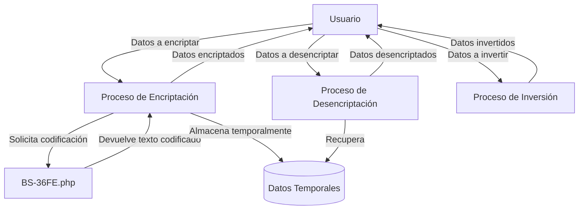

## Module: crypto.php

# Análisis Integral del Módulo crypto.php

## Módulo/Componente SQL
**Nombre del Módulo**: crypto.php

## Objetivos Primarios
Este módulo es una biblioteca de funciones de criptografía en PHP diseñada para codificar y decodificar contraseñas o claves. Su propósito principal es proporcionar un mecanismo de encriptación bidireccional (que permite tanto cifrar como descifrar), complementando el codificador BS-36FE que solo permite codificación unidireccional.

## Funciones Críticas, Métodos y Consultas
1. **encriptar($cadena, $separador='|')**: Función principal que cifra una cadena de texto utilizando un algoritmo personalizado basado en BS-36FE.
2. **desencriptar($cadena)**: Función que descifra una cadena previamente encriptada con la función encriptar().
3. **invertir($dato)**: Función auxiliar que invierte parcialmente una cadena, utilizada para manipular datos transmitidos por GET.

## Variables y Elementos Clave
- **$cadena**: Variable que contiene el texto a encriptar o desencriptar.
- **$separador**: Carácter utilizado para delimitar partes de la cadena encriptada (por defecto '|').
- **$clave**: Resultado de la codificación de la cadena original mediante BS-36FE.
- **$resultado**: Variable que almacena el resultado final de la encriptación o desencriptación.

## Interdependencias y Relaciones
- El módulo depende del archivo "BS-36FE.php" que contiene la función EncodeText() utilizada en el proceso de encriptación.
- No interactúa directamente con bases de datos o tablas SQL.

## Operaciones Principales vs. Auxiliares
- **Operaciones Principales**: 
  - Encriptación de cadenas de texto
  - Desencriptación de cadenas previamente encriptadas
- **Operaciones Auxiliares**:
  - Validación del separador
  - Codificación/decodificación Base64 para garantizar la integridad de los datos
  - Inversión parcial de cadenas para datos transmitidos por GET

## Secuencia Operacional/Flujo de Ejecución
1. **Encriptación**:
   - Recibe la cadena a encriptar y opcionalmente un separador
   - Genera una clave usando EncodeText()
   - Procesa cada carácter de la cadena original sumando el valor ASCII del carácter correspondiente en la clave
   - Codifica el resultado en Base64 para evitar problemas de transmisión
   - Devuelve la cadena encriptada

2. **Desencriptación**:
   - Decodifica la cadena Base64
   - Extrae el separador y la clave
   - Procesa cada carácter restando el valor ASCII del carácter correspondiente en la clave
   - Devuelve la cadena original

## Aspectos de Rendimiento y Optimización
- El algoritmo utiliza operaciones simples (sumas y restas de valores ASCII), lo que lo hace eficiente.
- La codificación Base64 añade una pequeña sobrecarga pero es necesaria para mantener la integridad de los datos.
- Para cadenas muy largas, el rendimiento podría verse afectado por los bucles que procesan cada carácter individualmente.

## Reusabilidad y Adaptabilidad
- Las funciones están diseñadas para ser reutilizables en diferentes contextos.
- El parámetro opcional $separador permite cierta personalización.
- El código podría adaptarse fácilmente para usar diferentes algoritmos de codificación base modificando la llamada a EncodeText().

## Uso y Contexto
- Este módulo está diseñado para ser utilizado en aplicaciones web PHP que requieren encriptación bidireccional de datos sensibles.
- Es especialmente útil para almacenar información que necesita ser recuperada en su forma original posteriormente.
- Según los comentarios, se utiliza para manejar contraseñas o claves, aunque para este propósito específico sería más seguro un hash unidireccional.

## Suposiciones y Limitaciones
- **Suposiciones**:
  - Se asume que el módulo BS-36FE.php está disponible y contiene la función EncodeText().
  - Se asume que los datos encriptados no serán manipulados manualmente.

- **Limitaciones**:
  - La seguridad depende en gran medida del algoritmo BS-36FE.
  - No implementa técnicas criptográficas estándar o modernas como AES o RSA.
  - La función invertir() solo invierte parcialmente la cadena, lo que podría no proporcionar suficiente seguridad para datos sensibles.
  - El algoritmo no utiliza sal (salt) o vectores de inicialización, lo que podría hacerlo vulnerable a ataques de diccionario.
## Flow Diagram [via mermaid]

