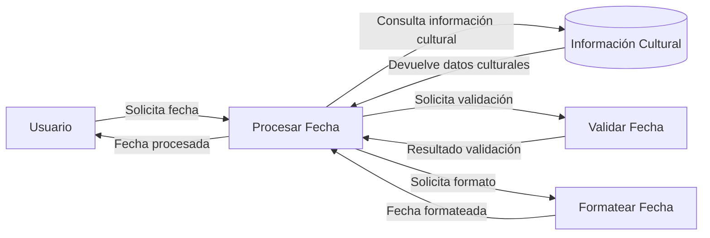

## Module: date.js

# Análisis Integral del Módulo date.js

## Nombre del Módulo/Componente SQL
**date.js** - Biblioteca JavaScript para manipulación y formateo de fechas

## Objetivos Primarios
Este módulo proporciona una extensión completa del objeto nativo `Date` de JavaScript, ofreciendo funcionalidades avanzadas para manipular, formatear y analizar fechas. Está diseñado para facilitar operaciones complejas con fechas que no están disponibles en la API estándar de JavaScript.

## Funciones, Métodos y Consultas Críticas
- **Manipulación de fechas**: Métodos como `addDays()`, `addMonths()`, `addYears()` para modificar fechas
- **Formateo de fechas**: Método `toString()` extendido con patrones personalizables
- **Análisis de texto**: Funcionalidad `Date.parse()` mejorada para interpretar fechas en diferentes formatos
- **Navegación por calendario**: Métodos como `moveToFirstDayOfMonth()`, `moveToLastDayOfMonth()`
- **Comparación de fechas**: Métodos como `equals()`, `compareTo()`, `between()`
- **Localización**: Soporte para información cultural con `Date.CultureInfo`
- **Cálculos de tiempo**: Clases adicionales como `TimeSpan` y `TimePeriod` para manejar duraciones

## Variables y Elementos Clave
- **Date.CultureInfo**: Objeto que contiene información de localización (nombres de meses, días, formatos)
- **Date.Grammar**: Sistema de análisis sintáctico para interpretar cadenas de texto como fechas
- **Date.Parsing**: Conjunto de operadores y funciones para el análisis de fechas
- **TimeSpan**: Clase para representar intervalos de tiempo
- **TimePeriod**: Clase para representar períodos entre dos fechas

## Interdependencias y Relaciones
- Extiende el objeto nativo `Date` de JavaScript con nuevos métodos
- Utiliza patrones de diseño para gramáticas y análisis sintáctico
- Las clases `TimeSpan` y `TimePeriod` complementan la funcionalidad principal
- Depende de la configuración cultural (`Date.CultureInfo`) para formateo y análisis

## Operaciones Principales vs. Auxiliares
**Operaciones principales**:
- Manipulación de fechas (adición/sustracción de unidades de tiempo)
- Formateo de fechas según patrones
- Análisis de cadenas de texto para convertirlas en fechas

**Operaciones auxiliares**:
- Validación de componentes de fecha (día, mes, año)
- Cálculos de días en un mes, años bisiestos
- Conversión entre zonas horarias
- Funciones de utilidad para comparación y navegación

## Secuencia Operativa/Flujo de Ejecución
1. Configuración inicial de información cultural y patrones de formato
2. Extensión del prototipo de `Date` con nuevos métodos
3. Implementación del sistema de análisis gramatical para fechas
4. Sobrescritura de métodos nativos como `Date.parse()`
5. Implementación de clases auxiliares (`TimeSpan`, `TimePeriod`)

## Aspectos de Rendimiento y Optimización
- Uso de caché para patrones de formato frecuentes
- Implementación eficiente de análisis de texto mediante expresiones regulares
- Posibles problemas de rendimiento al analizar formatos de fecha complejos
- El encadenamiento de múltiples operaciones de fecha podría afectar el rendimiento

## Reusabilidad y Adaptabilidad
- Alta reusabilidad gracias a su diseño modular
- Adaptable a diferentes localizaciones mediante la configuración de `Date.CultureInfo`
- Extensible para añadir nuevos formatos de fecha o funcionalidades
- Puede integrarse fácilmente en diferentes proyectos web

## Uso y Contexto
- Aplicaciones web que requieren manipulación avanzada de fechas
- Interfaces de usuario con calendarios o selectores de fecha
- Cálculos de intervalos de tiempo o duraciones
- Internacionalización de aplicaciones con diferentes formatos de fecha
- Análisis de fechas en diferentes formatos de entrada

## Suposiciones y Limitaciones
- Asume que el entorno JavaScript soporta la extensión de objetos nativos
- Limitaciones potenciales con fechas anteriores a 1970 o posteriores a 2099
- Posibles conflictos con otras bibliotecas que extiendan el objeto `Date`
- Dependencia de la configuración correcta de la información cultural
- No está diseñado para cálculos astronómicos precisos o calendarios no gregorianos
- La versión analizada es Alpha-1, lo que sugiere que podría tener errores o funcionalidades incompletas
## Flow Diagram [via mermaid]

