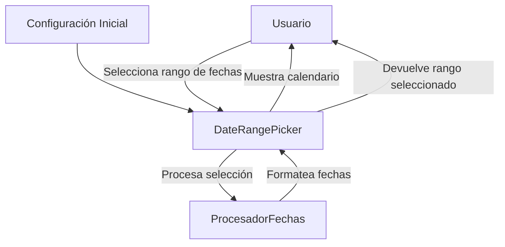

## Module: daterangepicker.jQuery.compressed.js

# Análisis Completo del Módulo daterangepicker.jQuery.compressed.js

## Nombre del Componente
**daterangepicker.jQuery.compressed.js** - Un plugin de jQuery para selección de rangos de fechas.

## Objetivos Primarios
Este módulo proporciona una interfaz gráfica para seleccionar rangos de fechas en aplicaciones web. Permite a los usuarios elegir fechas específicas, rangos predefinidos o personalizados, y formatea la salida para su uso en formularios o consultas.

## Funciones, Métodos y Consultas Críticas
- **daterangepicker()**: Función principal que inicializa el selector de rango de fechas.
- **restoreDateFromData()**: Restaura fechas guardadas previamente.
- **saveDateToData()**: Guarda fechas para uso posterior.
- **Funciones de control de visualización**: `t()`, `k()`, `c()`, `v()` - Controlan la apertura, cierre y posicionamiento del selector.
- **q()**: Gestiona la lógica de selección de diferentes tipos de rangos de fechas.
- **b()**: Formatea las fechas según la configuración especificada.

## Variables y Elementos Clave
- **e**: Objeto de configuración que contiene todas las opciones personalizables.
- **j**: El contenedor principal del selector de fechas.
- **n**: Contenedor de los elementos de selección de rango.
- **u**: Lista de rangos predefinidos.
- **presetRanges**: Rangos de fechas predefinidos (hoy, últimos 7 días, mes hasta la fecha, etc.).
- **presets**: Tipos de selección (fecha específica, todas las fechas antes/después, rango de fechas).

## Interdependencias y Relaciones
- Depende de jQuery como framework base.
- Utiliza jQuery UI Datepicker para la selección de fechas individuales.
- Interactúa con los elementos del DOM donde se aplica el plugin.
- Se integra con eventos del sistema (click, hover) para la interacción del usuario.

## Operaciones Core vs. Auxiliares
**Core:**
- Inicialización del selector de fechas.
- Manejo de la selección de rangos.
- Formateo y devolución de las fechas seleccionadas.

**Auxiliares:**
- Posicionamiento del selector en la pantalla.
- Efectos visuales (fade in/out).
- Manejo de eventos de ratón.
- Validación y restricción de fechas.

## Secuencia Operacional/Flujo de Ejecución
1. Inicialización del plugin con opciones predeterminadas o personalizadas.
2. Creación de la interfaz de usuario con rangos predefinidos y controles de selección.
3. Configuración de los datepickers para fechas de inicio y fin.
4. Establecimiento de manejadores de eventos para interacción del usuario.
5. Al seleccionar un rango o fechas específicas, se actualiza la visualización y los valores.
6. Al confirmar, se formatean las fechas y se actualizan los elementos de entrada.

## Aspectos de Rendimiento y Optimización
- El código está comprimido para reducir el tamaño de descarga.
- Utiliza delegación de eventos para mejorar el rendimiento.
- Implementa caching de elementos DOM para reducir consultas repetitivas.
- Potenciales mejoras: reducir la creación de objetos Date repetidos y optimizar las animaciones.

## Reusabilidad y Adaptabilidad
- Altamente configurable a través del objeto de opciones.
- Permite personalización de textos, formatos de fecha y comportamientos.
- Se puede aplicar a diferentes tipos de elementos de entrada.
- Soporta múltiples instancias en la misma página.

## Uso y Contexto
- Se utiliza en formularios web donde se requiere selección de rangos de fechas.
- Aplicable en paneles de filtrado, informes, reservas y cualquier interfaz que necesite selección de períodos.
- Se implementa llamando a `$(selector).daterangepicker(opciones)`.

## Suposiciones y Limitaciones
- Asume que jQuery y jQuery UI están cargados en la página.
- Requiere que el navegador soporte JavaScript moderno.
- La versión comprimida dificulta la depuración y modificación.
- No está diseñado para ser responsivo en dispositivos móviles pequeños.
- Depende de la implementación específica de Date.parse que puede variar entre navegadores.
- No incluye soporte nativo para internacionalización (aunque puede configurarse).
## Flow Diagram [via mermaid]

