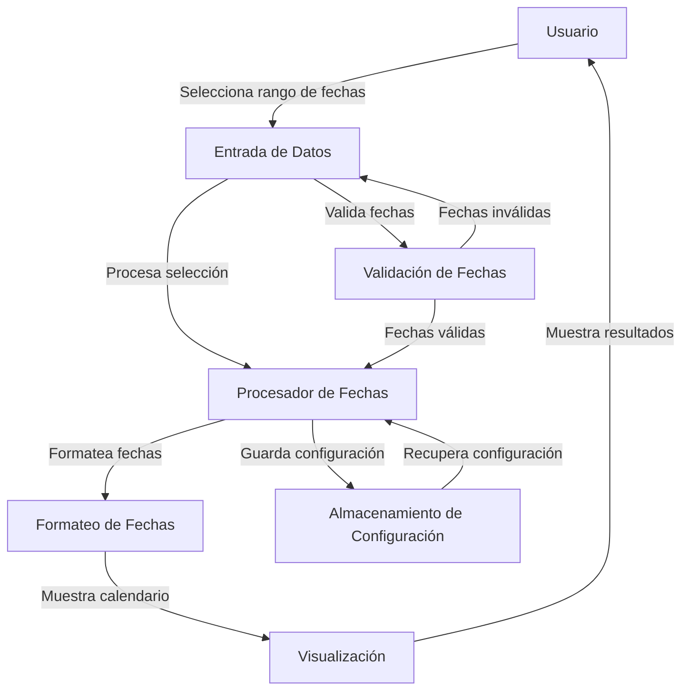

## Module: daterangepicker.jQuery.js

# Análisis Integral del Módulo daterangepicker.jQuery.js

## Nombre del Componente
**daterangepicker.jQuery.js** - Plugin de jQuery para selección de rangos de fechas

## Objetivos Primarios
Este módulo es un plugin de jQuery que proporciona una interfaz gráfica para seleccionar rangos de fechas. Permite a los usuarios elegir fechas específicas o rangos predefinidos a través de una interfaz visual interactiva, facilitando la entrada de datos temporales en formularios web.

## Funciones, Métodos y Consultas Críticas
- **$.fn.daterangepicker**: Función principal que inicializa el selector de rango de fechas.
- **showRP()**: Muestra el selector de rango.
- **hideRP()**: Oculta el selector de rango.
- **toggleRP()**: Alterna la visibilidad del selector.
- **positionRP()**: Posiciona el selector en relación con el elemento de entrada.
- **clickActions()**: Maneja las acciones de clic en los presets del menú.
- **fDate()**: Formatea las fechas según la configuración especificada.

## Variables y Elementos Clave
- **rangeInput**: Elemento(s) de entrada donde se mostrarán las fechas seleccionadas.
- **options**: Objeto de configuración con múltiples parámetros personalizables.
- **rp**: Contenedor principal del selector de rango de fechas.
- **rpPickers**: Contenedor de los calendarios de inicio y fin.
- **doneBtn**: Botón para confirmar la selección.
- **presetRanges**: Rangos predefinidos como "Hoy", "Últimos 7 días", etc.
- **presets**: Tipos de selección como "Fecha específica", "Rango de fechas", etc.

## Interdependencias y Relaciones
El plugin depende de:
- jQuery core
- jQuery UI Datepicker
- date.js (para manipulación de fechas)
- jQuery UI CSS Framework (para estilos)

Interactúa con los elementos del DOM para mostrar/ocultar calendarios y actualizar los valores de entrada.

## Operaciones Principales vs. Auxiliares
**Operaciones Principales:**
- Inicialización del selector de rango
- Manejo de selección de fechas
- Actualización de los valores de entrada

**Operaciones Auxiliares:**
- Formateo de fechas
- Posicionamiento del selector
- Manejo de eventos de interfaz (hover, click)
- Restricción de fechas (cuando constrainDates está activado)

## Secuencia Operativa/Flujo de Ejecución
1. Inicialización del plugin con opciones personalizadas
2. Captura de fechas iniciales desde los elementos de entrada
3. Construcción de la interfaz del selector (presets, calendarios, botones)
4. Configuración de eventos para interacción del usuario
5. Al seleccionar fechas, se actualizan los elementos de entrada
6. Al confirmar, se oculta el selector y se disparan eventos de cambio

## Aspectos de Rendimiento y Optimización
- Uso de cierres (closures) para encapsular la funcionalidad
- Caching de elementos DOM frecuentemente utilizados
- Animaciones controladas para mostrar/ocultar elementos
- Posible mejora: Reducir la manipulación repetitiva del DOM
- Posible cuello de botella: Múltiples llamadas a datepicker en elementos anidados

## Reusabilidad y Adaptabilidad
- Alta reusabilidad gracias a la parametrización extensiva
- Adaptable a diferentes formatos de fecha y configuraciones regionales
- Personalizable mediante opciones como presetRanges, dateFormat, etc.
- Puede utilizarse con uno o dos campos de entrada
- Extensible mediante callbacks (onChange, onOpen, onClose)

## Uso y Contexto
El plugin se utiliza típicamente en:
- Formularios de búsqueda con filtros por fecha
- Sistemas de reservas (hoteles, vuelos)
- Informes y análisis con rangos temporales
- Filtros de datos en aplicaciones web
- Cualquier interfaz que requiera selección de rangos de fechas

## Suposiciones y Limitaciones
**Suposiciones:**
- Se asume la disponibilidad de jQuery, jQuery UI y date.js
- Se espera que los elementos de entrada sean compatibles con jQuery
- Se asume un entorno web moderno con soporte para CSS3 y animaciones

**Limitaciones:**
- Dependencia de bibliotecas externas
- Diseño visual limitado a los estilos de jQuery UI
- No está optimizado para dispositivos móviles (táctiles)
- No incluye soporte nativo para internacionalización (depende de datepicker)
- Limitado a rangos de ±15 años por defecto
## Flow Diagram [via mermaid]

