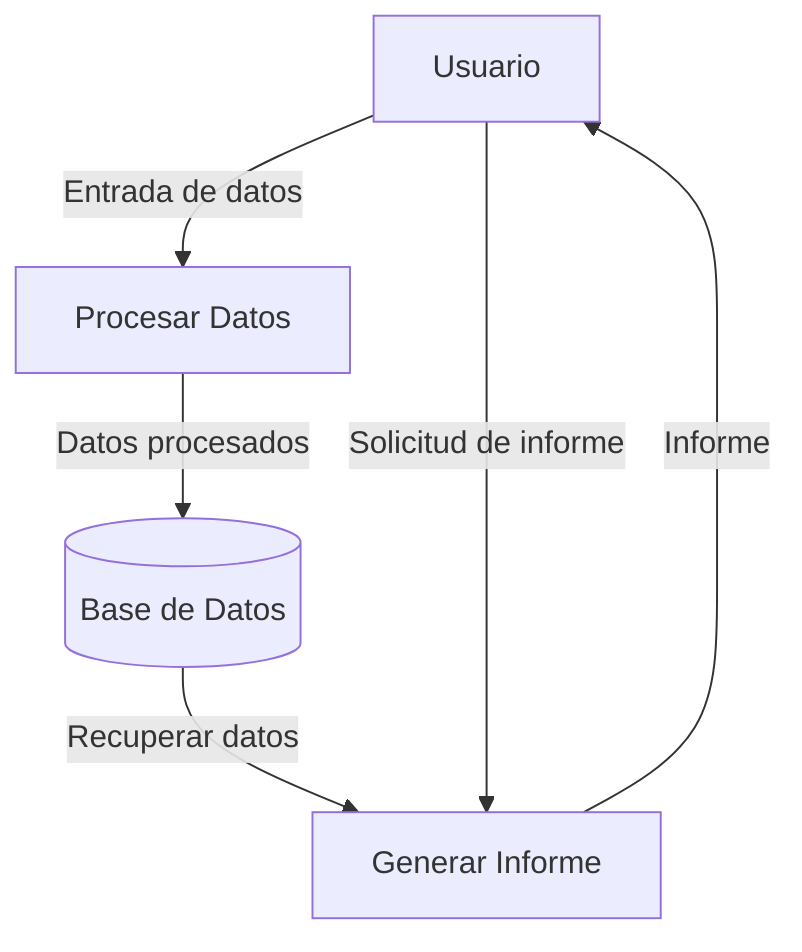
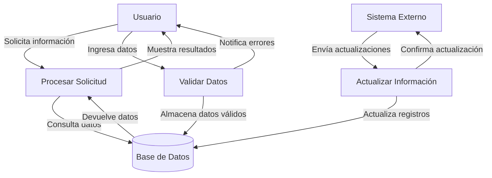

## Module: demo.js

# Análisis Integral del Módulo demo.js

## Módulo/Componente SQL
**Nombre del Módulo**: demo.js

## Objetivos Primarios
Este módulo JavaScript está diseñado para implementar y configurar diversos componentes de la interfaz de usuario utilizando jQuery UI. Su propósito principal es mejorar la experiencia del usuario mediante la creación de elementos interactivos como botones, diálogos, pestañas, acordeones y otros widgets de UI.

## Funciones, Métodos y Consultas Críticas
- **Inicialización de Widgets**: Configuración de múltiples componentes jQuery UI como botones, acordeones, diálogos, pestañas, datepickers, sliders, etc.
- **Gestión de Eventos**: Implementación de manejadores de eventos para interacciones del usuario (click, hover).
- **Manipulación Dinámica**: Funciones para añadir/eliminar pestañas dinámicamente.
- **Validación y Feedback**: Configuración de diálogos modales para confirmaciones y mensajes.

## Variables y Elementos Clave
- **Selectores jQuery**: `#dialog_simple`, `#tabs2`, `#menu-collapse`, `#datepicker`, etc.
- **Variables de Control**: `tabCounter`, `tabTitle`, `tabContent`, `availableTags`.
- **Templates**: `tabTemplate` para la generación dinámica de pestañas.
- **Objetos de Configuración**: Múltiples objetos de configuración para widgets como diálogos, datepickers y sliders.

## Interdependencias y Relaciones
- **Dependencia de jQuery**: Requiere la biblioteca jQuery base.
- **Dependencia de jQuery UI**: Utiliza extensivamente los componentes de jQuery UI.
- **Posible Dependencia de Wijmo**: Implementa componentes de la biblioteca Wijmo.
- **Dependencia de customFileInput**: Utiliza un plugin personalizado para entradas de archivos.

## Operaciones Principales vs. Auxiliares
**Operaciones Principales**:
- Inicialización y configuración de widgets jQuery UI.
- Implementación de interactividad para elementos de la interfaz.

**Operaciones Auxiliares**:
- Manejo de estados hover.
- Eliminación de focus de botones.
- Funciones de ayuda para manipulación dinámica de elementos.

## Secuencia Operacional/Flujo de Ejecución
1. El código se ejecuta cuando el DOM está completamente cargado (dentro de `$(function() {...})`).
2. Se inicializan los componentes básicos (botones, acordeones).
3. Se configuran los diálogos y sus eventos asociados.
4. Se implementan las pestañas y su funcionalidad dinámica.
5. Se configuran componentes adicionales (datepicker, slider, autocomplete).
6. Se establecen widgets más complejos (spinner, tooltip, menú).
7. Se implementan funcionalidades específicas como selección de rango de fechas.

## Aspectos de Rendimiento y Optimización
- **Posibles Problemas**: La inicialización de múltiples widgets jQuery UI puede afectar el tiempo de carga inicial.
- **Áreas de Mejora**: Podría beneficiarse de una carga diferida (lazy loading) de componentes no visibles inicialmente.
- **Selección de Eventos**: Utiliza delegación de eventos en algunos casos (`$("#tabs2").on("click", 'span.ui-icon-close', function() {...}`), lo cual es eficiente.

## Reusabilidad y Adaptabilidad
- **Modularidad Limitada**: El código está estructurado como un único bloque dentro de la función jQuery ready, lo que limita su modularidad.
- **Potencial de Mejora**: Podría beneficiarse de una estructura más modular, separando la inicialización de cada tipo de widget en funciones independientes.
- **Parametrización**: Muchas configuraciones están hardcodeadas, lo que reduce la adaptabilidad a diferentes contextos.

## Uso y Contexto
Este módulo probablemente forma parte de un panel de administración o una aplicación web rica en interacciones de usuario. Se utiliza para proporcionar una interfaz de usuario coherente y rica en funcionalidades, implementando patrones de UI comunes como:
- Formularios interactivos
- Navegación por pestañas
- Diálogos modales para confirmaciones
- Selección de fechas y rangos
- Controles deslizantes para selección de valores

## Suposiciones y Limitaciones
**Suposiciones**:
- Se asume que jQuery y jQuery UI están cargados previamente.
- Se espera que existan elementos HTML con los IDs referenciados en el código.
- Se asume compatibilidad con navegadores modernos que soportan jQuery UI.

**Limitaciones**:
- Fuerte acoplamiento con la estructura HTML específica.
- Dependencia de versiones específicas de jQuery UI que podrían quedar obsoletas.
- Falta de manejo de errores para casos donde los elementos esperados no existan.
- Ausencia de responsividad explícita para diferentes tamaños de pantalla.
## Flow Diagram [via mermaid]

## Module: demo.js

# Análisis Integral del Módulo demo.js

## Nombre del Componente
**Módulo JavaScript**: demo.js

## Objetivos Primarios
Este módulo tiene como propósito principal inicializar y configurar diversos componentes de interfaz de usuario basados en jQuery UI. El código está diseñado para mejorar la experiencia del usuario mediante la implementación de elementos interactivos como acordeones, pestañas, diálogos, deslizadores y otros widgets de UI.

## Funciones, Métodos y Consultas Críticas
- **Inicialización de widgets jQuery UI**: El código configura múltiples componentes como:
  - Acordeón (`accordion`)
  - Pestañas (`tabs`)
  - Botones (`button`)
  - Diálogos (`dialog`)
  - Calendario (`datepicker`)
  - Deslizadores (`slider`)
  - Barras de progreso (`progressbar`)
  - Autocompletado (`autocomplete`)
  - Menús (`menu`)
  - Spinner (`spinner`)
  - Tooltips (`tooltip`)

- **Gestión dinámica de pestañas**: Implementa funcionalidad para añadir y eliminar pestañas dinámicamente.

## Variables y Elementos Clave
- **Selectores jQuery**: Numerosos selectores como `#accordion`, `#tabs`, `#dialog`, `#datepicker` que identifican elementos DOM para aplicar funcionalidades.
- **Variables de configuración**:
  - `availableTags`: Array para el autocompletado
  - `tabCounter`: Contador para la creación dinámica de pestañas
  - `tabTemplate`: Plantilla HTML para nuevas pestañas

## Interdependencias y Relaciones
- **Dependencia principal**: jQuery y jQuery UI
- **Interacciones entre componentes**: 
  - Botones que activan diálogos
  - Formularios dentro de diálogos que crean nuevas pestañas
  - Eventos que modifican el estado de los componentes (como hover)

## Operaciones Principales vs. Auxiliares
- **Operaciones principales**:
  - Inicialización de widgets jQuery UI
  - Configuración de comportamientos interactivos
  - Manejo de eventos de usuario
- **Operaciones auxiliares**:
  - Efectos visuales (como estados hover)
  - Funciones de callback para eventos
  - Manipulación de valores en componentes

## Secuencia Operacional/Flujo de Ejecución
1. El código se ejecuta cuando el DOM está completamente cargado (dentro de `$(function() {...})`)
2. Se inicializan todos los widgets jQuery UI con sus configuraciones específicas
3. Se configuran los manejadores de eventos para interacciones del usuario
4. Se definen funciones específicas como `addTab()` para la gestión dinámica de componentes
5. Se establecen comportamientos para eventos como clics y hover

## Aspectos de Rendimiento y Optimización
- La inicialización de múltiples widgets jQuery UI puede afectar el tiempo de carga inicial de la página
- El código no implementa carga diferida (lazy loading) para componentes que podrían no ser inmediatamente necesarios
- Múltiples selectores jQuery podrían consolidarse para mejorar el rendimiento

## Reusabilidad y Adaptabilidad
- El código está estructurado como un script de inicialización general, lo que limita su reusabilidad
- No está modularizado en funciones específicas que puedan reutilizarse independientemente
- La adaptabilidad es limitada ya que está estrechamente acoplado a elementos DOM específicos

## Uso y Contexto
- Este módulo se utiliza para mejorar la interfaz de usuario de una aplicación web
- Proporciona elementos interactivos avanzados como diálogos modales, pestañas dinámicas y widgets de formulario
- Probablemente forma parte de un panel de administración o una aplicación web rica en interacciones

## Suposiciones y Limitaciones
- **Suposiciones**:
  - Se asume que jQuery y jQuery UI están cargados antes de este script
  - Se espera que los elementos DOM referenciados existan en la página
  - Se asume compatibilidad con los navegadores modernos que soportan jQuery UI
  
- **Limitaciones**:
  - Fuerte acoplamiento a IDs específicos de elementos HTML
  - Falta de manejo de errores para casos donde los elementos no existan
  - Ausencia de configuración dinámica basada en el entorno o preferencias del usuario
  - No implementa técnicas de optimización para dispositivos móviles o conexiones lentas
## Flow Diagram [via mermaid]

