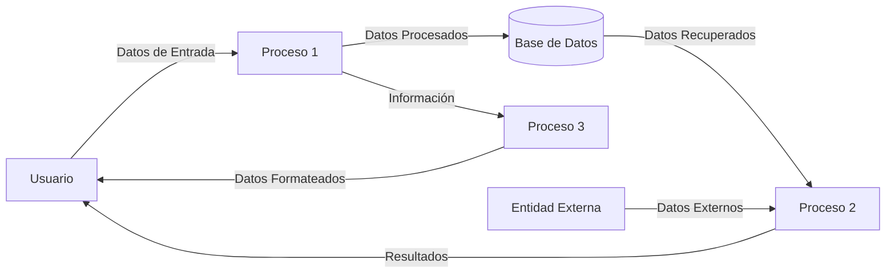

## Module: docs.js

# Análisis Integral del Módulo docs.js

## Módulo/Componente SQL
**Nombre del Módulo**: docs.js

## Objetivos Primarios
Este módulo JavaScript está diseñado específicamente para dar soporte a la documentación de un sitio web. Como se indica en el comentario inicial, no está destinado a ser utilizado en producción ("NO USE NINGUNO DE ESTE JAVASCRIPT, TODO ES BASURA PARA NUESTRA DOCUMENTACIÓN"). Su propósito es mejorar la experiencia de usuario en las páginas de documentación, proporcionando funcionalidades como navegación lateral fija y formato de código.

## Funciones, Métodos y Consultas Críticas
- **Función anónima autoejecutada**: Encapsula todo el código para evitar conflictos con el ámbito global.
- **$(function(){})**: Función que se ejecuta cuando el DOM está completamente cargado.
- **Manejo de eventos de clic**: Previene la acción predeterminada en enlaces internos.
- **Método .affix()**: Aplica el comportamiento de fijación a la barra lateral de navegación.
- **Método .button()**: Aplica estilos de botón a elementos con clase 'download-btn'.
- **prettyPrint()**: Función para formatear y resaltar código en la documentación.

## Variables y Elementos Clave
- **$window**: Variable jQuery que referencia el objeto window.
- **.bs-docs-sidenav**: Selector para la barra lateral de navegación.
- **.download-btn**: Selector para los botones de descarga.
- **offset**: Configuración para determinar cuándo la barra lateral debe fijarse.

## Interdependencias y Relaciones
- **jQuery**: El módulo depende completamente de la biblioteca jQuery (referenciada como window.jQuery).
- **Bootstrap**: Utiliza componentes de Bootstrap como .affix() y .button().
- **PrettyPrint**: Posible dependencia de una biblioteca externa para el formato de código.

## Operaciones Principales vs. Auxiliares
**Operaciones principales**:
- Configuración de la barra lateral fija (affix)
- Formateo de código con prettyPrint

**Operaciones auxiliares**:
- Prevención de comportamiento predeterminado en enlaces internos
- Estilización de botones de descarga

## Secuencia Operacional/Flujo de Ejecución
1. El script espera a que el DOM esté completamente cargado.
2. Configura los manejadores de eventos para los enlaces internos.
3. Configura la barra lateral para que se fije durante el desplazamiento.
4. Aplica estilos a los botones de descarga.
5. Si está disponible, ejecuta prettyPrint para formatear el código.

## Aspectos de Rendimiento y Optimización
- El código está encapsulado en una función anónima autoejecutada, lo que evita la contaminación del ámbito global.
- La configuración de offset para .affix() es responsiva, cambiando según el ancho de la ventana.
- No hay operaciones intensivas que puedan afectar significativamente el rendimiento.

## Reusabilidad y Adaptabilidad
- La reusabilidad es limitada, ya que el código está específicamente diseñado para la documentación.
- El comentario inicial advierte explícitamente contra su reutilización.
- No está parametrizado para adaptarse a diferentes contextos.

## Uso y Contexto
Este módulo está diseñado exclusivamente para mejorar la experiencia de usuario en páginas de documentación, probablemente de un framework o biblioteca. Proporciona:
- Navegación lateral que permanece visible durante el desplazamiento
- Formato mejorado para bloques de código
- Estilización de botones de descarga

## Suposiciones y Limitaciones
**Suposiciones**:
- Se asume la disponibilidad de jQuery y Bootstrap.
- Se espera una estructura HTML específica con elementos como .bs-docs-sidenav y .download-btn.
- Posiblemente asume la disponibilidad de prettyPrint para el formato de código.

**Limitaciones**:
- Código no destinado para uso en producción, solo para documentación.
- Dependencia de versiones específicas de jQuery y Bootstrap.
- Funcionalidad limitada a mejorar la experiencia de usuario en la documentación.
- No es adaptable a otros contextos sin modificaciones significativas.
## Flow Diagram [via mermaid]

