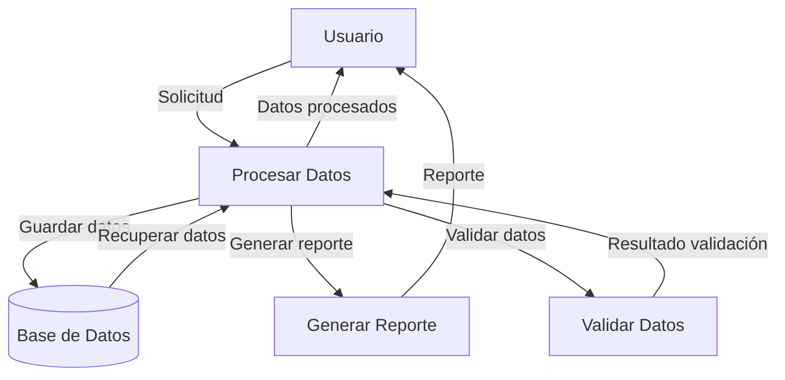

## Module: enhance.min.js

# Análisis Integral del Módulo enhance.min.js

## Nombre del Componente
**Módulo**: enhance.min.js (EnhanceJS versión 1.1)

## Objetivos Primarios
Este módulo implementa una metodología de "Mejora Progresiva Dirigida por Pruebas" (Test-Driven Progressive Enhancement). Su propósito principal es permitir la carga condicional de recursos (scripts y estilos) basándose en las capacidades del navegador del usuario, optimizando así la experiencia según las características técnicas disponibles.

## Funciones, Métodos y Consultas Críticas
- **enhance()**: Función principal que inicializa el proceso de mejora progresiva.
- **u()**: Ejecuta las pruebas de capacidades del navegador.
- **y()**: Maneja el flujo cuando las pruebas son exitosas.
- **x()**: Maneja el flujo cuando las pruebas fallan.
- **D()**: Carga los estilos CSS condicionales.
- **F(), G(), H()**: Gestionan la carga de scripts, con o sin cola.
- **n()**: Función para consultar media queries.
- **J(), K(), L()**: Funciones para manipular cookies.

## Variables y Elementos Clave
- **d**: Objeto de configuración que contiene todas las opciones.
- **i**: Referencia al elemento documentElement (html).
- **h**: Referencia al elemento head.
- **j**: Bandera que indica si las pruebas han pasado.
- **m**: Array para almacenar estados de media queries alternados.
- **defaultTests**: Objeto que contiene las pruebas predefinidas para capacidades del navegador.

## Interdependencias y Relaciones
- Interactúa con el DOM para realizar pruebas de capacidades.
- Utiliza cookies para almacenar resultados de pruebas y preferencias del usuario.
- Manipula elementos del DOM para inyectar estilos y scripts condicionales.
- Se integra con eventos del navegador como DOMContentLoaded y onload.

## Operaciones Principales vs. Auxiliares
**Operaciones Principales**:
- Ejecución de pruebas de capacidades del navegador.
- Carga condicional de recursos (CSS y JavaScript).
- Gestión del flujo basado en resultados de pruebas.

**Operaciones Auxiliares**:
- Manipulación de cookies.
- Creación de enlaces para alternar entre versiones.
- Detección de media queries.
- Manejo de errores de carga.

## Secuencia Operacional/Flujo de Ejecución
1. Inicialización con enhance() que configura las opciones.
2. Ejecución de pruebas de capacidades del navegador.
3. Basado en los resultados, se determina si se carga la versión "mejorada".
4. Si las pruebas pasan, se cargan los estilos y scripts configurados.
5. Se ejecutan callbacks según el resultado (onPass/onFail).
6. Opcionalmente, se añade un enlace para alternar entre versiones.

## Aspectos de Rendimiento y Optimización
- Implementa carga condicional para evitar descargar recursos innecesarios.
- Ofrece opción de carga en cola (queueLoading) para scripts, mejorando el rendimiento.
- Utiliza detección de capacidades en lugar de detección de navegador, lo que es más preciso.
- El código está minificado para reducir el tamaño de descarga.

## Reusabilidad y Adaptabilidad
- Altamente configurable a través del objeto de opciones.
- Permite añadir pruebas personalizadas mediante addTests.
- Soporta configuración de media queries personalizadas.
- Proporciona hooks (callbacks) para personalizar el comportamiento.

## Uso y Contexto
- Se utiliza en sitios web que necesitan adaptarse a diferentes capacidades de navegador.
- Ideal para implementar estrategias de mejora progresiva.
- Útil en entornos donde se requiere soporte para navegadores antiguos sin sacrificar experiencias avanzadas.
- Se implementa típicamente en la cabecera del documento HTML.

## Suposiciones y Limitaciones
- Asume que las cookies están habilitadas para funcionalidad completa.
- Depende de la correcta implementación de las pruebas para detectar capacidades.
- La detección de media queries puede variar entre navegadores.
- El código minificado dificulta la depuración.
- No es compatible con entornos sin JavaScript.
- Las pruebas asíncronas pueden no ser manejadas correctamente.
- Tiene un timeout de 3 segundos para la ejecución de pruebas, lo que podría ser insuficiente en conexiones lentas.
## Flow Diagram [via mermaid]

