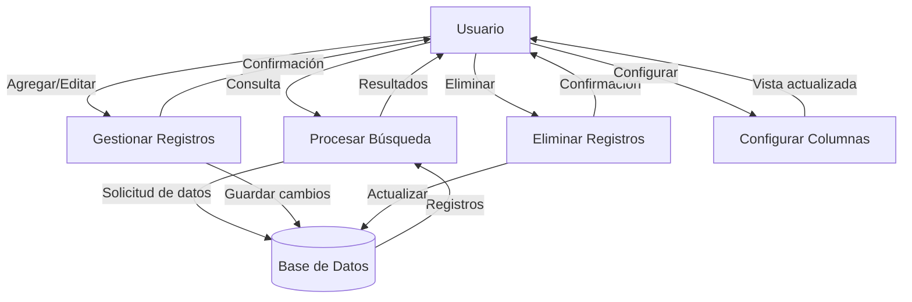

## Module: grid.locale-en.js

# Análisis Integral del Módulo grid.locale-en.js

## Nombre del Módulo/Componente SQL
**grid.locale-en.js** - Módulo de localización en inglés para jqGrid

## Objetivos Primarios
Este módulo proporciona la traducción al inglés para la biblioteca jqGrid. Su propósito principal es definir todos los textos, mensajes, formatos y etiquetas que se utilizan en la interfaz de usuario de jqGrid cuando se configura para mostrar contenido en inglés.

## Funciones, Métodos y Consultas Críticas
- **Función anónima principal**: Encapsula todo el código para evitar conflictos con otras bibliotecas.
- **$.extend($.jgrid, {...})**: Método principal que extiende el objeto jqGrid con las traducciones y configuraciones en inglés.
- No contiene consultas SQL ya que es un archivo de localización JavaScript.

## Variables y Elementos Clave
- **defaults**: Textos predeterminados para la navegación y visualización de registros.
- **search**: Configuración de textos para la funcionalidad de búsqueda.
- **edit**: Textos para operaciones de edición y mensajes de validación.
- **view**: Textos para la visualización de registros.
- **del**: Textos para la eliminación de registros.
- **nav**: Textos para la navegación en la cuadrícula.
- **col**: Textos para la selección de columnas.
- **errors**: Mensajes de error comunes.
- **formatter**: Configuraciones para el formato de diferentes tipos de datos (números, moneda, fechas).

## Interdependencias y Relaciones
- Depende de jQuery (indicado por el parámetro `$` en la función anónima).
- Se integra con el objeto global `$.jgrid` que debe ser proporcionado por la biblioteca principal jqGrid.
- No tiene dependencias directas con otros módulos específicos, pero es utilizado por el componente principal de jqGrid.

## Operaciones Principales vs. Auxiliares
- **Operaciones principales**: Definición de traducciones y formatos para la interfaz de usuario.
- **Operaciones auxiliares**: 
  - Función de formateo de sufijos ordinales para fechas (`S: function (j) {...}`).
  - Definición de máscaras de formato para diferentes representaciones de fecha y hora.

## Secuencia Operativa/Flujo de Ejecución
1. Se verifica la existencia del objeto `$.jgrid` y se crea si no existe.
2. Se extiende el objeto `$.jgrid` con todas las traducciones y configuraciones en inglés.
3. Se definen los formatos específicos para diferentes tipos de datos.
4. El módulo queda disponible para ser utilizado por jqGrid cuando se inicializa una instancia.

## Aspectos de Rendimiento y Optimización
- El código está encapsulado en una función anónima autoejecutable para evitar la contaminación del espacio de nombres global.
- No hay operaciones intensivas que puedan afectar el rendimiento, ya que principalmente define objetos estáticos.
- La carga de este archivo debería ser rápida debido a su naturaleza estática y tamaño relativamente pequeño.

## Reusabilidad y Adaptabilidad
- Alta reusabilidad: Puede ser utilizado en cualquier proyecto que implemente jqGrid.
- Sirve como plantilla para crear archivos de localización para otros idiomas.
- La estructura modular permite reemplazar fácilmente este archivo por otro archivo de localización para cambiar el idioma de la interfaz.

## Uso y Contexto
- Se utiliza en aplicaciones web que implementan jqGrid para la visualización y manipulación de datos tabulares.
- Se carga automáticamente cuando se inicializa jqGrid con la configuración de idioma inglés.
- Proporciona todos los textos necesarios para la interfaz de usuario en inglés.

## Suposiciones y Limitaciones
- **Suposiciones**:
  - Se asume que jQuery está cargado antes de este archivo.
  - Se asume que el componente principal de jqGrid está disponible.
- **Limitaciones**:
  - Específico para el idioma inglés; se necesitarían archivos adicionales para soporte multilingüe.
  - Los formatos de fecha están configurados según las convenciones estadounidenses (MM/DD/YYYY), lo que podría no ser adecuado para todas las regiones de habla inglesa.
  - No proporciona soporte para personalizaciones regionales específicas dentro del idioma inglés (variaciones entre EE.UU., Reino Unido, etc.).
## Flow Diagram [via mermaid]

