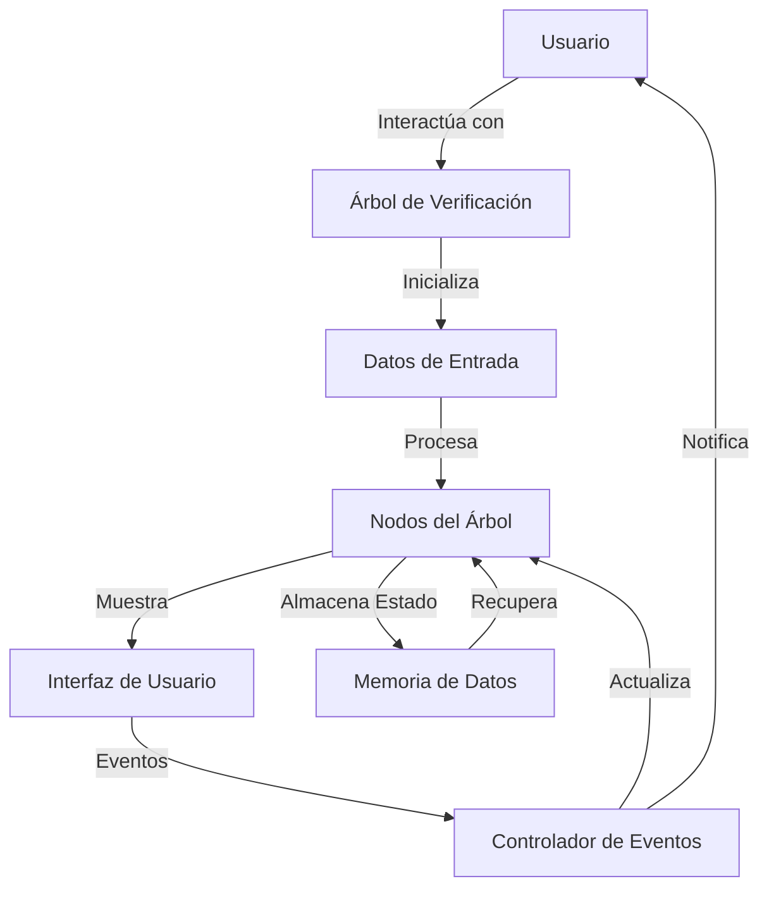

## Module: highchecktree.js

# Análisis Integral del Módulo highchecktree.js

## Nombre del Módulo/Componente SQL
**jquery.highCheckTree** - Un plugin de jQuery para crear árboles de casillas de verificación jerárquicos.

## Objetivos Primarios
Este módulo proporciona una implementación de un árbol de casillas de verificación jerárquico utilizando jQuery. Permite visualizar y manipular datos estructurados en forma de árbol, donde cada nodo puede ser seleccionado/deseleccionado, y estas selecciones se propagan a sus nodos hijos y padres según la lógica jerárquica.

## Funciones, Métodos y Consultas Críticas
- **highCheckTree()**: Función principal del plugin que inicializa el árbol.
- **getChildrenHtml()**: Genera el HTML para los nodos hijos.
- **updateChildrenNodes()**: Actualiza los nodos hijos con datos de la fuente.
- **initalCheckTree()**: Función anónima que inicializa el árbol con los datos proporcionados.
- **Manejadores de eventos**: Para expandir/colapsar nodos, marcar/desmarcar casillas, y manejar interacciones del ratón.

## Variables y Elementos Clave
- **settings**: Objeto de configuración que contiene opciones como datos, callbacks para eventos.
- **container**: El elemento DOM donde se renderizará el árbol.
- **$tree**: Referencia al objeto jQuery del árbol.
- **Clases CSS clave**: 'checked', 'half_checked', 'expanded', 'collapsed', 'nochildren'.
- **Atributos de datos**: Almacenamiento de datos de nodos mediante $.data().

## Interdependencias y Relaciones
- **Dependencia de jQuery**: El plugin extiende la funcionalidad de jQuery.
- **Estructura de datos jerárquica**: Requiere datos en formato específico con items y children.
- **Relación padre-hijo**: Los estados de selección se propagan entre nodos padres e hijos.

## Operaciones Principales vs. Auxiliares
**Operaciones principales**:
- Renderización del árbol basado en datos de entrada.
- Manejo de selección/deselección de nodos.
- Propagación de estados entre nodos relacionados.

**Operaciones auxiliares**:
- Manejo de eventos de expansión/colapso.
- Efectos visuales para hover.
- Almacenamiento y recuperación de datos de nodos.

## Secuencia Operacional/Flujo de Ejecución
1. Inicialización del plugin con configuración y datos.
2. Generación del HTML inicial para el árbol.
3. Configuración de manejadores de eventos para interacciones del usuario.
4. Respuesta a eventos del usuario (clic en casillas, flechas, etiquetas).
5. Actualización del estado visual y de datos según las interacciones.
6. Ejecución de callbacks configurados para diversos eventos.

## Aspectos de Rendimiento y Optimización
- **Carga diferida**: Los nodos hijos se cargan solo cuando se expanden por primera vez.
- **Almacenamiento de datos**: Uso de $.data() para asociar datos con elementos DOM.
- **Reutilización de nodos**: Los nodos ya expandidos no se vuelven a generar.
- **Posible mejora**: La selección de todos los nodos hijos podría optimizarse para árboles grandes.

## Reusabilidad y Adaptabilidad
- **Alta parametrización**: Múltiples opciones de configuración y callbacks.
- **Estructura de datos flexible**: Puede adaptarse a diferentes estructuras jerárquicas.
- **Personalización visual**: Posibilidad de estilizar mediante CSS.
- **Extensibilidad**: Los callbacks permiten extender la funcionalidad sin modificar el código base.

## Uso y Contexto
- **Interfaces de usuario**: Ideal para selección de categorías, permisos, o cualquier dato jerárquico.
- **Filtros avanzados**: Útil en paneles de administración o interfaces de búsqueda.
- **Visualización de datos**: Permite mostrar y manipular estructuras de datos complejas.
- **Ejemplo de uso**: `$('#container').highCheckTree({data: treeData, onCheck: handleCheck});`

## Suposiciones y Limitaciones
- **Estructura de datos específica**: Requiere datos en formato predefinido con item y children.
- **Dependencia de jQuery**: No funciona sin jQuery.
- **Limitaciones visuales**: El estilo visual depende de CSS adicional no incluido en el código.
- **Rendimiento**: Podría tener problemas con árboles muy grandes o profundos.
- **Compatibilidad**: No se especifica compatibilidad con versiones específicas de navegadores o jQuery.
## Flow Diagram [via mermaid]

