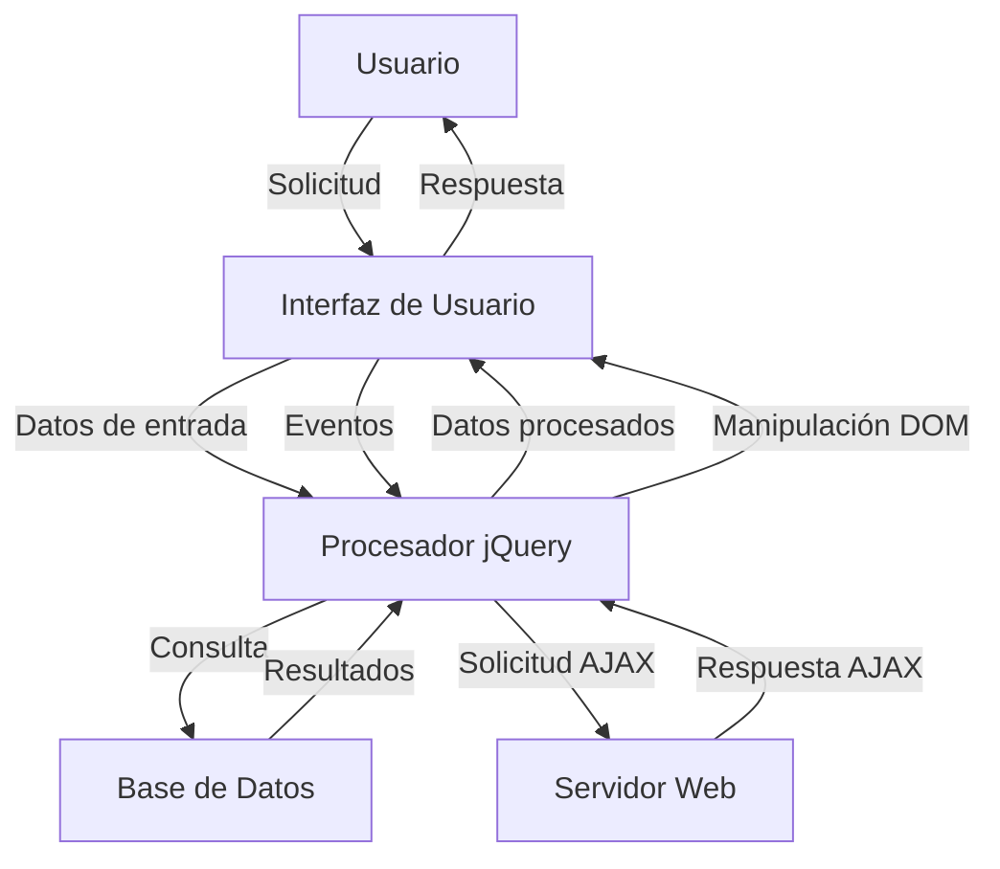

## Module: jquery-1.10.2.min.js

# Análisis Completo de jQuery v1.10.2

## Nombre del Módulo/Componente SQL
jQuery v1.10.2 - Biblioteca JavaScript

## Objetivos Primarios
jQuery es una biblioteca de JavaScript diseñada para simplificar la manipulación del DOM, el manejo de eventos, animaciones y operaciones AJAX en aplicaciones web. Su objetivo principal es proporcionar una capa de abstracción que facilite la interacción con el HTML, permitiendo a los desarrolladores escribir menos código y más eficiente para realizar tareas comunes en JavaScript.

## Funciones, Métodos y Consultas Críticas
- **Selectores**: `$()` o `jQuery()` - El método principal para seleccionar elementos DOM
- **Manipulación DOM**: `.html()`, `.text()`, `.append()`, `.prepend()`, `.remove()`
- **Eventos**: `.on()`, `.off()`, `.trigger()` - Manejo de eventos del navegador
- **AJAX**: `$.ajax()`, `$.get()`, `$.post()` - Comunicación asíncrona con el servidor
- **Animaciones**: `.animate()`, `.fadeIn()`, `.fadeOut()`, `.slideDown()`, `.slideUp()`
- **Utilidades**: `$.extend()`, `$.each()`, `$.map()` - Funciones de utilidad para manipulación de objetos y arrays

## Variables y Elementos Clave
- **$**: Alias principal de la función jQuery
- **jQuery.fn**: El prototipo de jQuery donde se definen los métodos para los objetos jQuery
- **jQuery.extend**: Método para extender objetos y añadir funcionalidad
- **jQuery.support**: Objeto que contiene información sobre características soportadas por el navegador
- **jQuery.Callbacks**: Sistema para gestionar listas de funciones callback
- **jQuery.Deferred**: Implementación de promesas para operaciones asíncronas

## Interdependencias y Relaciones
- **Sizzle**: Motor de selección CSS integrado en jQuery
- **Interacción con el DOM**: Depende de las APIs DOM del navegador
- **Eventos del navegador**: Se integra con el sistema de eventos nativo
- **AJAX**: Utiliza XMLHttpRequest o ActiveXObject según el navegador
- **Animaciones**: Depende del sistema de temporizadores del navegador (setTimeout/setInterval)

## Operaciones Core vs. Auxiliares
**Core**:
- Selección de elementos DOM
- Manipulación del DOM
- Manejo de eventos
- Operaciones AJAX

**Auxiliares**:
- Detección de características del navegador
- Utilidades para manipulación de arrays y objetos
- Animaciones y efectos visuales
- Gestión de datos asociados a elementos DOM

## Secuencia Operacional/Flujo de Ejecución
1. **Inicialización**: Configuración del entorno y detección de características del navegador
2. **Selección**: Cuando se invoca `$()`, se seleccionan elementos del DOM
3. **Encadenamiento**: Los métodos devuelven el objeto jQuery para permitir encadenamiento
4. **Ejecución**: Se ejecutan las operaciones solicitadas (manipulación, eventos, etc.)
5. **Callbacks/Promesas**: Para operaciones asíncronas, se utilizan callbacks o promesas

## Aspectos de Rendimiento y Optimización
- **Caché de selectores**: Reutilizar objetos jQuery en lugar de crear nuevos
- **Delegación de eventos**: Uso de `.on()` con delegación para mejorar rendimiento
- **Minimización de manipulaciones DOM**: Agrupar cambios antes de aplicarlos
- **Optimización de selectores**: Usar IDs cuando sea posible para selecciones más rápidas
- **Uso de fragmentos de documento**: Para insertar múltiples elementos de forma eficiente

## Reusabilidad y Adaptabilidad
- **Plugins**: Sistema extensible que permite crear plugins mediante `$.fn.nombrePlugin`
- **Noconflict**: `$.noConflict()` permite liberar la variable `$` para otros frameworks
- **Compatibilidad**: Funciona en múltiples navegadores, abstrayendo diferencias
- **Modularidad**: Funcionalidad organizada en módulos que pueden ser extendidos

## Uso y Contexto
- **Desarrollo web**: Utilizado en sitios y aplicaciones web para simplificar JavaScript
- **Frameworks**: Base para muchos frameworks y bibliotecas JavaScript
- **Plugins**: Ecos
## Flow Diagram [via mermaid]

