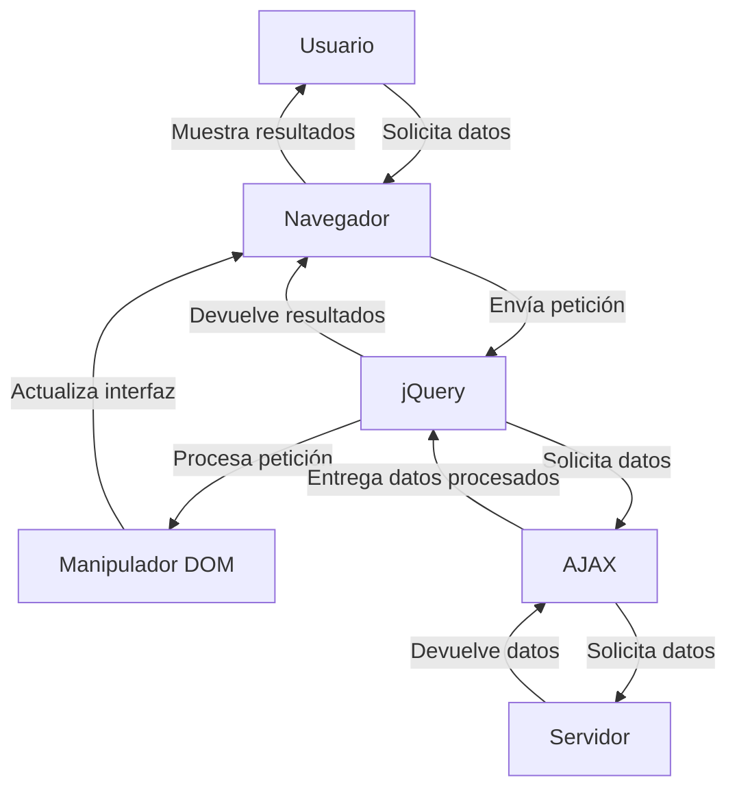

## Module: jquery-1.8.3.js

# Análisis Completo del Módulo jQuery 1.8.3

## Módulo/Componente SQL
**jQuery JavaScript Library v1.8.3**

## Objetivos Primarios
jQuery es una biblioteca de JavaScript diseñada para simplificar la manipulación del DOM (Document Object Model), el manejo de eventos, animaciones y operaciones AJAX en aplicaciones web. Su objetivo principal es proporcionar una capa de abstracción que facilite la interacción con elementos HTML, permitiendo a los desarrolladores escribir menos código y de manera más eficiente.

## Funciones, Métodos y Consultas Críticas
- **Selectores**: La función principal `jQuery()` o `$()` que permite seleccionar elementos del DOM.
- **Manipulación DOM**: Métodos como `.html()`, `.text()`, `.append()`, `.prepend()`, `.remove()` para modificar el contenido y estructura del DOM.
- **Manejo de eventos**: Métodos como `.on()`, `.off()`, `.bind()`, `.unbind()` para gestionar eventos.
- **AJAX**: Funciones como `$.ajax()`, `$.get()`, `$.post()` para realizar peticiones asíncronas.
- **Animaciones**: Métodos como `.animate()`, `.fadeIn()`, `.fadeOut()`, `.slideDown()` para efectos visuales.
- **Utilidades**: Funciones como `$.extend()`, `$.each()`, `$.map()` para manipulación de objetos y arrays.

## Variables y Elementos Clave
- **jQuery/$ (alias)**: La función principal que sirve como constructor y namespace.
- **jQuery.fn**: El prototipo de los objetos jQuery donde se definen los métodos de la cadena.
- **document**: Referencia al documento HTML.
- **window**: Referencia al objeto window del navegador.
- **Callbacks**: Sistema de gestión de callbacks para operaciones asíncronas.
- **Deferred**: Implementación de promesas para operaciones asíncronas.
- **Support**: Objeto que almacena información sobre compatibilidad del navegador.

## Interdependencias y Relaciones
- **Sizzle**: Motor de selección CSS integrado para compatibilidad entre navegadores.
- **Browser Detection**: Mecanismos para detectar capacidades del navegador.
- **Event System**: Sistema de eventos que interactúa con el sistema nativo del navegador.
- **CSS/Attributes**: Módulos para manipular estilos y atributos de elementos.
- **AJAX**: Componente que interactúa con XMLHttpRequest o ActiveXObject según el navegador.

## Operaciones Core vs. Auxiliares
**Operaciones Core:**
- Selección de elementos DOM
- Manipulación del DOM
- Gestión de eventos
- Animaciones
- Peticiones AJAX

**Operaciones Auxiliares:**
- Detección de características del navegador
- Utilidades para manipulación de arrays y objetos
- Normalización de eventos entre navegadores
- Caché de datos asociados a elementos DOM

## Secuencia Operacional/Flujo de Ejecución
1. **Inicialización**: Definición del namespace jQuery y variables globales.
2. **Configuración**: Establecimiento de propiedades y métodos básicos.
3. **Extensión**: Adición de funcionalidades mediante jQuery.fn.extend y jQuery.extend.
4. **Ejecución**: Cuando se invoca jQuery(), se crea una instancia que envuelve los elementos seleccionados.
5. **Encadenamiento**: Los métodos devuelven el objeto jQuery para permitir encadenar operaciones.

## Aspectos de Rendimiento y Optimización
- **Caché de selectores**: Almacenamiento de resultados de selecciones para evitar búsquedas repetidas.
- **Event delegation**: Uso de delegación de eventos para mejorar el rendimiento.
- **Lazy loading**: Carga diferida de componentes según necesidad.
- **Minimización de reflows**: Agrupación de operaciones DOM para reducir recálculos de layout.
- **Optimización de loops**: Uso de técnicas como caching de longitud en bucles.

## Reusabilidad y Adaptabilidad
- **Arquitectura de plugins**: Facilita la extensión mediante jQuery.fn.
- **Namespacing**: Evita conflictos con otras bibliotecas mediante $.noConflict().
- **Compatibilidad AMD**: Soporte para cargadores de módulos asíncronos.
- **Compatibilidad entre navegadores**: Abstracción de diferencias entre navegadores.
- **API consistente**: Interfaz uniforme para operaciones comunes.

## Uso y Contexto
- **Desarrollo web frontend**: Manipulación de elementos HTML, CSS y eventos.
- **Aplicaciones web interactivas**: Creación de interfaces dinámicas.
- **Integración con APIs**: Consumo de servicios web mediante AJAX.
- **Animaciones y efectos visuales**: Mejora de experiencia de usuario.
- **Compatibilidad cross-browser**: Normalización de comportamientos entre navegadores.

## Suposiciones y Limitaciones
- **Dependencia del DOM**: Requiere que el DOM esté cargado para muchas operaciones.
- **Rendimiento en aplicaciones grandes**: Puede ser menos eficiente que soluciones más modernas.
- **Compatibilidad con navegadores antiguos**: Mantiene código para IE6-8 que puede afectar el rendimiento.
- **Tamaño del archivo**: ~93KB minificado, lo que puede afectar tiempos de carga.
- **Paradigma imperativo**: No sigue patrones reactivos o declarativos de frameworks modernos.
## Flow Diagram [via mermaid]

