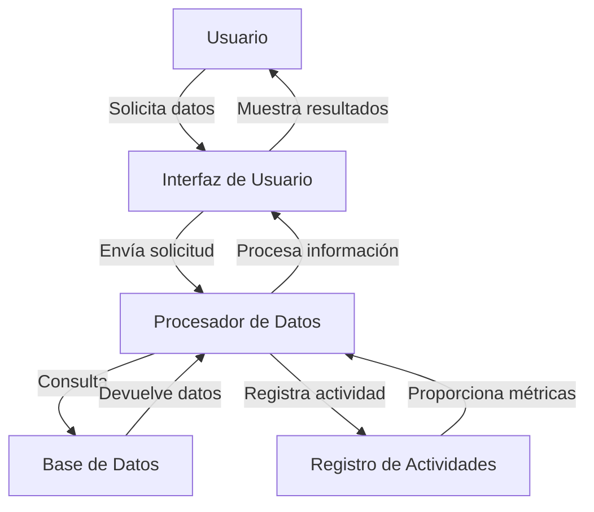
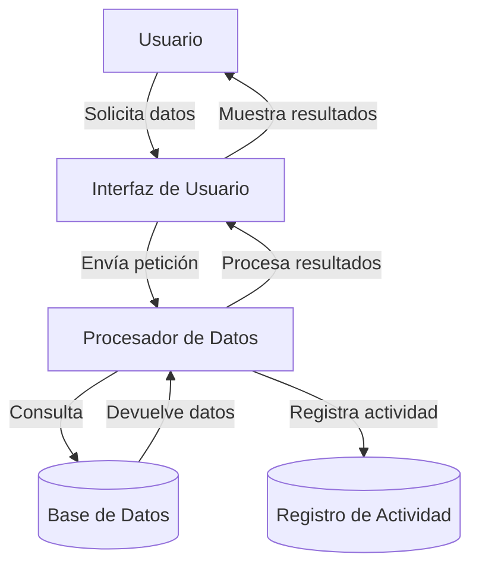

## Module: jquery-1.8.3.min.js

# Análisis Completo del Módulo jQuery 1.8.3

## Nombre del Módulo/Componente SQL
jQuery v1.8.3 (jquery-1.8.3.min.js)

## Objetivos Primarios
jQuery es una biblioteca de JavaScript que simplifica la interacción con documentos HTML, manipulación del DOM, manejo de eventos, animaciones y comunicaciones AJAX. Su objetivo principal es proporcionar una capa de abstracción que facilite el desarrollo web, permitiendo escribir menos código para lograr más funcionalidades.

## Funciones, Métodos y Consultas Críticas
- **Selectores**: Funciones para seleccionar elementos del DOM (`$()`, `find()`, `filter()`)
- **Manipulación DOM**: Métodos para modificar el contenido y estructura (`append()`, `html()`, `text()`, `remove()`)
- **Eventos**: Sistema de gestión de eventos (`on()`, `off()`, `trigger()`)
- **AJAX**: Funciones para comunicación asíncrona (`ajax()`, `get()`, `post()`)
- **Animaciones**: Métodos para efectos visuales (`animate()`, `show()`, `hide()`, `fadeIn()`, `fadeOut()`)
- **Utilidades**: Funciones auxiliares (`each()`, `extend()`, `isFunction()`, `isArray()`)

## Variables y Elementos Clave
- **$**: Alias principal de la función jQuery
- **jQuery.fn**: Prototipo donde se definen los métodos para objetos jQuery
- **jQuery.extend**: Método para extender funcionalidades
- **jQuery.support**: Objeto que contiene información sobre compatibilidad del navegador
- **jQuery.ajax**: Configuración y métodos para peticiones AJAX
- **jQuery.Callbacks**: Sistema de gestión de callbacks
- **jQuery.Deferred**: Implementación de promesas

## Interdependencias y Relaciones
- **Módulo Core**: Base de la biblioteca que proporciona funcionalidad fundamental
- **Módulo Selector**: Interactúa con el DOM para localizar elementos
- **Módulo Eventos**: Se relaciona con el DOM para gestionar interacciones del usuario
- **Módulo AJAX**: Depende de XMLHttpRequest o ActiveXObject para comunicaciones
- **Módulo Efectos**: Utiliza el sistema de animación y manipulación CSS
- **Módulo Utilidades**: Proporciona herramientas utilizadas por todos los demás módulos

## Operaciones Core vs. Auxiliares
**Operaciones Core:**
- Selección de elementos DOM
- Manipulación del DOM
- Gestión de eventos
- Peticiones AJAX
- Animaciones

**Operaciones Auxiliares:**
- Detección de características del navegador
- Normalización de eventos
- Utilidades de manipulación de arrays y objetos
- Gestión de callbacks y promesas
- Validaciones y comprobaciones de tipos

## Secuencia Operacional/Flujo de Ejecución
1. **Inicialización**: Definición del espacio de nombres jQuery y alias $
2. **Configuración**: Establecimiento de propiedades de soporte y detección de navegador
3. **Definición de API**: Implementación de métodos en jQuery.fn y jQuery
4. **Extensión**: Adición de plugins y módulos específicos
5. **Ejecución**: Respuesta a eventos y llamadas a métodos por parte del usuario

## Aspectos de Rendimiento y Optimización
- Uso de caché para selectores frecuentes
- Encadenamiento de métodos para reducir selecciones repetidas
- Optimización de bucles con `each()` en lugar de bucles tradicionales
- Detección de características del navegador para aplicar soluciones específicas
- Minimización del código para reducir el tamaño de descarga
- Uso de delegación de eventos para mejorar el rendimiento con muchos elementos

## Reusabilidad y Adaptabilidad
- **Arquitectura modular**: Permite incluir solo las partes necesarias
- **Sistema de plugins**: Facilita la extensión con nuevas funcionalidades
- **Compatibilidad entre navegadores**: Abstrae diferencias entre plataformas
- **Configuración personalizable**: Muchos métodos aceptan opciones para adaptar su comportamiento
- **Soporte para noConflict**: Permite coexistir con otras bibliotecas que usan $

## Uso y Contexto
- **Desarrollo web frontend**: Manipulación de páginas HTML
- **Aplicaciones web interactivas**: Gestión de eventos y actualizaciones dinámicas
- **Comunicación con servidores**: Mediante AJAX para aplicaciones de una sola página
- **Animaciones y efectos visuales**: Para mejorar la experiencia de usuario
- **Compatibilidad cross-browser**: Para garantizar funcionamiento en diferentes navegadores

## Suposiciones y Limitaciones
**Suposiciones:**
- Existencia de un documento HTML con elementos DOM
- Soporte básico de JavaScript en el navegador
- Disponibilidad de XMLHttpRequest para AJAX

**Limitaciones:**
- Rendimiento puede ser inferior a JavaScript nativo en operaciones simples
- Tamaño de la biblioteca puede afectar tiempos de carga en conexiones lentas
- Algunas funcionalidades dependen de características específicas del navegador
- No está optimizado para aplicaciones móviles de alto rendimiento
- Versión 1.8.3 no incluye las mejoras de rendimiento de versiones posteriores
## Flow Diagram [via mermaid]

## Module: jquery-1.8.3.min.js

# Análisis Completo del Módulo jQuery 1.8.3

## Nombre del Componente/Módulo
jQuery v1.8.3 (jquery-1.8.3.min.js) - Una biblioteca de JavaScript minificada.

## Objetivos Primarios
jQuery es una biblioteca de JavaScript diseñada para simplificar la manipulación del DOM, el manejo de eventos, las animaciones y las peticiones AJAX en aplicaciones web. Su objetivo principal es proporcionar una capa de abstracción que facilite la interacción con el DOM y la compatibilidad entre navegadores, permitiendo a los desarrolladores escribir menos código para lograr más funcionalidad.

## Funciones, Métodos y Consultas Críticas
- **Selectores**: `$()` o `jQuery()` - La función principal para seleccionar elementos del DOM.
- **Manipulación DOM**: `.html()`, `.text()`, `.append()`, `.prepend()`, `.remove()`.
- **Eventos**: `.on()`, `.off()`, `.trigger()` - Para gestionar eventos del navegador.
- **AJAX**: `$.ajax()`, `$.get()`, `$.post()` - Para realizar peticiones asíncronas.
- **Animaciones**: `.animate()`, `.fadeIn()`, `.fadeOut()`, `.slideDown()`, `.slideUp()`.
- **Utilidades**: `$.each()`, `$.extend()`, `$.isFunction()`, `$.parseJSON()`.

## Variables y Elementos Clave
- **v**: El objeto principal de jQuery (alias interno de jQuery).
- **$**: El alias público de jQuery.
- **jQuery.fn**: El prototipo para todos los objetos jQuery.
- **jQuery.support**: Objeto que contiene información sobre características soportadas por el navegador.
- **jQuery.ajax**: Configuración y métodos para peticiones AJAX.
- **jQuery.Callbacks**: Sistema para gestionar listas de funciones callback.
- **jQuery.Deferred**: Implementación de promesas para operaciones asíncronas.

## Interdependencias y Relaciones
- Interactúa directamente con el DOM del navegador.
- Se integra con el sistema de eventos del navegador.
- Proporciona una capa de abstracción sobre XMLHttpRequest para AJAX.
- Puede coexistir con otras bibliotecas mediante `$.noConflict()`.
- Permite extensiones a través de plugins mediante `$.fn`.

## Operaciones Principales vs. Auxiliares
**Operaciones Principales**:
- Selección y manipulación de elementos DOM.
- Gestión de eventos.
- Peticiones AJAX.
- Animaciones.

**Operaciones Auxiliares**:
- Detección de características del navegador.
- Utilidades para manipulación de arrays y objetos.
- Normalización de eventos entre navegadores.
- Gestión de colas para animaciones.

## Secuencia de Ejecución
1. Definición del espacio de nombres jQuery y alias $.
2. Configuración de funciones core y utilidades.
3. Implementación de selectores y manipulación DOM.
4. Configuración del sistema de eventos.
5. Implementación de AJAX.
6. Configuración de animaciones.
7. Exposición de la API pública.
8. Registro en AMD si está disponible.

## Aspectos de Rendimiento y Optimización
- Uso de caché para selectores frecuentes.
- Encadenamiento de métodos para operaciones eficientes.
- Delegación de eventos para mejor rendimiento.
- Optimizaciones específicas para diferentes navegadores.
- Minimización del código para reducir el tamaño de descarga.
- Uso de técnicas como "function hoisting" para optimizar la ejecución.

## Reusabilidad y Adaptabilidad
- Diseño modular que permite incluir solo las partes necesarias.
- Sistema de plugins para extender funcionalidad.
- Compatibilidad con múltiples versiones de navegadores.
- Capacidad para coexistir con otras bibliotecas.
- API consistente que facilita el aprendizaje y uso.

## Uso y Contexto
- Se utiliza en páginas web para simplificar la manipulación del DOM.
- Facilita la creación de interfaces de usuario interactivas.
- Simplifica peticiones AJAX y manejo de datos.
- Se incluye típicamente en el encabezado o al final del cuerpo del HTML.
- Puede ser cargado desde CDNs o localmente.

## Suposiciones y Limitaciones
- Asume que el DOM está completamente cargado antes de ejecutar código (a menos que se use `$(document).ready()`).
- Puede tener limitaciones de rendimiento en aplicaciones muy grandes o complejas.
- Algunas funcionalidades dependen de características específicas del navegador.
- La versión 1.8.3 no incluye algunas características modernas de JavaScript.
- No está optimizado para aplicaciones móviles con recursos limitados.
- Depende del modelo de eventos del navegador, que puede variar entre plataformas.
## Flow Diagram [via mermaid]

