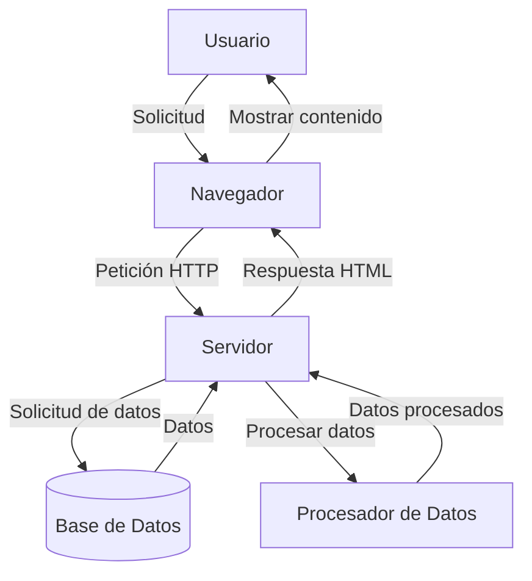

## Module: jquery-1.9.0.min.js

# Análisis Completo del Módulo jQuery 1.9.0

## Nombre del Componente/Módulo
jQuery versión 1.9.0 (jquery-1.9.0.min.js) - Una biblioteca de JavaScript minificada.

## Objetivos Primarios
jQuery es una biblioteca de JavaScript diseñada para simplificar la manipulación del DOM (Document Object Model), el manejo de eventos, animaciones y operaciones AJAX en aplicaciones web. Su objetivo principal es proporcionar una capa de abstracción que facilite la interacción con elementos HTML, permitiendo a los desarrolladores escribir menos código y más eficiente para realizar tareas comunes en el navegador.

## Funciones, Métodos y Consultas Críticas
- **Selectores**: `$()` o `jQuery()` - La función principal para seleccionar elementos del DOM.
- **Manipulación DOM**: `.html()`, `.text()`, `.append()`, `.prepend()`, `.remove()`, `.empty()`, `.css()`, `.attr()`, `.addClass()`, `.removeClass()`.
- **Eventos**: `.on()`, `.off()`, `.trigger()`, `.bind()`, `.unbind()`, `.delegate()`, `.undelegate()`.
- **AJAX**: `$.ajax()`, `$.get()`, `$.post()`, `$.getJSON()`, `$.getScript()`.
- **Animaciones**: `.animate()`, `.fadeIn()`, `.fadeOut()`, `.slideDown()`, `.slideUp()`, `.toggle()`.
- **Utilidades**: `$.each()`, `$.extend()`, `$.map()`, `$.grep()`, `$.isFunction()`, `$.isArray()`.

## Variables y Elementos Clave
- **$**: Alias principal de la función jQuery.
- **jQuery.fn**: El prototipo de los objetos jQuery donde se definen los métodos de la biblioteca.
- **jQuery.support**: Objeto que contiene información sobre las capacidades del navegador.
- **jQuery.expr**: Sistema de expresiones para selectores avanzados.
- **jQuery.event**: Sistema de gestión de eventos.
- **jQuery.ajax**: Sistema de comunicación asíncrona con el servidor.
- **jQuery.Callbacks**: Sistema de gestión de callbacks.
- **jQuery.Deferred**: Implementación de promesas para operaciones asíncronas.

## Interdependencias y Relaciones
- **Interacción con el DOM**: jQuery depende fuertemente del DOM del navegador para realizar sus operaciones.
- **Compatibilidad entre navegadores**: Contiene numerosas comprobaciones y soluciones para diferencias entre navegadores.
- **Módulos internos**: La biblioteca está organizada en módulos internos que se comunican entre sí (core, selector, traversing, manipulation, css, event, ajax, effects).
- **Extensibilidad**: Permite la creación de plugins mediante `$.fn.extend()` y `$.extend()`.

## Operaciones Core vs. Auxiliares
- **Core**: Selección de elementos (`$()`), manipulación DOM, gestión de eventos, AJAX.
- **Auxiliares**: Detección de características del navegador, utilidades de arrays y objetos, animaciones, efectos visuales, validaciones internas.

## Secuencia Operacional/Flujo de Ejecución
1. **Inicialización**: Se define el objeto jQuery y se asigna al símbolo `$`.
2. **Detección de entorno**: Se realizan comprobaciones sobre el navegador y sus capacidades.
3. **Definición de métodos**: Se establecen los métodos principales en el prototipo jQuery.fn.
4. **Gestión de eventos**: Se configura el sistema de eventos.
5. **Ejecución**: Cuando se invoca `$()`, se crea una instancia de jQuery que envuelve los elementos seleccionados.
6. **Encadenamiento**: Los métodos devuelven el objeto jQuery para permitir el encadenamiento de operaciones.

## Aspectos de Rendimiento y Optimización
- **Minificación**: El código está minificado para reducir su tamaño.
- **Caché de selectores**: Implementa sistemas de caché para mejorar el rendimiento de selectores repetidos.
- **Delegación de eventos**: Permite la delegación de eventos para mejorar el rendimiento con muchos elementos.
- **Optimización de bucles**: Utiliza técnicas optimizadas para recorrer colecciones.
- **Detección de características**: En lugar de detección de navegadores, utiliza detección de características para mayor eficiencia.

## Reusabilidad y Adaptabilidad
- **Patrón de diseño modular**: Facilita la extensión mediante plugins.
- **API consistente**: Mantiene una interfaz coherente para facilitar su uso.
- **Compatibilidad con versiones anteriores**: Mantiene compatibilidad con versiones anteriores cuando es posible.
- **Configurabilidad**: Muchos métodos aceptan opciones para personalizar su comportamiento.

## Uso y Contexto
- **Desarrollo web**: Utilizado en millones de sitios web para simplificar la programación JavaScript.
- **Frameworks**: Base para numerosos frameworks y bibliotecas JavaScript.
- **Plugins**: Ecosistema extenso de plugins que amplían su funcionalidad.
- **Aplicaciones web**: Facilita la creación de interfaces de usuario dinámicas e interactivas.

## Suposiciones y Limitaciones
- **Suposiciones**:
  - Asume que el DOM está completamente cargado cuando se ejecutan ciertas operaciones (a menos que se use `$(document).ready()`).
  - Espera que el navegador soporte JavaScript básico.
  
- **Limitaciones**:
  - Puede tener problemas de rendimiento en aplicaciones muy grandes o con muchos elementos DOM.
  - Añade una capa adicional sobre JavaScript nativo, lo que puede afectar al rendimiento.
  - En la versión 1.9.0 no incluye soporte para algunas características modernas de JavaScript.
  - No está optimizado para aplicaciones móviles con recursos limitados.
## Flow Diagram [via mermaid]

