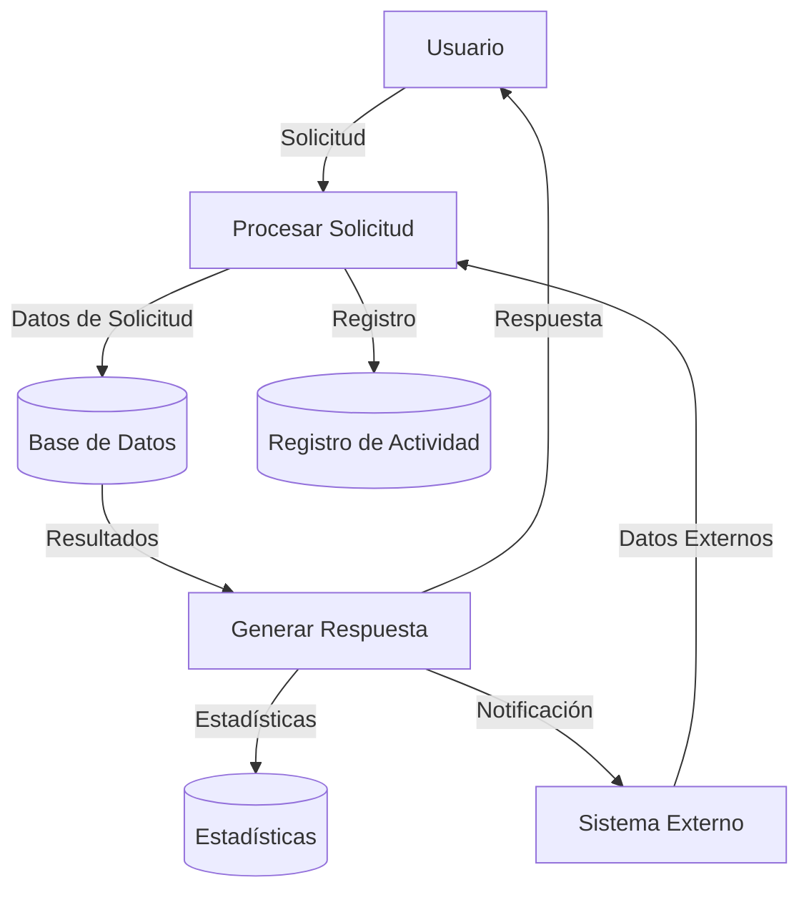

## Module: jquery-2.2.3.min.js

# Análisis Completo del Módulo jQuery 2.2.3

## Nombre del Módulo/Componente SQL
**jQuery v2.2.3** - Biblioteca JavaScript

## Objetivos Primarios
jQuery es una biblioteca de JavaScript diseñada para simplificar la manipulación del DOM (Document Object Model), el manejo de eventos, animaciones y operaciones AJAX en aplicaciones web. Su objetivo principal es proporcionar una capa de abstracción que facilite la interacción con elementos HTML, permitiendo a los desarrolladores escribir menos código y de manera más eficiente.

## Funciones, Métodos y Consultas Críticas
- **Selectores**: `$()` o `jQuery()` - El método principal para seleccionar elementos del DOM
- **Manipulación DOM**: `.html()`, `.text()`, `.append()`, `.prepend()`, `.remove()`
- **Eventos**: `.on()`, `.off()`, `.trigger()` - Manejo de eventos del navegador
- **AJAX**: `$.ajax()`, `$.get()`, `$.post()` - Comunicación asíncrona con el servidor
- **Animaciones**: `.animate()`, `.show()`, `.hide()`, `.toggle()` - Efectos visuales
- **Recorrido DOM**: `.find()`, `.parent()`, `.children()`, `.siblings()` - Navegación por el DOM
- **Utilidades**: `$.extend()`, `$.each()`, `$.map()` - Funciones de utilidad general

## Variables y Elementos Clave
- **n**: Alias interno para jQuery
- **$**: Alias público para jQuery
- **fn**: Prototipo de jQuery donde se definen los métodos para los objetos jQuery
- **expando**: Identificador único para almacenar datos asociados a elementos
- **Callbacks**: Sistema para gestionar listas de funciones de callback
- **Deferred**: Implementación de promesas para operaciones asíncronas
- **Event**: Sistema de gestión de eventos del navegador

## Interdependencias y Relaciones
- **Módulo Sizzle**: Motor de selección CSS integrado para consultas complejas
- **Módulo AJAX**: Interactúa con XMLHttpRequest o equivalentes del navegador
- **Módulo Animaciones**: Depende del sistema de temporizadores del navegador
- **Módulo Eventos**: Se integra con el sistema de eventos nativo del navegador
- **Compatibilidad entre navegadores**: Proporciona abstracciones para manejar diferencias entre navegadores

## Operaciones Core vs. Auxiliares
**Operaciones Core:**
- Selección de elementos DOM mediante selectores CSS
- Manipulación del DOM (inserción, eliminación, modificación)
- Manejo de eventos
- Peticiones AJAX

**Operaciones Auxiliares:**
- Animaciones y efectos visuales
- Utilidades para manipulación de arrays y objetos
- Validaciones y detección de características del navegador
- Gestión de datos asociados a elementos DOM

## Secuencia Operacional/Flujo de Ejecución
1. **Inicialización**: Configuración del entorno y detección de características del navegador
2. **Exposición de la API**: Definición de métodos públicos y privados
3. **Ejecución bajo demanda**: Las funcionalidades se activan cuando el desarrollador las invoca
4. **Encadenamiento de métodos**: Permite ejecutar múltiples operaciones en secuencia
5. **Gestión de eventos**: Sistema de registro, delegación y disparo de eventos
6. **Procesamiento asíncrono**: Manejo de operaciones AJAX y animaciones

## Aspectos de Rendimiento y Optimización
- **Caché de selectores**: Almacena resultados de consultas para evitar repetir búsquedas
- **Delegación de eventos**: Reduce el número de manejadores de eventos adjuntos
- **Procesamiento por lotes**: Agrupa operaciones DOM para minimizar reflows
- **Detección de características**: Evita comprobaciones redundantes de capacidades del navegador
- **Minificación**: El código está comprimido para reducir el tamaño de descarga

## Reusabilidad y Adaptabilidad
- **Plugins**: Arquitectura extensible que permite añadir nuevas funcionalidades
- **Noconflict**: Método `$.noConflict()` para evitar conflictos con otras bibliotecas
- **Compatibilidad**: Funciona en múltiples navegadores y versiones
- **Modularidad**: Componentes independientes que pueden utilizarse por separado
- **Configuración**: Muchos métodos aceptan opciones para personalizar su comportamiento

## Uso y Contexto
- **Desarrollo web frontend**: Manipulación de interfaces de usuario
- **Aplicaciones web interactivas**: Mejora la experiencia del usuario con efectos y animaciones
- **Comunicación cliente-servidor**: Simplifica peticiones AJAX
- **Frameworks**: Base para otros frameworks y bibliotecas JavaScript
- **Compatibilidad**: Soluciona inconsistencias entre navegadores

## Suposiciones y Limitaciones
- **Suposiciones**:
  - Existencia de un documento HTML válido
  - Soporte básico de JavaScript en el navegador
  - Disponibilidad de DOM API estándar
  
- **Limitaciones**:
  - Versión 2.x no es compatible con Internet Explorer 8 o anteriores
  - Rendimiento puede degradarse con grandes conjuntos de datos o DOM muy complejo
  - Tamaño de la biblioteca puede ser excesivo para proyectos pequeños
  - Algunas funcionalidades modernas requieren polyfills adicionales
  - No está optimizado para aplicaciones móviles de alto rendimiento

Esta versión de jQuery (2.2.3) representa una biblioteca madura y estable, ampliamente utilizada en el desarrollo web, aunque actualmente existen alternativas más modernas y ligeras para proyectos nuevos.
## Flow Diagram [via mermaid]

