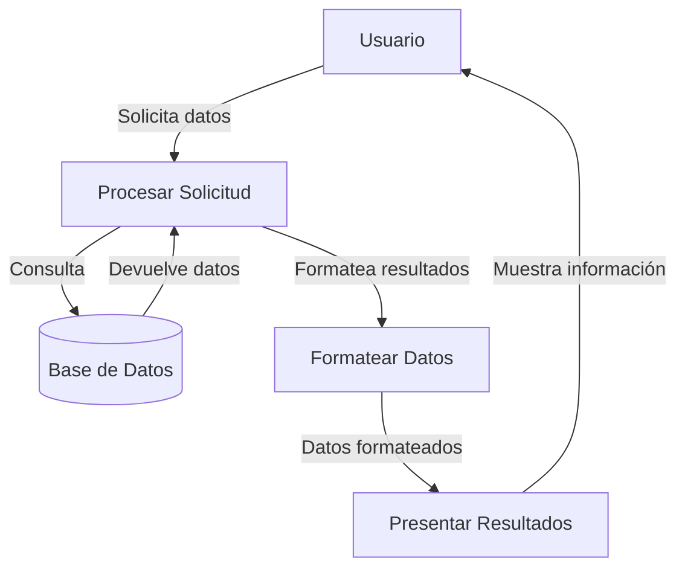

## Module: jquery-3.0.min.js

# Análisis Integral de jQuery 3.0.0

## Nombre del Módulo/Componente SQL
jQuery versión 3.0.0 (jquery-3.0.min.js)

## Objetivos Primarios
Este módulo constituye la biblioteca principal de jQuery, diseñada para simplificar la manipulación del DOM, el manejo de eventos, las animaciones y las peticiones AJAX en aplicaciones web. jQuery proporciona una capa de abstracción que facilita la programación JavaScript, permitiendo a los desarrolladores escribir menos código para lograr más funcionalidad.

## Funciones, Métodos y Consultas Críticas
- **Selector de jQuery (`$` o `jQuery`)**: Función principal para seleccionar elementos DOM.
- **Manipulación DOM**: Métodos como `.append()`, `.prepend()`, `.html()`, `.text()` para modificar el contenido.
- **Manejo de eventos**: `.on()`, `.off()`, `.trigger()` para gestionar eventos del navegador.
- **AJAX**: `$.ajax()`, `$.get()`, `$.post()` para comunicación asíncrona con el servidor.
- **Animaciones**: `.animate()`, `.fadeIn()`, `.fadeOut()` para efectos visuales.
- **Utilidades**: `$.extend()`, `$.each()`, `$.map()` para operaciones comunes.
- **Promesas**: `$.Deferred()`, `.promise()` para manejo asíncrono.

## Variables y Elementos Clave
- **`r` y `jQuery`**: Objetos principales que exponen la API de jQuery.
- **`r.fn`**: Prototipo donde se definen los métodos para colecciones de elementos.
- **`r.extend`**: Método para extender objetos y añadir funcionalidad.
- **`r.expr`**: Expresiones para selectores avanzados.
- **`r.event`**: Sistema de gestión de eventos.
- **`r.ajax`**: Configuración y métodos para peticiones AJAX.
- **`r.Callbacks`**, `r.Deferred`: Implementaciones para manejo asíncrono.

## Interdependencias y Relaciones
- **Relación con el DOM**: jQuery interactúa directamente con el DOM del navegador.
- **Compatibilidad entre navegadores**: Proporciona una capa de abstracción para manejar diferencias entre navegadores.
- **Módulo AMD**: Compatible con sistemas de módulos como RequireJS.
- **Extensibilidad**: Permite plugins mediante `$.fn.extend()` y `$.extend()`.
- **Interacción con CSS**: Manipula estilos y clases CSS.
- **Interacción con eventos nativos**: Envuelve el sistema de eventos del navegador.

## Operaciones Core vs. Auxiliares
**Operaciones Core:**
- Selección de elementos DOM mediante selectores CSS.
- Manipulación del DOM (inserción, eliminación, modificación).
- Manejo de eventos.
- Peticiones AJAX.

**Operaciones Auxiliares:**
- Animaciones y efectos visuales.
- Utilidades para manipulación de arrays y objetos.
- Validaciones y comprobaciones de tipos.
- Normalización de comportamientos entre navegadores.
- Caché de elementos y datos.

## Secuencia Operacional/Flujo de Ejecución
1. **Inicialización**: Se define el objeto jQuery y se establece el alias `$`.
2. **Detección del entorno**: Comprueba si está en un entorno CommonJS, AMD o global.
3. **Definición de funciones core**: Establece las funciones principales y prototipos.
4. **Extensión de funcionalidad**: Define métodos para manipulación DOM, eventos, etc.
5. **Detección de características**: Comprueba capacidades del navegador.
6. **Exposición de la API**: Expone el objeto jQuery al ámbito global o como módulo.
7. **Evento ready**: Prepara el evento DOMContentLoaded para ejecutar código cuando el DOM esté listo.

## Aspectos de Rendimiento y Optimización
- **Encadenamiento de métodos**: Permite operaciones consecutivas sin repetir selectores.
- **Caché de selectores**: Almacena resultados de selecciones para evitar búsquedas repetidas.
- **Delegación de eventos**: Optimiza el manejo de eventos para elementos dinámicos.
- **Minimización**: El código está minificado para reducir el tamaño de descarga.
- **Uso de arrays nativos**: Aprovecha métodos nativos cuando es posible.
- **Detección de características**: Evita comprobaciones redundantes de capacidades del navegador.

## Reusabilidad y Adaptabilidad
- **Patrón de plugin**: Permite extender jQuery con plugins personalizados.
- **Configuración de opciones**: Muchos métodos aceptan objetos de configuración para personalizar comportamiento.
- **Compatibilidad con versiones anteriores**: Mantiene compatibilidad con código escrito para versiones previas.
- **Modularidad**: Funciones organizadas en módulos lógicos que pueden usarse independientemente.
- **Soporte para noConflict**: Permite usar jQuery junto con otras bibliotecas que usan `$`.

## Uso y Contexto
- **Desarrollo web frontend**: Principalmente usado para manipular el DOM y manejar eventos.
- **Aplicaciones web interactivas**: Facilita la creación de interfaces dinámicas.
- **Integración con APIs**: Simplifica las peticiones AJAX a servicios web.
- **Frameworks y CMS**: Utilizado como base para muchos frameworks y sistemas de gestión de contenido.
- **Plugins de terceros**: Existe un ecosistema extenso de plugins que amplían su funcionalidad.

## Suposiciones y Limitaciones
- **Asume un DOM estándar**: Espera trabajar con un DOM que siga los estándares web.
- **Dependencia del navegador**: Requiere un entorno de navegador con JavaScript habilitado.
- **Rendimiento en DOM grandes**: Puede tener problemas de rendimiento en páginas con DOM muy extensos.
- **Tamaño**: A pesar de estar minificado, añade peso a la aplicación web.
- **Evolución de JavaScript**: Con la evolución de JavaScript nativo, algunas funcionalidades de jQuery son ahora nativas en los navegadores modernos.
- **Mantenimiento**: Requiere actualización para mantener compatibilidad con nuevos navegadores.
## Flow Diagram [via mermaid]

