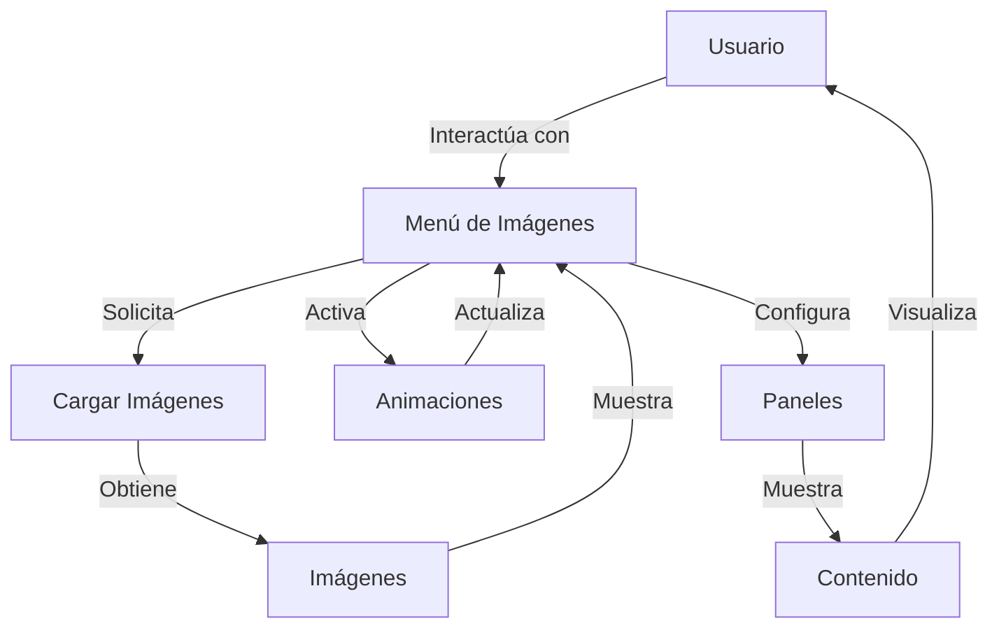

## Module: jquery-bgImageMenu.js

# Análisis Integral del Módulo jquery-bgImageMenu.js

## Nombre del Módulo/Componente SQL
**jquery-bgImageMenu.js** - Un plugin de jQuery para crear menús con imágenes de fondo.

## Objetivos Primarios
Este módulo es un plugin de jQuery diseñado para crear menús interactivos con imágenes de fondo. Su propósito principal es permitir la creación de interfaces de usuario donde los paneles de menú tienen imágenes de fondo que cambian dinámicamente con efectos de animación cuando el usuario interactúa con ellos.

## Funciones, Métodos y Consultas Críticas
- **bgImageMenu**: Método principal que inicializa el plugin.
- **init**: Configura el menú, inicializa los paneles y establece los eventos.
- **Funciones de animación**: Conjunto de métodos en el objeto `anim` que implementan diferentes tipos de animaciones:
  - `def`: Animación por defecto
  - `fade`: Desvanecimiento
  - `seqFade`: Desvanecimiento secuencial
  - `horizontalSlide`: Deslizamiento horizontal
  - `seqHorizontalSlide`: Deslizamiento horizontal secuencial
  - `verticalSlide`: Deslizamiento vertical
  - `seqVerticalSlide`: Deslizamiento vertical secuencial
  - `verticalSlideAlt`: Deslizamiento vertical alternativo
  - `seqVerticalSlideAlt`: Deslizamiento vertical alternativo secuencial

## Variables y Elementos Clave
- **settings**: Objeto de configuración con parámetros como:
  - `pos`: Posición del panel abierto por defecto
  - `width`: Ancho del contenedor
  - `height`: Altura del contenedor
  - `border`: Tamaño del borde/margen entre paneles
  - `menuSpeed`: Velocidad de expansión/colapso del menú
  - `type`: Configuración de animación (modo, velocidad, easing, factor secuencial)
- **$panels**: Elementos de panel del menú
- **$labels**: Etiquetas de los paneles
- **$content**: Contenido de los paneles
- **$panelBg**: Contenedores de imágenes de fondo
- **temp.current**: Índice del panel actual
- **temp.currentBgImage**: Imagen de fondo actual

## Interdependencias y Relaciones
- Depende de jQuery como biblioteca base
- Extiende la funcionalidad de jQuery mediante `$.fn.bgImageMenu`
- Utiliza el método `reverse` de Array para manipular elementos en orden inverso
- Interactúa con elementos DOM específicos con clases como `sbi_panel`, `sbi_label`, `sbi_content`, `sbi_panel_img`

## Operaciones Principales vs. Auxiliares
**Operaciones Principales**:
- Inicialización del menú con imágenes de fondo
- Manejo de eventos de ratón para mostrar/ocultar contenido
- Ejecución de animaciones al cambiar entre paneles

**Operaciones Auxiliares**:
- `preloadImages`: Precarga de imágenes para mejorar rendimiento
- `setPanelBackground`: Configuración de imágenes de fondo
- `setup`: Configuración inicial de dimensiones y estilos

## Secuencia Operacional/Flujo de Ejecución
1. Inicialización del plugin con opciones personalizadas
2. Precarga de imágenes de fondo
3. Configuración de paneles y contenedores
4. Establecimiento de eventos de ratón (mouseenter/mouseleave)
5. Al interactuar con una etiqueta:
   - Se detiene cualquier animación en curso
   - Se colapsa el contenido del panel actual
   - Se ejecuta la animación correspondiente para cambiar la imagen de fondo
   - Se expande el contenido del nuevo panel seleccionado
6. Al salir del menú, se restaura la imagen de fondo predeterminada si está configurada

## Aspectos de Rendimiento y Optimización
- Precarga de imágenes para evitar retrasos visuales
- Uso de `setTimeout` para controlar el tiempo de respuesta a eventos
- Verificación de animaciones en curso para evitar superposiciones
- Cálculo eficiente de dimensiones de paneles basado en el ancho total
- Posible mejora: Optimización de selectores jQuery para reducir búsquedas DOM repetitivas

## Reusabilidad y Adaptabilidad
- Alta reusabilidad gracias a la estructura de plugin de jQuery
- Altamente configurable mediante el objeto `settings`
- Múltiples tipos de animación que se pueden seleccionar sin modificar el código
- Parámetros ajustables para velocidad, timing y efectos visuales
- Puede adaptarse a diferentes tamaños y números de paneles

## Uso y Contexto
- Se utiliza para crear menús interactivos con efectos visuales en sitios web
- Implementación típica:
  ```javascript
  $('#menu').bgImageMenu({
    width: 900,
    height: 400,
    type: {
      mode: 'fade',
      speed: 500
    }
  });
  ```
- Requiere una estructura HTML específica con elementos `.sbi_panel`, `.sbi_label` y `.sbi_content`
- Cada panel debe tener un atributo `data-bg` con la URL de la imagen de fondo

## Suposiciones y Limitaciones
- Supone que jQuery está cargado en la página
- Requiere una estructura HTML específica para funcionar correctamente
- Depende de CSS para algunos aspectos visuales
- Las imágenes deben tener dimensiones adecuadas para el tamaño del contenedor
- Posible limitación de rendimiento con muchos paneles o imágenes grandes
- No está diseñado para ser responsive por defecto, requiere configuración adicional
- Asume que las imágenes están disponibles y accesibles en las rutas especificadas
## Flow Diagram [via mermaid]

