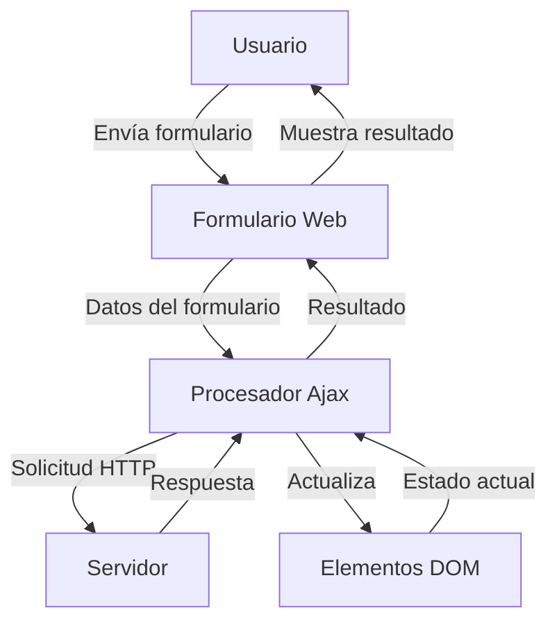

## Module: jquery-form.js

# Análisis Integral del Módulo jQuery Form Plugin

## Módulo/Componente SQL
**Nombre del Módulo**: jQuery Form Plugin (versión 2.63, 29-ENE-2011)

## Objetivos Primarios
Este plugin de jQuery está diseñado para facilitar el envío de formularios HTML mediante AJAX. Proporciona una capa de abstracción que permite enviar formularios de manera asíncrona sin necesidad de escribir código JavaScript personalizado para cada formulario. El objetivo principal es simplificar la interacción con formularios web, permitiendo envíos sin recargar la página completa.

## Funciones, Métodos y Consultas Críticas
- **ajaxSubmit()**: Función principal que envía un formulario mediante AJAX.
- **ajaxForm()**: Automatiza completamente el proceso de envío del formulario, vinculando eventos y manejando la coordinación.
- **formToArray()**: Convierte los elementos del formulario en un array de objetos con propiedades 'name' y 'value'.
- **formSerialize()**: Serializa los datos del formulario en un formato adecuado para envío.
- **fieldSerialize()**: Serializa elementos de campo específicos en formato de consulta.
- **fieldValue()**: Obtiene los valores de los elementos seleccionados.
- **clearForm()**, **clearFields()**, **resetForm()**: Funciones para manipular el estado de los formularios.
- **enable()**, **selected()**: Funciones auxiliares para manipular elementos de formulario.

## Variables y Elementos Clave
- **options**: Objeto de configuración que controla el comportamiento del envío AJAX.
- **$form**: Referencia jQuery al formulario que se está procesando.
- **xhr**: Objeto que simula XMLHttpRequest para manejar respuestas en modo iframe.
- **callbacks**: Array de funciones a ejecutar después del envío exitoso.
- **Elementos de formulario**: Inputs, selects, checkboxes, radios y otros elementos HTML que son procesados.

## Interdependencias y Relaciones
- Requiere jQuery v1.3.2 o superior.
- Interactúa con el sistema de eventos de jQuery para manejar envíos y clics.
- Se integra con el sistema AJAX de jQuery ($.ajax).
- Utiliza funciones de jQuery como $.param, $.merge, $.isFunction, etc.
- Interactúa con el DOM para manipular elementos de formulario y manejar respuestas.

## Operaciones Principales vs. Auxiliares
**Operaciones Principales**:
- Envío de formularios mediante AJAX (ajaxSubmit, ajaxForm)
- Serialización de datos de formulario (formToArray, formSerialize)

**Operaciones Auxiliares**:
- Manejo de eventos (submit, click)
- Validación y preprocesamiento de datos
- Gestión de carga de archivos mediante iframes
- Procesamiento de respuestas (XML, JSON, script)
- Funciones de utilidad para manipular formularios (clear, reset, enable)

## Secuencia Operacional/Flujo de Ejecución
1. El usuario inicia el envío del formulario (directamente o mediante ajaxForm).
2. Se capturan los eventos submit/click y se previene el comportamiento predeterminado.
3. Se recopilan y serializan los datos del formulario.
4. Se ejecutan callbacks de pre-envío (beforeSerialize, beforeSubmit).
5. Se determina si se debe usar un iframe (para carga de archivos) o AJAX estándar.
6. Se envían los datos al servidor.
7. Se procesa la respuesta según el tipo de datos especificado.
8. Se ejecutan callbacks de éxito/error/completo.
9. Se limpia el entorno (eliminación de iframes temporales, etc.).

## Aspectos de Rendimiento y Optimización
- Utiliza timeouts para operaciones asíncronas.
- Implementa detección de tiempo de espera para evitar bloqueos.
- Maneja casos especiales para diferentes navegadores (especialmente IE).
- Optimiza la creación y eliminación de iframes para cargas de archivos.
- Implementa verificaciones de DOM para asegurar que los elementos estén disponibles.

## Reusabilidad y Adaptabilidad
- Altamente parametrizable a través del objeto options.
- Puede ser aplicado a cualquier formulario HTML.
- Soporta múltiples tipos de datos de respuesta (HTML, XML, JSON, script).
- Permite personalización mediante callbacks en diferentes etapas del proceso.
- Funciona con formularios simples y complejos, incluyendo carga de archivos.

## Uso y Contexto
- Se utiliza en aplicaciones web para mejorar la experiencia del usuario al enviar formularios.
- Aplicable en situaciones donde se requiere envío de datos sin recargar la página.
- Útil para implementar interfaces de usuario dinámicas y responsivas.
- Comúnmente usado en paneles de administración, formularios de contacto, sistemas de login, etc.
- Se puede integrar con otros plugins de jQuery para crear experiencias de usuario avanzadas.

## Suposiciones y Limitaciones
**Suposiciones**:
- El navegador tiene JavaScript habilitado.
- jQuery está cargado en la página.
- Los formularios tienen una estructura HTML válida.

**Limitaciones**:
- No se debe usar ajaxSubmit y ajaxForm en el mismo formulario.
- Elementos con nombre o ID "submit" pueden causar problemas.
- Algunas funcionalidades pueden variar entre navegadores (especialmente en navegadores antiguos).
- El manejo de archivos requiere técnicas especiales (iframe) que tienen sus propias limitaciones.
- La depuración puede ser compleja debido a la naturaleza asíncrona de las operaciones.
## Flow Diagram [via mermaid]

