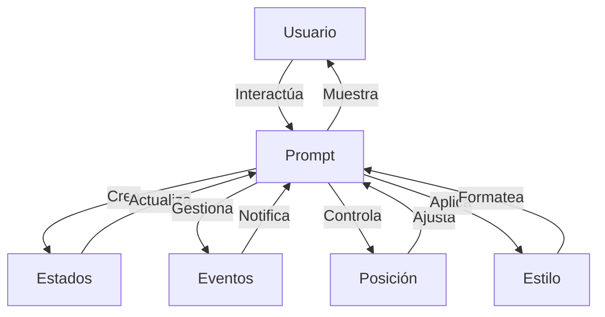

## Module: jquery-imprompt.js

# Análisis Integral del Módulo jQuery Impromptu

## Nombre del Componente
jQuery Impromptu (jquery-imprompt.js) - Versión 4.0.1

## Objetivos Primarios
Este módulo es un plugin de jQuery diseñado para crear diálogos modales interactivos (prompts) personalizables. Su propósito principal es facilitar la creación de interfaces de usuario para interacciones como alertas, confirmaciones y formularios modales, ofreciendo una alternativa más flexible y estéticamente agradable a los diálogos nativos del navegador.

## Funciones, Métodos y Consultas Críticas
- **$.prompt()**: Función principal que inicializa y muestra el diálogo modal.
- **$.prompt.position()**: Gestiona el posicionamiento del diálogo en la pantalla.
- **$.prompt.style()**: Aplica estilos CSS al diálogo.
- **$.prompt.close()**: Cierra el diálogo y ejecuta callbacks asociados.
- **$.prompt.goToState()**: Cambia entre diferentes estados del diálogo.
- **$.prompt.nextState()** y **$.prompt.prevState()**: Navegan entre estados secuenciales.
- **$.prompt.getStateContent()**, **$.prompt.getCurrentState()**, **$.prompt.getCurrentStateName()**: Funciones auxiliares para obtener información sobre estados.
- **$.fn.prompt**: Extensión de jQuery para invocar el plugin desde selectores jQuery.
- **$.fn.promptDropIn**: Efecto de animación para la entrada del diálogo.

## Variables y Elementos Clave
- **$.prompt.options**: Configuración del diálogo actual.
- **$.prompt.defaults**: Valores predeterminados para las opciones.
- **$.prompt.jqib**: Contenedor principal del diálogo.
- **$.prompt.jqi**: Elemento del diálogo interno.
- **$.prompt.jqif**: Elemento de fondo/overlay.
- **$.prompt.states**: Colección de estados del diálogo.
- **$.prompt.currentPrefix**: Prefijo CSS actual.
- **$.prompt.currentStateName**: Nombre del estado actual del diálogo.

## Interdependencias y Relaciones
- Depende de la biblioteca jQuery para su funcionamiento.
- Interactúa con el DOM para crear y manipular elementos HTML.
- Utiliza eventos de jQuery para manejar interacciones del usuario.
- Compatible con iframes para solucionar problemas en IE6 y con elementos select.
- Interactúa con el sistema de eventos del navegador para manejar teclas (Esc, Tab).

## Operaciones Core vs. Auxiliares
**Operaciones Core:**
- Creación y visualización del diálogo modal.
- Gestión de estados y transiciones entre ellos.
- Manejo de eventos de usuario (clics en botones, teclas).

**Operaciones Auxiliares:**
- Posicionamiento y estilizado del diálogo.
- Compatibilidad con navegadores antiguos (IE6).
- Validación y procesamiento de formularios dentro del diálogo.
- Animaciones y efectos visuales.

## Secuencia Operacional/Flujo de Ejecución
1. Inicialización del plugin con opciones personalizadas.
2. Creación de la estructura HTML del diálogo.
3. Configuración de estados y botones según los parámetros.
4. Aplicación de estilos y posicionamiento.
5. Registro de manejadores de eventos para interacciones.
6. Visualización del diálogo con animaciones.
7. Procesamiento de interacciones del usuario (cambios de estado, envío de formularios).
8. Cierre del diálogo y ejecución de callbacks.

## Aspectos de Rendimiento y Optimización
- Uso de caching de selectores jQuery para mejorar el rendimiento.
- Implementación de soluciones específicas para IE6 (uso de iframes).
- Posible sobrecarga en la manipulación del DOM al crear estructuras complejas.
- Potenciales problemas de rendimiento con múltiples diálogos o en dispositivos de bajo rendimiento.
- La animación y posicionamiento podrían optimizarse para reducir reflows.

## Reusabilidad y Adaptabilidad
- Alta reusabilidad gracias a la parametrización extensiva.
- Personalizable mediante opciones y CSS.
- Arquitectura basada en estados que permite diálogos complejos y flujos de trabajo.
- Extensible mediante callbacks en diferentes puntos del ciclo de vida.
- Permite la integración con otros plugins de jQuery y frameworks.

## Uso y Contexto
- Utilizado para reemplazar diálogos nativos del navegador con alternativas más atractivas y funcionales.
- Aplicable en formularios, confirmaciones, asistentes paso a paso y notificaciones.
- Ideal para aplicaciones web que requieren interacciones modales complejas.
- Se puede implementar en cualquier proyecto que utilice jQuery.

## Suposiciones y Limitaciones
- Asume la disponibilidad de jQuery en el proyecto.
- Requiere compatibilidad con CSS moderno para visualización óptima.
- Limitaciones de accesibilidad potenciales si no se implementa correctamente.
- Posibles conflictos con otros plugins que manipulan el z-index o crean overlays.
- Comportamiento no garantizado en dispositivos móviles antiguos o navegadores no estándar.
- La compatibilidad con IE6 sugiere que es un plugin relativamente antiguo que podría no seguir las mejores prácticas actuales.
## Flow Diagram [via mermaid]

