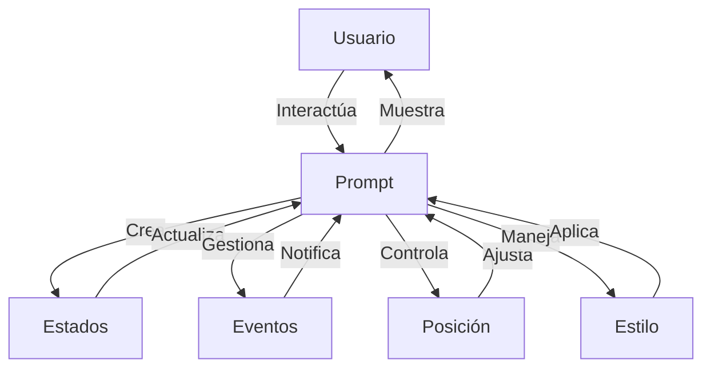

## Module: jquery-impromptu.4.0.min.js

# Análisis Integral del Módulo jQuery Impromptu

## Nombre del Componente
jQuery Impromptu (versión 4.0.1)

## Objetivos Primarios
Este módulo es una extensión de jQuery diseñada para crear diálogos modales interactivos (prompts) en páginas web. Su propósito principal es proporcionar una interfaz de usuario para mostrar mensajes, solicitar información o guiar al usuario a través de una serie de pasos o estados en forma de diálogos emergentes personalizables.

## Funciones, Métodos y Consultas Críticas
- **$.prompt()**: Función principal que inicializa y muestra el diálogo modal.
- **$.prompt.position()**: Posiciona el diálogo en la pantalla.
- **$.prompt.style()**: Aplica estilos CSS al diálogo.
- **$.prompt.close()**: Cierra el diálogo y ejecuta callbacks asociados.
- **$.prompt.goToState()**: Cambia entre diferentes estados del diálogo.
- **$.prompt.nextState()** y **$.prompt.prevState()**: Navegan entre estados secuenciales.
- **$.prompt.getStateContent()**, **$.prompt.getCurrentState()**, **$.prompt.getCurrentStateName()**: Métodos para obtener información sobre estados.
- **$.fn.prompt**: Extensión de jQuery para inicializar un prompt desde contenido HTML existente.
- **$.fn.promptDropIn**: Efecto de animación para la entrada del diálogo.

## Variables y Elementos Clave
- **$.prompt.options**: Configuración del diálogo actual.
- **$.prompt.defaults**: Valores predeterminados para las opciones.
- **$.prompt.jqib**: Contenedor principal del diálogo.
- **$.prompt.jqi**: Elemento del diálogo interno.
- **$.prompt.jqif**: Elemento de fondo/overlay.
- **$.prompt.states**: Colección de estados del diálogo.
- **$.prompt.currentPrefix**: Prefijo CSS actual.
- **$.prompt.currentStateName**: Nombre del estado actual.

## Interdependencias y Relaciones
- Depende de la biblioteca jQuery principal.
- Interactúa con el DOM para crear y manipular elementos HTML.
- Utiliza eventos de jQuery para manejar interacciones del usuario.
- Detecta y se adapta a Internet Explorer 6 con soluciones específicas.
- Interactúa con elementos `<select>` en IE6 para evitar problemas de visualización.

## Operaciones Core vs. Auxiliares
**Operaciones Core:**
- Creación y visualización del diálogo modal.
- Manejo de estados y transiciones entre ellos.
- Procesamiento de entradas del usuario y ejecución de callbacks.

**Operaciones Auxiliares:**
- Posicionamiento y estilizado del diálogo.
- Manejo de eventos de teclado (Esc, Tab).
- Compatibilidad con navegadores antiguos.
- Animaciones y efectos visuales.
- Validaciones y manejo de persistencia.

## Secuencia Operacional/Flujo de Ejecución
1. Inicialización del diálogo mediante `$.prompt()`.
2. Configuración de opciones y estados.
3. Creación de elementos HTML para el diálogo.
4. Aplicación de estilos y posicionamiento.
5. Vinculación de eventos (clic, teclado).
6. Visualización del diá
## Flow Diagram [via mermaid]

