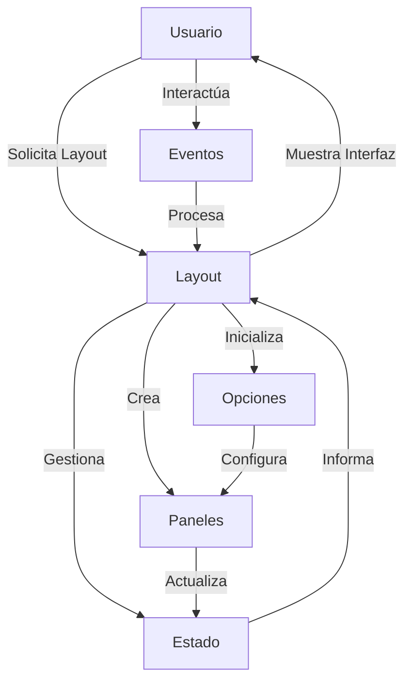

## Module: jquery-layout.js

# Análisis Integral del Módulo jquery-layout.js

## Nombre del Módulo/Componente SQL
**jquery-layout.js** - Plugin de jQuery para crear diseños de interfaz de usuario con paneles redimensionables.

## Objetivos Primarios
Este módulo proporciona una solución completa para crear interfaces de usuario con múltiples paneles (norte, sur, este, oeste y centro) que pueden ser redimensionados, abiertos, cerrados, ocultados y personalizados. Permite crear diseños complejos de tipo "dashboard" con paneles que pueden contener cualquier tipo de contenido HTML, incluyendo iframes, formularios y otros elementos interactivos.

## Funciones, Métodos y Consultas Críticas
- **$.layout()**: Método principal que inicializa el layout en un contenedor.
- **open()**, **close()**, **toggle()**: Métodos para controlar la visibilidad de los paneles.
- **sizePane()**, **resizeAll()**: Métodos para redimensionar paneles.
- **addPane()**, **removePane()**: Métodos para agregar o eliminar paneles dinámicamente.
- **initContent()**: Inicializa el contenido de un panel.
- **createChildLayout()**: Crea layouts anidados dentro de paneles.
- **state management**: Funcionalidad para guardar y restaurar el estado del layout (tamaños, visibilidad).

## Variables y Elementos Clave
- **options**: Objeto de configuración que define el comportamiento del layout.
- **state**: Objeto que mantiene el estado actual de cada panel y del layout.
- **$Ps**: Colección de elementos jQuery que representan los paneles.
- **$Rs**: Colección de elementos jQuery que representan los redimensionadores.
- **$Ts**: Colección de elementos jQuery que representan los botones de alternar.
- **_c**: Configuración interna con constantes y valores predeterminados.

## Interdependencias y Relaciones
- **jQuery UI**: Depende de jQuery y opcionalmente de jQuery UI para funcionalidades como arrastrar y soltar.
- **Plugins internos**: Incluye varios plugins integrados:
  - **stateManagement**: Para guardar/restaurar el estado del layout.
  - **buttons**: Para crear botones personalizados que controlan el layout.
  - **browserZoom**: Para manejar el zoom del navegador.
- **Eventos**: Utiliza un sistema de eventos para comunicarse con otros componentes.

## Operaciones Core vs. Auxiliares
**Core**:
- Inicialización del layout y paneles
- Redimensionamiento y posicionamiento de paneles
- Manejo de eventos de usuario (arrastrar, clic)
- Gestión del estado de los paneles

**Auxiliares**:
- Manejo de cookies para persistencia
- Funciones de utilidad para cálculos de tamaño
- Validación de opciones
- Manejo de compatibilidad entre navegadores

## Secuencia de Ejecución
1. **Inicialización**: Se crea el layout, se procesan las opciones y se inicializan los contenedores.
2. **Creación de paneles**: Se crean los paneles según la configuración.
3. **Inicialización de manejadores**: Se configuran los redimensionadores y botones.
4. **Aplicación de estado inicial**: Se aplican tamaños y estados iniciales.
5. **Enlace de eventos**: Se conectan eventos de usuario para interacción.
6. **Ciclo de vida**: El layout responde a eventos como redimensionamiento, apertura/cierre de paneles.

## Aspectos de Rendimiento y Optimización
- **Caching de elementos DOM**: Almacena referencias a elementos para evitar búsquedas repetidas.
- **Throttling de eventos**: Limita la frecuencia de respuesta a eventos como redimensionamiento de ventana.
- **Cálculos eficientes de tamaño**: Optimiza los cálculos de dimensiones para evitar reflows innecesarios.
- **Lazy initialization**: Permite inicializar componentes solo cuando son necesarios.
- **Manejo de iframes**: Incluye optimizaciones específicas para trabajar con iframes.

## Reusabilidad y Adaptabilidad
- **Altamente configurable**: Ofrece numerosas opciones para personalizar el comportamiento.
- **API pública**: Proporciona métodos para controlar el layout programáticamente.
- **Eventos personalizables**: Permite definir callbacks para diversos eventos.
- **Layouts anidados**: Soporta la creación de layouts dentro de paneles para estructuras complejas.
- **Temas**: Compatible con temas de jQuery UI y CSS personalizado.

## Uso y Contexto
Este módulo se utiliza para crear interfaces de usuario complejas con múltiples secciones redimensionables, como:
- Aplicaciones de administración
- Dashboards
- Editores de código
- Interfaces de monitoreo
- Aplicaciones que requieren múltiples vistas simultáneas

## Suposiciones y Limitaciones
- **Suposiciones**:
  - El contenedor debe tener un tamaño definido o ser visible al inicializar.
  - Se asume que jQuery está disponible globalmente.
  - Los paneles deben seguir una estructura específica de HTML.

- **Limitaciones**:
  - Problemas de rendimiento con muchos layouts anidados.
  - Algunas funcionalidades dependen de características específicas de navegadores.
  - Complejidad para integrarse con frameworks modernos como React o Vue.
  - El manejo de eventos táctiles para dispositivos móviles es limitado.
  - La personalización avanzada puede requerir modificaciones del código fuente.
## Flow Diagram [via mermaid]

