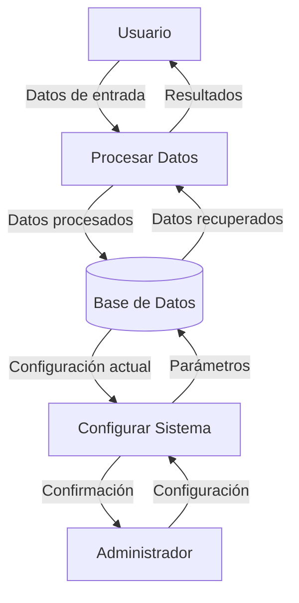

## Module: jquery-ui.js

# Análisis Completo del Módulo jQuery UI

## Nombre del Módulo/Componente SQL
jQuery UI versión 1.8.21

## Objetivos Primarios
Este módulo es una biblioteca de interfaz de usuario construida sobre jQuery que proporciona un conjunto de interacciones, widgets, efectos y temas para crear interfaces web interactivas y responsivas. Su propósito principal es facilitar la creación de interfaces de usuario ricas y consistentes con comportamientos complejos como arrastrar y soltar, redimensionar, seleccionar y ordenar elementos.

## Funciones, Métodos y Consultas Críticas
- **Core UI**: Proporciona funcionalidades básicas como manejo de posición, z-index y selección.
- **Widget**: Framework para crear widgets reutilizables con estado y opciones configurables.
- **Mouse**: Base para interacciones basadas en ratón como draggable, droppable, etc.
- **Position**: Posicionamiento preciso de elementos relativos a otros elementos.
- **Interacciones**: 
  - Draggable: Permite arrastrar elementos.
  - Droppable: Define áreas donde se pueden soltar elementos arrastrados.
  - Resizable: Permite redimensionar elementos.
  - Selectable: Permite seleccionar elementos individuales o múltiples.
  - Sortable: Permite reordenar elementos mediante arrastre.
- **Widgets**:
  - Accordion: Paneles colapsables.
  - Autocomplete: Sugerencias de texto mientras se escribe.
  - Button: Botones estilizados y consistentes.
  - Dialog: Ventanas de diálogo modal o no modal.
  - Slider: Control deslizante para seleccionar valores.
  - Tabs: Organización de contenido en pestañas.
  - Datepicker: Selector de fechas.
  - Progressbar: Barra de progreso.
- **Efectos**: Animaciones como fade, slide, bounce, highlight, etc.

## Variables y Elementos Clave
- **$.ui**: Namespace principal para todas las funcionalidades de jQuery UI.
- **$.Widget**: Constructor base para todos los widgets.
- **$.ui.mouse**: Base para interacciones basadas en ratón.
- **Opciones de configuración**: Cada componente tiene un conjunto de opciones configurables.
- **Eventos**: Sistema de eventos para notificar cambios (ej. dragstart, dragstop, select).
- **Callbacks**: Funciones que se ejecutan en respuesta a acciones del usuario.

## Interdependencias y Relaciones
- Depende de jQuery core como base.
- Estructura jerárquica donde los componentes más complejos dependen de los más básicos:
  - Widget depende de core.
  - Las interacciones dependen de mouse y widget.
  - Los widgets complejos pueden depender de position y otros componentes.
- Los efectos pueden ser utilizados independientemente o en combinación con widgets.
- Muchos componentes pueden interactuar entre sí (ej. draggable con droppable).

## Operaciones Core vs. Auxiliares
- **Core**: 
  - Manejo de eventos de ratón y teclado.
  - Sistema de widgets y opciones.
  - Posicionamiento y dimensionamiento.
- **Auxiliares**:
  - Efectos visuales y animaciones.
  - Helpers para crear wrappers y manejar CSS.
  - Funciones de utilidad para cálculos y validaciones.

## Secuencia Operacional/Flujo de Ejecución
1. Inicialización: Se cargan los componentes y se establecen las opciones predeterminadas.
2. Creación de widgets: Se transforman elementos DOM en widgets interactivos.
3. Manejo de eventos: Se registran listeners para eventos de usuario.
4. Respuesta a interacciones: Se ejecutan callbacks y se actualizan estados.
5. Animaciones y efectos: Se aplican cuando es necesario.
6. Limpieza: Los métodos destroy liberan recursos cuando los componentes ya no son necesarios.

## Aspectos de Rendimiento y Optimización
- Uso de caché para elementos DOM frecuentemente accedidos.
- Delegación de eventos para mejorar el rendimiento.
- Optimizaciones para cálculos de posición y dimensiones.
- Posibles cuellos de botella en operaciones intensivas como sortable con muchos elementos.
- Uso de requestAnimationFrame para animaciones más fluidas en versiones posteriores.

## Reusabilidad y Adaptabilidad
- Altamente configurable a través de opciones.
- API consistente entre componentes.
- Tematizable mediante ThemeRoller.
- Extensible mediante el patrón de plugin de jQuery.
- Métodos públicos para interactuar programáticamente con los widgets.

## Uso y Contexto
- Utilizado para crear interfaces web interactivas y responsivas.
- Común en aplicaciones web empresariales y dashboards.
- Puede ser utilizado en conjunto con frameworks MVC o como solución independiente.
- Ideal para prototipado rápido y desarrollo de interfaces consistentes.

## Suposiciones y Limitaciones
- Asume que jQuery core está cargado.
- Algunas funcionalidades pueden tener problemas de compatibilidad con dispositivos táctiles.
- El tamaño del archivo puede ser considerable si se incluyen todos los componentes.
- Algunas animaciones pueden ser lentas en dispositivos de bajo rendimiento.
- Diseñado principalmente para navegadores de escritorio, aunque incluye soporte básico para móviles.
- Versión 1.8.21 es antigua y puede tener problemas de compatibilidad con navegadores modernos.
## Flow Diagram [via mermaid]

