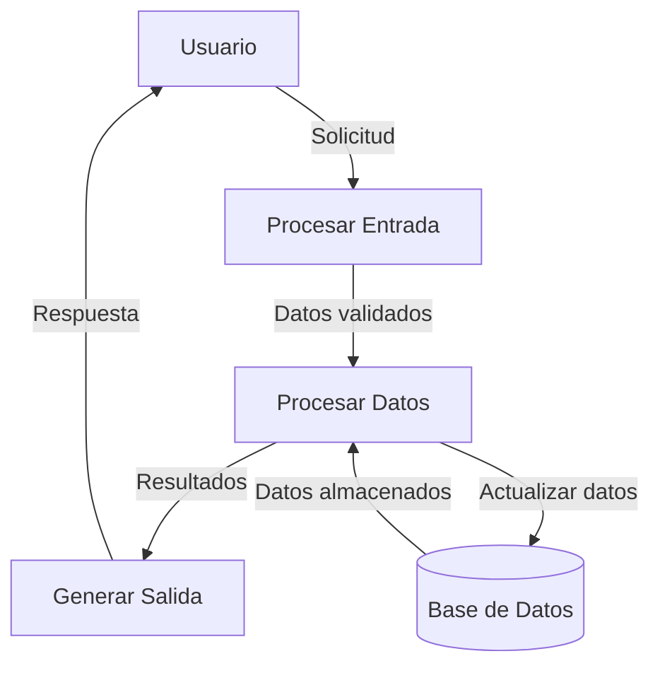
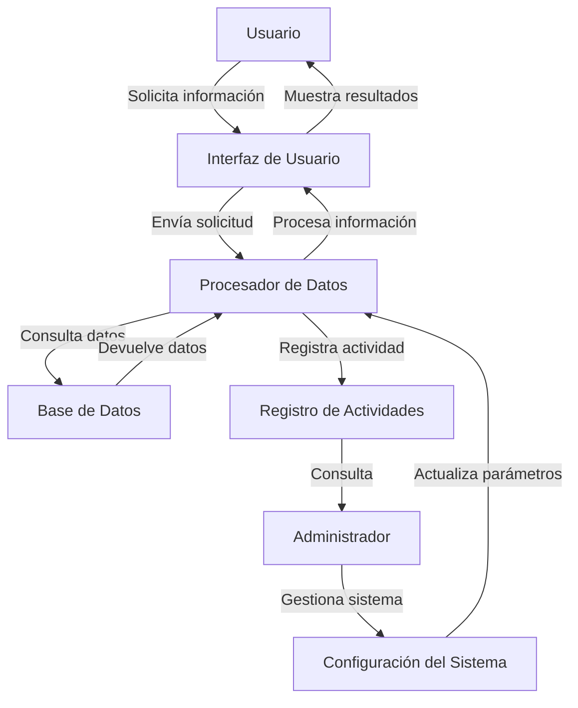
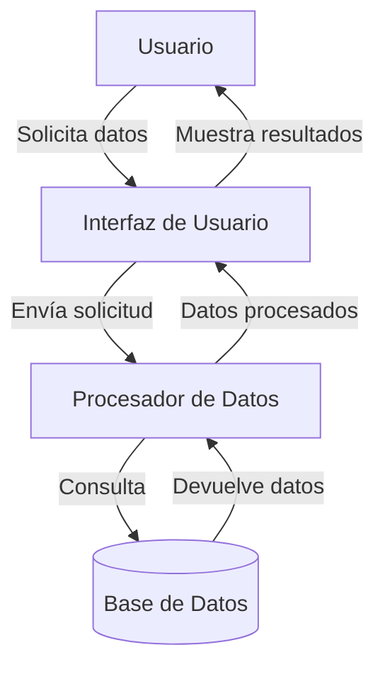

## Module: jquery-ui.min.js

# Análisis Completo del Módulo jQuery UI

## Nombre del Módulo/Componente SQL
jQuery UI versión 1.11.4 (jquery-ui.min.js)

## Objetivos Primarios
Este módulo es una biblioteca de interfaz de usuario construida sobre jQuery que proporciona un conjunto de interacciones, efectos, widgets y temas para crear interfaces web interactivas y responsivas. Su objetivo principal es facilitar la creación de interfaces de usuario ricas y consistentes mediante componentes predefinidos y personalizables.

## Funciones, Métodos y Consultas Críticas
- **Widgets principales**: Accordion, Autocomplete, Button, Datepicker, Dialog, Menu, Progressbar, Selectmenu, Slider, Sortable, Spinner, Tabs, Tooltip
- **Interacciones**: Draggable, Droppable, Resizable, Selectable, Sortable
- **Efectos visuales**: Blind, Bounce, Clip, Drop, Explode, Fade, Fold, Highlight, Puff, Pulsate, Scale, Shake, Slide, Transfer
- **Utilidades**: Position, Widget Factory (para crear widgets personalizados)

## Variables y Elementos Clave
- **Namespace principal**: `$.ui` (extensión del namespace jQuery)
- **Métodos de utilidad**: `$.widget()` (para crear widgets)
- **Objetos clave**: `e.ui.keyCode` (códigos de teclado), `e.ui.mouse` (base para interacciones con ratón)
- **Opciones de configuración**: Cada widget tiene su propio conjunto de opciones configurables (como `show`, `hide`, `disabled`, etc.)

## Interdependencias y Relaciones
- **Dependencia principal**: jQuery core (requiere jQuery para funcionar)
- **Relaciones internas**: Muchos widgets dependen de componentes base como Widget Factory, Mouse, Position
- **Herencia**: Widgets como Draggable, Resizable heredan de la clase base Mouse
- **Interoperabilidad**: Componentes como Draggable y Droppable están diseñados para trabajar juntos

## Operaciones Principales vs. Auxiliares
- **Operaciones principales**: Renderizado y comportamiento de widgets, manejo de eventos de usuario, animaciones
- **Operaciones auxiliares**: Cálculos de posición, validación de opciones, normalización de datos, manejo de temas visuales

## Secuencia Operativa/Flujo de Ejecución
1. Inicialización de la biblioteca al cargar
2. Registro de widgets, efectos e interacciones
3. Creación de instancias de widgets cuando se invocan (ej. `$('#elemento').datepicker()`)
4. Configuración de opciones y estado inicial
5. Manejo de eventos de usuario (clic, arrastre, etc.)
6. Actualización del DOM según las interacciones
7. Limpieza y destrucción de widgets cuando se solicita

## Aspectos de Rendimiento y Optimización
- Uso de delegación de eventos para mejorar el rendimiento
- Carga diferida de componentes visuales
- Reutilización de elementos DOM cuando es posible
- Minimización de reflows y repaints mediante manipulación eficiente del DOM
- Posibles cuellos de botella en widgets complejos como Datepicker o Dialog con muchas opciones

## Reutilización y Adaptabilidad
- Alta modularidad: cada componente puede usarse independientemente
- Personalización mediante opciones y métodos
- Extensibilidad a través del sistema de plugins
- Tematización mediante CSS (ThemeRoller)
- API consistente entre widgets para facilitar el aprendizaje

## Uso y Contexto
- Desarrollo de aplicaciones web interactivas
- Mejora de formularios y controles de interfaz de usuario
- Implementación de funcionalidades como arrastrar y soltar, ordenamiento, selección
- Creación de interfaces consistentes entre navegadores
- Aplicaciones típicas: paneles de administración, dashboards, formularios avanzados

## Suposiciones y Limitaciones
- **Suposiciones**: 
  - Disponibilidad de jQuery en la versión compatible
  - Navegadores modernos con soporte para CSS y JavaScript
  - DOM completamente cargado antes de inicializar componentes
  
- **Limitaciones**:
  - Tamaño del archivo (puede afectar el tiempo de carga)
  - Posibles conflictos con otras bibliotecas que modifiquen el DOM
  - Rendimiento en dispositivos móviles puede ser inferior al óptimo
  - Versión 1.11.4 no incluye las últimas características de accesibilidad
  - Algunos componentes pueden requerir ajustes adicionales para ser totalmente responsivos
## Flow Diagram [via mermaid]

## Module: jquery-ui.min.js

# Análisis Completo del Módulo jQuery UI

## Nombre del Componente
jQuery UI (versión 1.11.4)

## Objetivos Primarios
jQuery UI es una biblioteca de interfaz de usuario construida sobre jQuery que proporciona un conjunto de interacciones, efectos, widgets y temas para crear aplicaciones web interactivas. Su objetivo principal es facilitar la creación de interfaces de usuario ricas y responsivas mediante componentes predefinidos y personalizables.

## Funciones, Métodos y Consultas Críticas
- **Widgets principales**: Accordion, Autocomplete, Button, Datepicker, Dialog, Menu, Progressbar, Selectmenu, Slider, Sortable, Spinner, Tabs, Tooltip
- **Interacciones**: Draggable, Droppable, Resizable, Selectable, Sortable
- **Efectos visuales**: Blind, Bounce, Clip, Drop, Explode, Fade, Fold, Highlight, Puff, Pulsate, Scale, Shake, Slide, Transfer
- **Utilidades**: Position, Widget Factory (para crear widgets personalizados)

## Variables y Elementos Clave
- **Namespace principal**: `$.ui` - Contiene todos los componentes y utilidades
- **Widget Factory**: Sistema para crear widgets con estado y opciones configurables
- **Eventos**: Sistema de eventos personalizado para cada widget (ej: `open`, `close`, `change`)
- **Opciones**: Cada widget tiene un conjunto de opciones configurables mediante objetos JSON
- **Elementos DOM**: Manipulación y creación dinámica de elementos HTML para construir interfaces

## Interdependencias y Relaciones
- **Dependencia de jQuery**: Requiere jQuery como base
- **Arquitectura modular**: Los componentes pueden utilizarse independientemente
- **Sistema de temas**: Integración con ThemeRoller para estilos consistentes
- **Interrelación entre widgets**: Algunos widgets pueden interactuar entre sí (ej: Draggable con Droppable)
- **Extensibilidad**: Mecanismos para extender widgets existentes o crear nuevos

## Operaciones Principales vs. Auxiliares
- **Operaciones principales**:
  - Creación y gestión de widgets de interfaz de usuario
  - Manejo de interacciones de arrastrar y soltar
  - Efectos visuales y animaciones
  - Posicionamiento de elementos

- **Operaciones auxiliares**:
  - Normalización entre navegadores
  - Gestión de eventos
  - Utilidades de dimensionamiento y posicionamiento
  - Funciones de ayuda para manipulación DOM

## Secuencia de Ejecución
1. Inicialización de la biblioteca mediante IIFE (Immediately Invoked Function Expression)
2. Definición del namespace `$.ui` y extensión de jQuery
3. Implementación del Widget Factory como base para todos los widgets
4. Definición de cada widget con su lógica específica
5. Cada widget sigue un ciclo de vida: creación, inicialización, interacción, destrucción
6. Sistema de eventos para manejar interacciones del usuario

## Aspectos de Rendimiento y Optimización
- **Minificación**: El código está minificado para reducir el tamaño de descarga
- **Modularidad**: Permite cargar solo los componentes necesarios
- **Reutilización de código**: Patrones comunes extraídos a funciones auxiliares
- **Gestión eficiente de eventos**: Delegación de eventos para mejorar el rendimiento
- **Optimizaciones de renderizado**: Minimización de reflows y repaints en animaciones

## Reutilización y Adaptabilidad
- **Configuración mediante opciones**: Cada widget acepta un objeto de opciones para personalización
- **API pública documentada**: Métodos expuestos para interactuar con los widgets
- **Extensibilidad**: Sistema de plugins para extender la funcionalidad
- **Tematización**: Soporte para cambiar la apariencia visual sin modificar el código
- **Compatibilidad entre versiones**: Mantenimiento de API consistente entre versiones

## Uso y Contexto
- **Aplicaciones web interactivas**: Ideal para crear interfaces de usuario ricas
- **Formularios avanzados**: Widgets como Datepicker, Autocomplete, Slider mejoran la experiencia de usuario
- **Interfaces de administración**: Componentes como Tabs, Accordion y Dialog son útiles para paneles de control
- **Aplicaciones de arrastrar y soltar**: Draggable, Droppable y Sortable facilitan estas interacciones
- **Visualización de datos**: Progressbar y otros widgets ayudan a representar información

## Suposiciones y Limitaciones
- **Suposiciones**:
  - Presencia de jQuery en la página
  - Compatibilidad con navegadores modernos
  - DOM completamente cargado antes de inicializar widgets
  - Estructura HTML adecuada para cada widget

- **Limitaciones**:
  - Mayor peso de descarga comparado con soluciones más modernas
  - Dependencia de jQuery limita su uso en frameworks modernos
  - Rendimiento puede degradarse en dispositivos móviles con muchos widgets
  - Algunas funcionalidades requieren polyfills para navegadores antiguos
  - No está optimizado para aplicaciones de una sola página (SPA) modernas
## Flow Diagram [via mermaid]

## Module: jquery-ui.min.js

# Análisis Completo del Módulo jQuery UI

## Nombre del Módulo/Componente SQL
jQuery UI versión 1.11.4 (jquery-ui.min.js)

## Objetivos Primarios
Este módulo es una biblioteca de interfaz de usuario construida sobre jQuery que proporciona un conjunto de interacciones, efectos, widgets y temas para crear aplicaciones web interactivas. Su objetivo principal es ofrecer componentes de interfaz de usuario consistentes y personalizables que mejoran la experiencia del usuario mediante interacciones ricas y efectos visuales.

## Funciones, Métodos y Consultas Críticas
- **Widgets principales**: 
  - Accordion: para crear paneles plegables
  - Autocomplete: para sugerencias de texto durante la escritura
  - Button: para crear botones estilizados
  - Datepicker: para selección de fechas
  - Dialog: para ventanas modales
  - Tabs: para organizar contenido en pestañas
  - Slider: para selección de valores numéricos
  - Sortable: para listas ordenables mediante arrastrar y soltar

- **Interacciones clave**:
  - Draggable: permite arrastrar elementos
  - Droppable: permite soltar elementos arrastrados
  - Resizable: permite redimensionar elementos
  - Selectable: permite seleccionar elementos de una lista
  - Sortable: permite reordenar elementos mediante arrastre

- **Efectos visuales**:
  - Efectos básicos: show, hide, toggle
  - Efectos avanzados: blind, bounce, clip, drop, explode, fade, fold, highlight, puff, pulsate, scale, shake, slide, transfer

## Variables y Elementos Clave
- **Objetos principales**:
  - `e.ui`: Namespace principal para todos los componentes de jQuery UI
  - `e.widget`: Factoría para crear widgets
  - `e.effects`: Controlador de efectos visuales

- **Parámetros comunes**:
  - `options`: Configuración personalizable para cada widget
  - `element`: Elemento DOM al que se aplica el widget
  - `instance`: Instancia del widget
  - `event`: Objeto de evento para manejadores de eventos

## Interdependencias y Relaciones
- Depende de jQuery como biblioteca base
- Arquitectura modular donde cada componente puede utilizarse independientemente
- Sistema de herencia entre widgets mediante `e.widget`
- Sistema de eventos para comunicación entre componentes
- Integración con el sistema de temas de jQuery UI (aunque no está explícitamente en este archivo)
- Relaciones entre componentes interactivos (por ejemplo, Draggable y Droppable funcionan juntos)

## Operaciones Principales vs. Auxiliares
- **Operaciones principales**:
  - Inicialización de widgets (`_create`, `_init`)
  - Renderizado de componentes de UI
  - Manejo de interacciones del usuario
  - Aplicación de efectos visuales

- **Operaciones auxiliares**:
  - Cálculos de posicionamiento (`position`)
  - Validación de entrada de usuario
  - Manejo de eventos del DOM
  - Utilidades para manipulación de CSS y atributos
  - Funciones de ayuda para animaciones

## Secuencia Operativa/Flujo de Ejecución
1. Inicialización de la biblioteca mediante patrón IIFE (Immediately Invoked Function Expression)
2. Definición del namespace `e.ui` y extensiones básicas de jQuery
3. Creación del framework de widgets mediante `e.widget`
4. Definición de cada widget con su ciclo de vida:
   - Creación (`_create`)
   - Inicialización (`_init`)
   - Configuración de opciones (`_setOption`)
   - Renderizado de UI
   - Vinculación de eventos
   - Destrucción (`_destroy`)
5. Manejo de interacciones del usuario mediante eventos
6. Aplicación de efectos visuales cuando sea necesario

## Aspectos de Rendimiento y Optimización
- Código minificado para reducir el tamaño de descarga
- Uso de delegación de eventos para mejorar el rendimiento
- Reutilización de objetos para minimizar la creación de nuevas instancias
- Caching de selectores y elementos DOM frecuentemente utilizados
- Optimización de animaciones mediante requestAnimationFrame (implícito)
- Posibles cuellos de botella en operaciones intensivas como arrastrar elementos en listas grandes o aplicar efectos complejos

## Reusabilidad y Adaptabilidad
- Alta reusabilidad gracias a su diseño modular
- Personalización mediante el sistema de opciones de cada widget
- Extensibilidad a través del sistema de herencia de widgets
- Adaptabilidad a diferentes contextos mediante eventos y callbacks
- Posibilidad de crear temas personalizados (aunque no está incluido en este archivo)
- API consistente entre componentes facilita el aprendizaje y uso

## Uso y Contexto
- Se utiliza en aplicaciones web para crear interfaces de usuario ricas e interactivas
- Implementación común en formularios, paneles de administración, dashboards y aplicaciones empresariales
- Se integra con frameworks MVC como complemento para la capa de vista
- Puede utilizarse tanto en aplicaciones de una sola página (SPA) como en sitios web tradicionales
- Contextos típicos: selección de fechas, diálogos modales, organización de contenido en pestañas, arrastrar y soltar elementos

## Suposiciones y Limitaciones
- **Suposiciones**:
  - jQuery está cargado antes que jQuery UI
  - El DOM está completamente cargado antes de inicializar los widgets
  - El navegador soporta CSS3 y JavaScript moderno
  - Los elementos DOM existen antes de aplicar los widgets

- **Limitaciones**:
  - Dependencia de jQuery limita su uso en proyectos modernos basados en frameworks como React o Vue
  - Tamaño considerable del archivo puede afectar el tiempo de carga
  - Algunos componentes pueden tener problemas de rendimiento en dispositivos móviles
  - Versión 1.11.4 es relativamente antigua (2015) y puede no ser compatible con las últimas prácticas web
  - No está optimizado para aplicaciones con alta densidad de componentes interactivos
## Flow Diagram [via mermaid]

