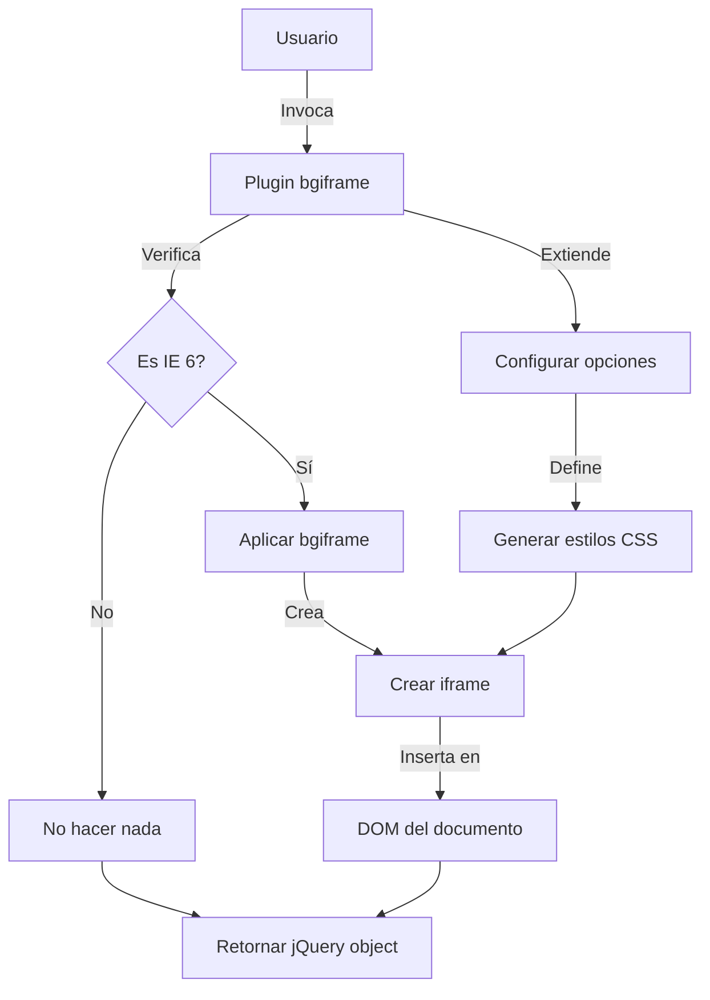

## Module: jquery.bgiframe-2.1.3-pre.js

# Análisis Integral del Módulo jQuery.bgiframe

## Nombre del Módulo/Componente SQL
**jquery.bgiframe-2.1.3-pre.js** - Un plugin de jQuery

## Objetivos Primarios
Este módulo es un plugin de jQuery diseñado específicamente para solucionar un problema de visualización en Internet Explorer 6, donde ciertos elementos HTML (como selectores desplegables) aparecen por encima de elementos con posicionamiento absoluto. El plugin resuelve este problema mediante la inserción de un iframe transparente detrás de los elementos seleccionados.

## Funciones, Métodos y Consultas Críticas
- **$.fn.bgiframe**: La función principal que implementa la solución para IE6, añadiendo un iframe invisible detrás de los elementos seleccionados.
- **$.fn.bgIframe**: Un alias antiguo para mantener compatibilidad con versiones anteriores del plugin.
- **prop()**: Función auxiliar que formatea valores numéricos añadiendo 'px' cuando es necesario.

## Variables y Elementos Clave
- **s**: Objeto de configuración que contiene parámetros como:
  - **top**: Posición superior del iframe
  - **left**: Posición izquierda del iframe
  - **width**: Ancho del iframe
  - **height**: Alto del iframe
  - **opacity**: Control de transparencia
  - **src**: URL fuente del iframe (por defecto "javascript:false;")

## Interdependencias y Relaciones
- Depende de la biblioteca jQuery (se implementa como un plugin de jQuery)
- Interactúa con el DOM para insertar iframes
- Utiliza `$.browser.msie` para detectar Internet Explorer
- Se integra con el sistema de estilos CSS del navegador

## Operaciones Principales vs. Auxiliares
**Operaciones Principales:**
- Detección de IE6 y aplicación condicional de la solución
- Creación e inserción del iframe con los estilos apropiados

**Operaciones Auxiliares:**
- Formateo de valores numéricos (función prop)
- Verificación de la existencia previa del iframe para evitar duplicados

## Secuencia Operacional/Flujo de Ejecución
1. Se verifica si el navegador es Internet Explorer 6
2. Si es IE6, se extienden las opciones predeterminadas con las proporcionadas por el usuario
3. Se genera el HTML para el iframe con los estilos necesarios
4. Para cada elemento seleccionado, se verifica si ya tiene un iframe
5. Si no tiene iframe, se inserta uno como primer hijo del elemento
6. Si no es IE6, simplemente devuelve la selección sin modificar

## Aspectos de Rendimiento y Optimización
- El plugin solo se activa en IE6, evitando sobrecarga innecesaria en navegadores modernos
- Utiliza expresiones CSS para dimensionar dinámicamente el iframe según el elemento padre
- Verifica la existencia previa del iframe para evitar inserciones duplicadas
- Utiliza un iframe con src="javascript:false;" para minimizar la carga de recursos

## Reusabilidad y Adaptabilidad
- Altamente reutilizable como plugin de jQuery
- Permite personalización mediante parámetros (top, left, width, height, opacity, src)
- Mantiene compatibilidad con versiones anteriores mediante el alias bgIframe
- Diseño modular que sigue las convenciones de plugins de jQuery

## Uso y Contexto
Este plugin se utiliza típicamente en aplicaciones web que necesitan soporte para IE6, especialmente cuando:
- Se utilizan menús desplegables o elementos flotantes
- Hay elementos con posicionamiento absoluto que pueden superponerse
- Se requiere compatibilidad con navegadores antiguos

Ejemplo de uso:
```javascript
$('#elementoProblematico').bgiframe();
// O con opciones personalizadas
$('#elementoProblematico').bgiframe({opacity: false, width: 500});
```

## Suposiciones y Limitaciones
**Suposiciones:**
- Se asume que jQuery está cargado antes de este plugin
- Se espera que $.browser.msie esté disponible para la detección de IE

**Limitaciones:**
- Solución específica para IE6, innecesaria en navegadores modernos
- Depende de expresiones CSS que están obsoletas en estándares web actuales
- Puede causar un ligero aumento en el consumo de memoria al crear iframes adicionales
- No resuelve todos los problemas de visualización en IE6, solo el problema específico de superposición
## Flow Diagram [via mermaid]

