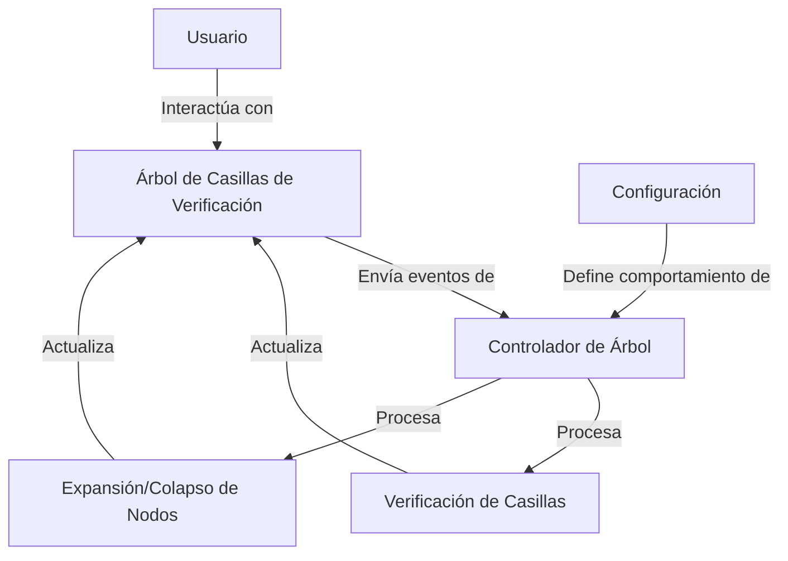

## Module: jquery.checkboxtree.js

# Análisis Integral del Módulo jquery.checkboxtree.js

## Nombre del Componente
**jquery.checkboxtree.js** - Plugin de jQuery para la implementación de árboles de casillas de verificación (checkboxes).

## Objetivos Primarios
Este módulo es un widget de jQuery UI que permite crear y gestionar árboles jerárquicos de casillas de verificación. Su propósito principal es proporcionar una interfaz interactiva para la selección de elementos organizados jerárquicamente, con capacidades de expansión/colapso y comportamientos personalizables para la selección/deselección de nodos.

## Funciones, Métodos y Consultas Críticas
- **_create()**: Inicializa el plugin, configura los eventos y establece la estructura visual.
- **check()/uncheck()**: Métodos principales para marcar/desmarcar nodos y gestionar el comportamiento en cascada.
- **expand()/collapse()**: Controlan la visualización de nodos secundarios.
- **expandAll()/collapseAll()**: Expanden o colapsan todos los nodos del árbol.
- **checkAll()/uncheckAll()**: Marcan o desmarcan todas las casillas del árbol.

## Variables y Elementos Clave
- **options**: Objeto de configuración con múltiples parámetros:
  - **collapsable**: Determina si el árbol puede expandirse/colapsarse.
  - **onCheck/onUncheck**: Configuraciones para el comportamiento en cascada.
  - **initializeChecked/initializeUnchecked**: Controlan el estado inicial de los nodos.
- **Elementos DOM**: Nodos `<li>`, `<input:checkbox>` y elementos de expansión/colapso.

## Interdependencias y Relaciones
- Depende de jQuery y jQuery UI (utiliza el framework de widgets).
- Interactúa con elementos DOM existentes, transformándolos en una estructura de árbol interactiva.
- Utiliza clases CSS de jQuery UI para la presentación visual.

## Operaciones Principales vs. Auxiliares
**Operaciones Principales**:
- Gestión de estados de casillas de verificación (check/uncheck).
- Expansión y colapso de nodos.

**Operaciones Auxiliares**:
- Métodos privados (_checkAncestors, _checkDescendants, etc.) que implementan la lógica de propagación.
- Funciones de marcado visual (_markAsCollapsed, _markAsExpanded, _markAsLeaf).
- Validaciones como _allDescendantChecked y _isRoot.

## Secuencia Operativa/Flujo de Ejecución
1. Inicialización del widget mediante _create().
2. Configuración de eventos para interacción del usuario.
3. Cuando un usuario interactúa con un nodo:
   - Se ejecuta la acción principal (check/uncheck o expand/collapse).
   - Se propagan los efectos según la configuración (a ancestros, descendientes, etc.).
   - Se actualizan los elementos visuales.

## Aspectos de Rendimiento y Optimización
- El uso de setTimeout para las operaciones visuales puede afectar el rendimiento en árboles grandes.
- Las operaciones en cascada (check/uncheck de múltiples nodos) podrían ser costosas en árboles complejos.
- La manipulación directa del DOM para cada nodo podría optimizarse mediante operaciones por lotes.

## Reusabilidad y Adaptabilidad
- Alta reusabilidad como widget de jQuery UI.
- Altamente configurable mediante el objeto options.
- Adaptable a diferentes estructuras de árbol y comportamientos mediante la personalización de opciones.
- Puede integrarse en cualquier aplicación web que utilice jQuery.

## Uso y Contexto
- Utilizado para representar estructuras jerárquicas donde se requiere selección múltiple.
- Aplicaciones típicas: selección de categorías, permisos, estructuras organizativas.
- Se implementa sobre una estructura HTML existente de listas anidadas (`<ul>/<li>`).
- Requiere inicialización explícita mediante código JavaScript.

## Suposiciones y Limitaciones
**Suposiciones**:
- La estructura HTML base debe seguir un patrón específico de listas anidadas.
- Se asume que jQuery y jQuery UI están disponibles.
- Se espera que cada nodo contenga una casilla de verificación.

**Limitaciones**:
- Algunas características están marcadas como obsoletas (deprecated).
- El rendimiento puede degradarse en árboles muy grandes o profundos.
- La personalización visual está limitada a las opciones proporcionadas.
- No incluye funcionalidad para carga dinámica de nodos (lazy loading).
## Flow Diagram [via mermaid]

