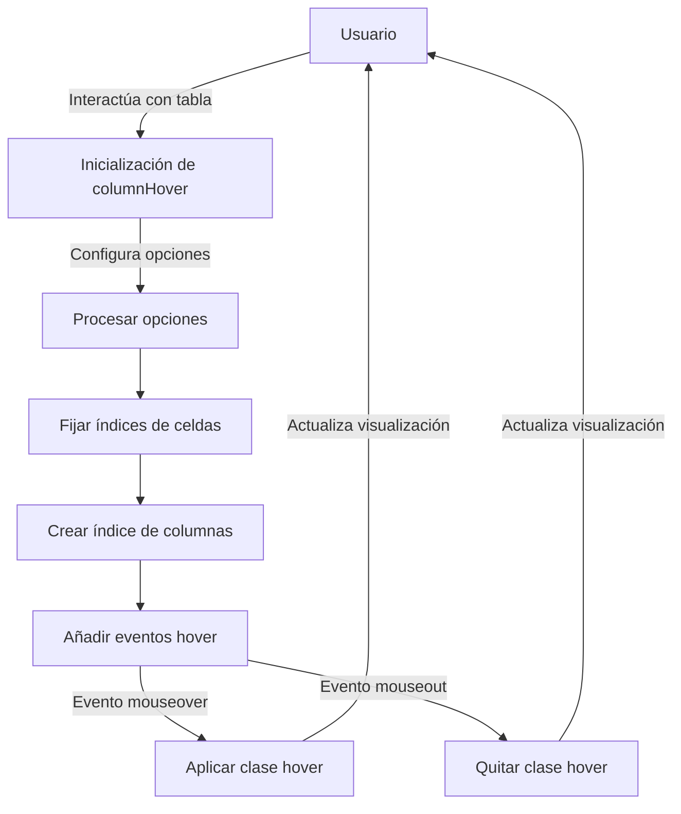

## Module: jquery.columnhover.js

# Análisis Integral del Módulo jQuery.columnHover.js

## Nombre del Componente
**Plugin jQuery columnHover** - Versión 0.1.1

## Objetivos Primarios
Este plugin de jQuery está diseñado para resaltar columnas completas de una tabla HTML cuando el usuario pasa el cursor sobre ellas. Funciona incluso en tablas complejas que utilizan atributos rowspan y colspan, permitiendo una experiencia de usuario mejorada al visualizar datos tabulares.

## Funciones, Métodos y Consultas Críticas
1. **fixCellIndexes(table)**: Función que calcula y almacena el índice real de cada celda en una tabla, corrigiendo los problemas causados por el uso de rowspan y colspan.
2. **columnHover(options)**: Método principal del plugin que configura el comportamiento de resaltado de columnas.
3. **hover(cell, colIndex, on)**: Función interna que aplica o elimina la clase de estilo hover a las celdas de una columna.
4. **addHover($s, colIndex)**: Función que agrega los eventos mouseover y mouseout a los elementos seleccionados.

## Variables y Elementos Clave
- **settings**: Objeto que almacena la configuración del plugin con opciones como:
  - **hoverClass**: Clase CSS aplicada a las celdas resaltadas (predeterminado: 'hover')
  - **eachCell**: Determina si el resaltado funciona desde cualquier celda o solo desde el encabezado (predeterminado: false)
  - **includeSpans**: Incluye columnas con atributo colspan en el proceso de resaltado (predeterminado: true)
  - **ignoreCols**: Array de índices de columnas que deben ser ignoradas en el proceso de resaltado (predeterminado: [])
- **colIndex**: Array que almacena las referencias a las celdas organizadas por columnas
- **realIndex**: Propiedad añadida a cada celda para almacenar su índice real corregido

## Interdependencias y Relaciones
- Depende de la biblioteca jQuery para su funcionamiento
- Se integra con tablas HTML existentes, modificando su comportamiento sin alterar su estructura
- No tiene dependencias externas más allá de jQuery

## Operaciones Core vs. Auxiliares
**Operaciones Core:**
- Cálculo de índices reales de celdas (fixCellIndexes)
- Aplicación de estilos de resaltado a columnas (hover)
- Manejo de eventos de ratón para activar el resaltado

**Operaciones Auxiliares:**
- Configuración de opciones personalizables
- Validación de la estructura de la tabla
- Manejo de casos especiales como celdas con colspan y rowspan

## Secuencia Operacional/Flujo de Ejecución
1. El plugin se inicializa en una tabla seleccionada con jQuery
2. Se establecen las opciones de configuración
3. Para cada tabla seleccionada:
   - Se verifica que la tabla tenga la estructura necesaria (tHead, tBodies)
   - Se corrigen los índices de celdas con fixCellIndexes
   - Se crea un índice de columnas recorriendo todos los cuerpos de la tabla
   - Se añaden eventos de hover a las celdas del encabezado
   - Si eachCell está habilitado, se añaden eventos a todas las celdas y al pie de tabla

## Aspectos de Rendimiento y Optimización
- La función fixCellIndexes puede ser costosa en tablas grandes y complejas
- El plugin crea matrices para almacenar referencias a celdas, lo que podría consumir memoria en tablas muy grandes
- El uso de delegación de eventos podría mejorar el rendimiento en lugar de asignar eventos a cada celda individual

## Reusabilidad y Adaptabilidad
- El plugin es altamente configurable a través de sus opciones
- Puede aplicarse a cualquier tabla HTML sin requerir una estructura específica
- Las opciones permiten adaptarlo a diferentes necesidades de UI/UX
- La implementación como plugin jQuery facilita su integración en proyectos existentes

## Uso y Contexto
- Se utiliza para mejorar la experiencia de usuario en aplicaciones web con tablas de datos
- Especialmente útil en tablas de datos complejas donde seguir visualmente una columna puede ser difícil
- Ejemplos de uso:
  ```javascript
  $('#tabla').columnHover(); // Uso básico con opciones predeterminadas
  $('#tabla').columnHover({eachCell: true, hoverClass: 'miClase'}); // Uso personalizado
  ```

## Suposiciones y Limitaciones
- Asume que la tabla tiene al menos un elemento thead y tbody
- Requiere que la tabla tenga una estructura HTML válida
- El rendimiento puede degradarse en tablas muy grandes o complejas
- No maneja automáticamente tablas generadas dinámicamente después de la inicialización
- La versión 0.1.1 es relativamente antigua (2007) y podría no ser compatible con las versiones más recientes de jQuery sin modificaciones
## Flow Diagram [via mermaid]

