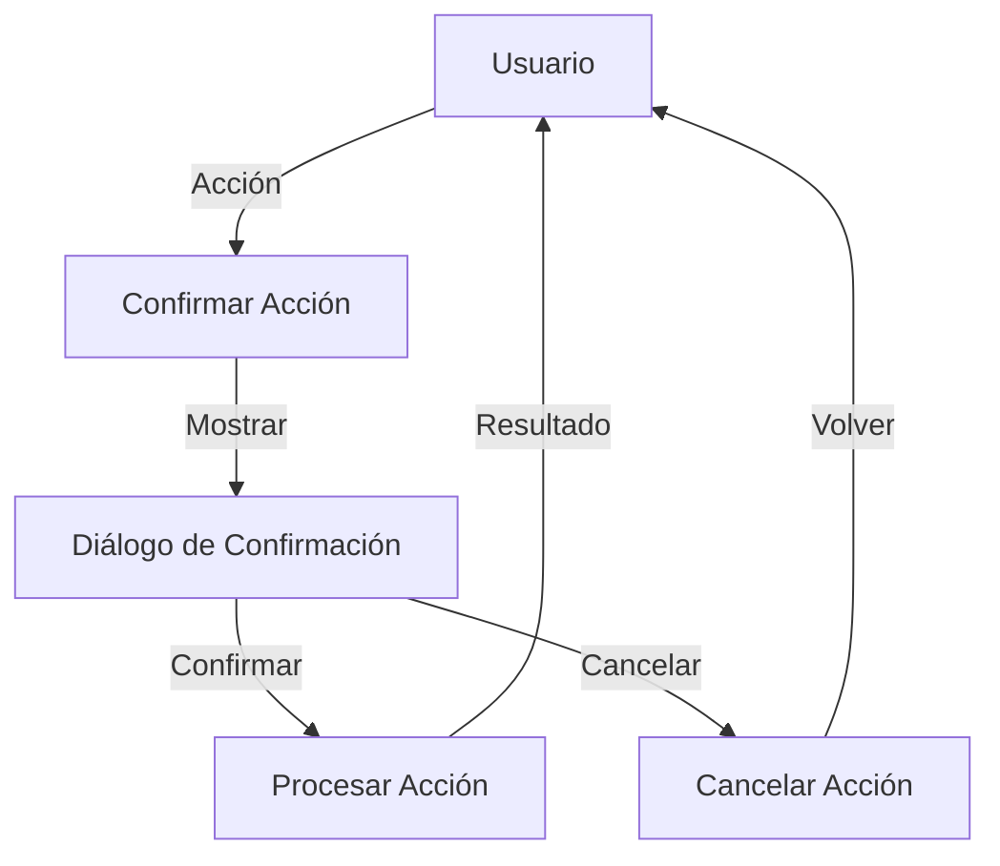

## Module: jquery.easy-confirm-dialog.js

# Análisis Integral del Módulo jQuery Easy Confirm Dialog

## Módulo/Componente SQL
**Nombre del Módulo**: jquery.easy-confirm-dialog.js

## Objetivos Primarios
Este módulo es un plugin de jQuery que proporciona una funcionalidad de diálogo de confirmación fácil de implementar. Su propósito principal es interceptar eventos (principalmente clics) en elementos HTML y mostrar un diálogo de confirmación antes de permitir que la acción original se ejecute.

## Funciones, Métodos y Consultas Críticas
- **$.easyconfirm.locales**: Objeto que almacena las traducciones para diferentes idiomas.
- **$.fn.easyconfirm**: Método principal del plugin que configura el diálogo de confirmación en los elementos seleccionados.
- **handler**: Función que intercepta el evento original y muestra el diálogo de confirmación.
- **init**: Función que inicializa el plugin guardando los manejadores originales y asignando el nuevo manejador.
- **saveHandlers**: Guarda los manejadores de eventos existentes antes de sobrescribirlos.
- **rebindHandlers**: Restaura los manejadores de eventos originales después de asignar el manejador del diálogo.
- **urlClick**: Función que navega a la URL del elemento si es válida.

## Variables y Elementos Clave
- **options**: Configuración del plugin con valores predeterminados como 'eventType' y 'icon'.
- **locale**: Objeto que contiene las traducciones de texto para el diálogo.
- **target**: El elemento DOM al que se aplica el plugin.
- **$target**: Versión jQuery del elemento DOM.
- **dialog**: El elemento de diálogo que se mostrará para la confirmación.
- **buttons**: Objeto que define los botones del diálogo y sus acciones.
- **_handlers**: Array que almacena temporalmente los manejadores de eventos originales.

## Interdependencias y Relaciones
- Depende de jQuery core para la manipulación del DOM y eventos.
- Requiere jQuery UI Dialog para la funcionalidad del diálogo modal.
- Interactúa con los eventos existentes en los elementos objetivo, preservándolos y restaurándolos.

## Operaciones Core vs. Auxiliares
**Operaciones Core**:
- Interceptar el evento original (generalmente clic).
- Mostrar el diálogo de confirmación.
- Ejecutar la acción original solo si se confirma.

**Operaciones Auxiliares**:
- Guardar y restaurar manejadores de eventos.
- Localización de textos para diferentes idiomas.
- Personalización del aspecto y comportamiento del diálogo.

## Secuencia Operacional/Flujo de Ejecución
1. Se inicializa el plugin en los elementos seleccionados.
2. Se guardan los manejadores de eventos existentes.
3. Se asigna el nuevo manejador que intercepta el evento.
4. Cuando ocurre el evento, se muestra el diálogo de confirmación.
5. Si el usuario confirma, se ejecuta la acción original (navegación o evento).
6. Si el usuario cancela, simplemente se cierra el diálogo.

## Aspectos de Rendimiento y Optimización
- El plugin sobrescribe temporalmente la función $.fn.attr para manejar correctamente los atributos de título en jQuery 1.6+.
- Utiliza closures para mantener el contexto y evitar variables globales.
- Almacena los manejadores de eventos en lugar de recrearlos, lo que mejora el rendimiento.
- El diálogo se crea una sola vez por elemento y se reutiliza en cada interacción.

## Reusabilidad y Adaptabilidad
- Alta reusabilidad gracias a su diseño como plugin de jQuery.
- Adaptable mediante opciones de configuración como 'eventType', 'icon' y 'locale'.
- Soporta múltiples idiomas a través del sistema de localización.
- Permite personalizar el diálogo mediante la opción 'dialog'.

## Uso y Contexto
- Se utiliza para añadir confirmaciones a acciones potencialmente peligrosas o irreversibles.
- Típicamente se aplica a enlaces o botones que ejecutan acciones importantes.
- Ejemplo de uso: `$('a.confirm').easyconfirm();`
- Puede personalizarse con diferentes textos, idiomas y estilos.

## Suposiciones y Limitaciones
- Asume que jQuery y jQuery UI Dialog están disponibles en el entorno.
- Requiere que los elementos objetivo tengan eventos o URLs válidas para funcionar correctamente.
- La personalización del diálogo está limitada a las opciones proporcionadas por jQuery UI Dialog.
- El plugin fue desarrollado para jQuery 1.6+ y podría requerir adaptaciones para versiones más recientes.
- No maneja confirmaciones asíncronas o basadas en promesas, lo que podría ser una limitación en aplicaciones modernas.
## Flow Diagram [via mermaid]

