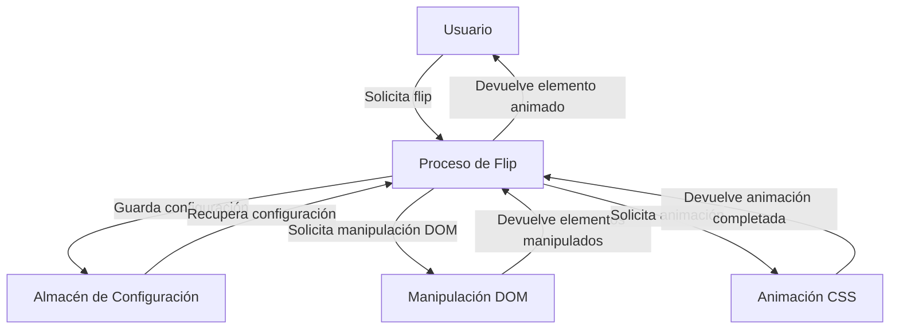

## Module: jquery.flip.js

# Análisis Integral del Módulo jQuery.flip.js

## Nombre del Componente
**Módulo**: jQuery.flip.js

## Objetivos Primarios
Este módulo es un plugin de jQuery que proporciona efectos de animación tipo "flip" (volteo) para elementos HTML. Su propósito principal es crear una transición visual donde un elemento parece girar sobre su eje, revelando un contenido diferente en el reverso.

## Funciones, Métodos y Consultas Críticas
- **$.fn.flip**: Función principal que implementa el efecto de volteo.
- **$.fn.revertFlip**: Método para revertir un efecto de volteo previamente aplicado.
- **int_prop**: Función auxiliar para manejar propiedades de estilo enteras durante la animación.
- **throwError**: Función para lanzar errores específicos del plugin.
- **isIE6orOlder**: Función para detectar versiones antiguas de Internet Explorer.
- **acceptHexColor**: Función para normalizar valores de color.

## Variables y Elementos Clave
- **colors**: Objeto que mapea nombres de colores a sus valores RGB.
- **settings**: Objeto de configuración que controla el comportamiento del efecto flip.
- **flipObj**: Objeto que almacena la configuración y estado del efecto.
- **$clone**: Elemento jQuery clonado utilizado para realizar la animación.
- **dirOptions**: Objeto que define las diferentes direcciones de animación (tb, bt, lr, rl).

## Interdependencias y Relaciones
- Depende de la biblioteca jQuery principal.
- Extiende jQuery.fx.step para manejar animaciones de bordes.
- Interactúa con el DOM para manipular elementos y crear efectos visuales.
- Almacena datos en los elementos DOM usando $.data() para mantener el estado.

## Operaciones Principales vs. Auxiliares
**Operaciones Principales**:
- Creación y animación del clon del elemento.
- Manipulación de bordes y colores para crear el efecto visual de volteo.
- Gestión del contenido antes y después de la animación.

**Operaciones Auxiliares**:
- Detección de navegadores antiguos (IE6).
- Conversión y normalización de colores.
- Manejo de errores y validaciones.
- Callbacks para eventos durante la animación.

## Secuencia Operacional/Flujo de Ejecución
1. Se verifica si el elemento ya está en proceso de animación (flipLock).
2. Se guardan los ajustes para una posible reversión posterior.
3. Se crea un clon del elemento
## Flow Diagram [via mermaid]

