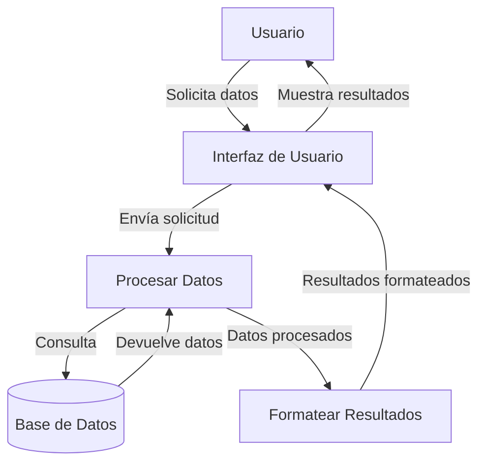

## Module: jquery.jqGrid.min.js

# Análisis Integral del Módulo jquery.jqGrid.min.js

## Módulo/SQL Component Name
El módulo analizado es **jquery.jqGrid.min.js**, una biblioteca JavaScript que proporciona funcionalidades para crear y manipular tablas de datos interactivas (grids) en aplicaciones web.

## Objetivos Primarios
El objetivo principal de jqGrid es proporcionar una solución completa para la visualización y manipulación de datos tabulares en aplicaciones web. Permite crear tablas interactivas con funcionalidades avanzadas como ordenación, filtrado, paginación, edición en línea, y más. Está diseñado para trabajar con datos provenientes de diversas fuentes (JSON, XML, arrays locales) y facilitar operaciones CRUD (Crear, Leer, Actualizar, Eliminar) sobre estos datos.

## Funciones, Métodos y Consultas Críticas
- **Funciones de inicialización**: `jqGrid()` - Método principal para inicializar la tabla
- **Funciones de manipulación de datos**:
  - `addRowData()`, `delRowData()`, `setRowData()` - Para gestionar filas
  - `getGridParam()`, `setGridParam()` - Para obtener y establecer parámetros de configuración
- **Funciones de edición**:
  - `editRow()`, `saveRow()`, `restoreRow()` - Para edición en línea
  - `editGridRow()`, `delGridRow()` - Para formularios de edición
- **Funciones de navegación**:
  - `navGrid()` - Para crear barras de navegación
  - `setSelection()` - Para seleccionar filas
- **Funciones de formateo**:
  - `formatter` - Para dar formato a los datos en celdas
- **Funciones de filtrado y búsqueda**:
  - `searchGrid()`, `filterToolbar()` - Para implementar búsquedas

## Variables y Elementos Clave
- **Columnas y Modelos**: `colModel` define la estructura de las columnas
- **Datos**: `data` almacena los datos locales
- **Parámetros de configuración**: 
  - `prmNames` - Nombres de parámetros para peticiones AJAX
  - `jsonReader`/`xmlReader` - Configuración para interpretar respuestas
- **Elementos de interfaz**:
  - `grid.bDiv` - Contenedor del cuerpo de la tabla
  - `grid.hDiv` - Contenedor de la cabecera
  - `pager` - Elemento de paginación

## Interdependencias y Relaciones
- **jQuery**: Dependencia principal, jqGrid es un plugin de jQuery
- **jQuery UI**: Utilizado para componentes como diálogos, botones y efectos visuales
- **Módulos internos**: El código está organizado en módulos que se extienden entre sí:
  - Módulo base (`grid.base.js`)
  - Módulo de formato (`jquery.fmatter.js`)
  - Módulo de edición (`grid.formedit.js`)
  - Módulo de edición en línea (`grid.inlinedit.js`)
  - Módulo de filtrado (`grid.filter.js`)
  - Módulos adicionales para subgrids, agrupación, etc.

## Operaciones Core vs. Auxiliares
- **Operaciones Core**:
  - Renderizado de la tabla y gestión de datos
  - Operaciones CRUD (Crear, Leer, Actualizar, Eliminar)
  - Paginación y ordenación
- **Operaciones Auxiliares**:
  - Formateo de datos
  - Validación de entradas
  - Gestión de eventos
  - Operaciones de arrastrar y soltar
  - Exportación e importación de datos

## Secuencia de Ejecución
1. **Inicialización**: Configuración de parámetros y creación de la estructura HTML
2. **Carga de datos**: Obtención de datos mediante AJAX o desde fuentes locales
3. **Renderizado**: Creación de filas y celdas según los datos y el modelo de columnas
4. **Interacción del usuario**: Manejo de eventos como clic, edición, ordenación
5. **Operaciones CRUD**: Procesamiento de cambios y sincronización con el servidor
6. **Actualización de la vista**: Refrescar la tabla según los cambios realizados

## Aspectos de Rendimiento y Optimización
- **Virtualización de filas**: Para manejar grandes conjuntos de datos sin afectar el rendimiento
- **Carga diferida**: Carga de datos por demanda mediante paginación
- **Caché de datos**: Almacenamiento local de datos para reducir peticiones al servidor
- **Optimización de DOM**: Minimización de manipulaciones del DOM para mejorar el rendimiento
- **Posibles cuellos de botella**: 
  - Renderizado de tablas con muchas columnas
  - Operaciones masivas sobre datos (filtrado, ordenación)
  - Edición en línea con muchas filas visibles

## Reusabilidad y Adaptabilidad
- **Alta configurabilidad**: Numerosos parámetros permiten adaptar el comportamiento
- **Sistema de eventos**: Permite extender la funcionalidad mediante hooks
- **Formatters y Unformatters**: Mecanismo para personalizar la presentación de datos
- **Temas visuales**: Compatibilidad con jQuery UI Themes para personalización visual
- **Extensibilidad**: Arquitectura modular que permite añadir nuevas funcionalidades

## Uso y Contexto
- **Aplicaciones web de gestión**: Ideal para paneles administrativos, CRMs, ERPs
- **Visualización de datos**: Presentación de información tabular con opciones avanzadas
- **Formularios complejos**: Edición de datos estructurados en forma de tabla
- **Escenarios típicos**:
  - Listados de productos, usuarios, transacciones
  - Paneles de administración
  - Informes interactivos
  - Interfaces de gestión de datos

## Suposiciones y Limitaciones
- **Suposiciones**:
  - Disponibilidad de jQuery y jQuery UI
  - Estructura específica de respuestas del servidor para operaciones CRUD
  - Navegadores modernos con soporte para JavaScript avanzado
- **Limitaciones**:
  - Rendimiento puede degradarse con conjuntos de datos muy grandes
  - Complejidad de configuración para casos de uso avanzados
  - Tamaño del código puede afectar tiempos de carga iniciales
  - Dependencia de jQuery limita su uso en frameworks modernos basados en Virtual DOM

Este módulo representa una solución completa y madura para la gestión de datos tabulares en aplicaciones web, con un amplio conjunto de funcionalidades que lo hacen adecuado para diversos escenarios de uso.
## Flow Diagram [via mermaid]

