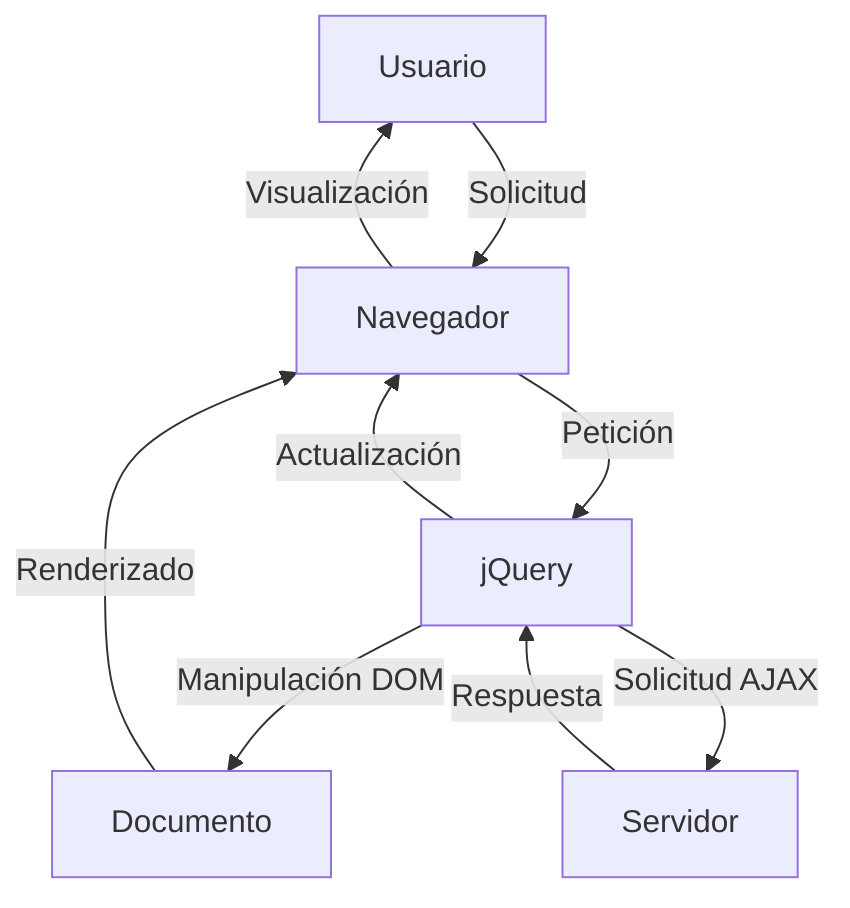
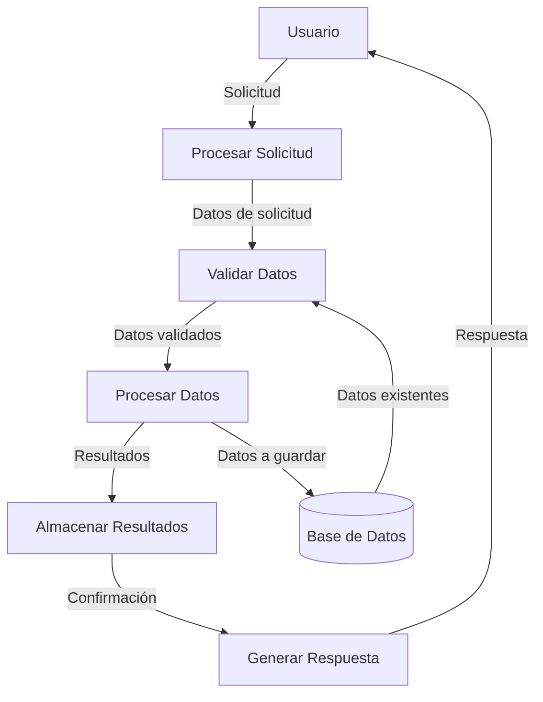

## Module: jquery.js

# Análisis Integral del Módulo jQuery.js

## Módulo/Componente SQL
**jQuery JavaScript Library v1.9.1**

## Objetivos Primarios
jQuery es una biblioteca de JavaScript diseñada para simplificar la manipulación del DOM, el manejo de eventos, las animaciones y las interacciones AJAX en aplicaciones web. Su propósito principal es proporcionar una capa de abstracción que facilite el desarrollo web, permitiendo a los desarrolladores escribir menos código para lograr más funcionalidad.

## Funciones, Métodos y Consultas Críticas
- **Selector de jQuery**: La función principal `jQuery()` o `$()` que permite seleccionar elementos del DOM.
- **Manipulación del DOM**: Métodos como `.append()`, `.prepend()`, `.html()`, `.text()` para modificar el contenido.
- **Manejo de eventos**: `.on()`, `.off()`, `.trigger()` para gestionar eventos del usuario.
- **Animaciones**: `.animate()`, `.fadeIn()`, `.fadeOut()`, `.slideDown()`, `.slideUp()` para efectos visuales.
- **AJAX**: `.ajax()`, `.get()`, `.post()` para comunicación asíncrona con el servidor.
- **Traversing**: `.find()`, `.parent()`, `.children()` para navegar por el DOM.
- **Utilidades**: `.each()`, `.extend()`, `.map()` para operaciones comunes.

## Variables y Elementos Clave
- **jQuery/$ (alias)**: La función principal que expone toda la API.
- **jQuery.fn**: El prototipo de los objetos jQuery donde se definen los métodos de la cadena.
- **jQuery.support**: Objeto que contiene información sobre características soportadas por el navegador.
- **jQuery.ajax**: Configuración y métodos para peticiones AJAX.
- **Sizzle**: Motor de selección CSS integrado para compatibilidad entre navegadores.
- **jQuery.Callbacks**: Sistema para gestionar listas de callbacks.
- **jQuery.Deferred**: Implementación de promesas para operaciones asíncronas.

## Interdependencias y Relaciones
- **Sizzle**: jQuery incorpora este motor de selección para garantizar la compatibilidad entre navegadores.
- **Módulo de eventos**: Interactúa con el DOM para gestionar eventos del navegador.
- **Módulo AJAX**: Depende de los objetos XMLHttpRequest o ActiveXObject según el navegador.
- **Animaciones**: Dependen del sistema de CSS y del temporizador del navegador.
- **Compatibilidad entre navegadores**: Múltiples comprobaciones y soluciones alternativas para diferentes navegadores.

## Operaciones Principales vs. Auxiliares
**Operaciones principales**:
- Selección de elementos DOM
- Manipulación del DOM
- Gestión de eventos
- Peticiones AJAX
- Animaciones

**Operaciones auxiliares**:
- Detección de características del navegador
- Normalización de comportamientos entre navegadores
- Utilidades para manipulación de arrays y objetos
- Gestión de caché interna
- Validaciones y conversiones de tipos

## Secuencia Operativa/Flujo de Ejecución
1. **Inicialización**: Configuración del entorno y detección de características del navegador.
2. **Exposición de la API**: Definición de la función jQuery y sus métodos.
3. **Ejecución de código**: Cuando se invoca `$()`, se crea una instancia de jQuery con los elementos seleccionados.
4. **Encadenamiento de métodos**: Los métodos devuelven el objeto jQuery para permitir el encadenamiento.
5. **Gestión de eventos**: Sistema de delegación y burbujeo de eventos.
6. **Ejecución asíncrona**: Para AJAX y animaciones mediante callbacks o promesas.

## Aspectos de Rendimiento y Optimización
- **Caché de selectores**: Reutilización de resultados de selecciones previas.
- **Delegación de eventos**: Uso de eventos delegados para reducir el número de manejadores.
- **Optimización de animaciones**: Uso de requestAnimationFrame cuando está disponible.
- **Gestión de memoria**: Limpieza de referencias para evitar fugas de memoria.
- **Minimización de reflows**: Agrupación de operaciones DOM para reducir el impacto en el rendimiento.

## Reutilización y Adaptabilidad
- **Arquitectura de plugins**: Permite extender jQuery mediante `$.fn` para añadir nuevas funcionalidades.
- **Configuración de opciones**: Muchos métodos aceptan objetos de configuración para personalizar su comportamiento.
- **Compatibilidad con AMD**: Soporte para cargadores de módulos asíncronos.
- **noConflict()**: Permite liberar la variable `$` para evitar conflictos con otras bibliotecas.
- **Extensibilidad**: Posibilidad de sobrescribir métodos internos para adaptarlos a necesidades específicas.

## Uso y Contexto
jQuery se utiliza principalmente en aplicaciones web para:
- Simplificar la manipulación del DOM en diferentes navegadores.
- Proporcionar una API consistente para eventos y animaciones.
- Facilitar las peticiones AJAX y el procesamiento de datos.
- Crear interfaces de usuario interactivas con menos código.
- Servir como base para plugins y frameworks más complejos.

## Suposiciones y Limitaciones
- **Suposiciones**:
  - Se asume que el DOM está completamente cargado antes de manipularlo (a menos que se use `$(document).ready()`).
  - Se espera que los selectores CSS sean válidos.
  - Para AJAX, se asume que el servidor responde en formatos esperados (JSON, XML, HTML).

- **Limitaciones**:
  - Rendimiento potencialmente inferior a JavaScript nativo en operaciones simples.
  - Tamaño de la biblioteca que puede afectar los tiempos de carga iniciales.
  - Algunas funcionalidades avanzadas de CSS3 o HTML5 pueden no estar completamente soportadas en versiones antiguas.
  - Dependencia de la compatibilidad del
## Flow Diagram [via mermaid]

## Module: jquery.js

# Análisis Integral del Módulo jQuery.js

## Nombre del Módulo/Componente SQL
jQuery JavaScript Library v1.7.2

## Objetivos Primarios
jQuery es una biblioteca de JavaScript diseñada para simplificar la manipulación del DOM (Document Object Model), el manejo de eventos, las animaciones y las interacciones AJAX en aplicaciones web. Su objetivo principal es proporcionar una capa de abstracción que facilite la programación en JavaScript, permitiendo a los desarrolladores escribir menos código para lograr más funcionalidad.

## Funciones, Métodos y Consultas Críticas
- **Selector de elementos**: La función principal `jQuery()` o `$()` permite seleccionar elementos del DOM mediante selectores CSS.
- **Manipulación del DOM**: Métodos como `.html()`, `.text()`, `.append()`, `.prepend()`, `.remove()` para modificar el contenido y estructura del DOM.
- **Manejo de eventos**: Funciones como `.on()`, `.off()`, `.click()`, `.hover()` para gestionar eventos de usuario.
- **Animaciones**: Métodos como `.animate()`, `.fadeIn()`, `.fadeOut()`, `.slideDown()`, `.slideUp()` para efectos visuales.
- **AJAX**: Funciones como `$.ajax()`, `$.get()`, `$.post()` para realizar peticiones asíncronas al servidor.
- **Utilidades**: Funciones como `$.each()`, `$.extend()`, `$.isArray()`, `$.isFunction()` para manipulación de datos y objetos.

## Variables y Elementos Clave
- **jQuery.fn**: El prototipo de los objetos jQuery, donde se definen los métodos que pueden ser llamados en colecciones de elementos.
- **jQuery.support**: Objeto que contiene información sobre las características soportadas por el navegador.
- **jQuery.browser**: Objeto (aunque obsoleto) que identifica el navegador del usuario.
- **jQuery.Callbacks**: Sistema para gestionar listas de callbacks.
- **jQuery.Deferred**: Implementación de promesas para manejar operaciones asíncronas.
- **jQuery.event**: Sistema de gestión de eventos.
- **Sizzle**: Motor de selección de elementos CSS integrado en jQuery.

## Interdependencias y Relaciones
- **Sizzle**: jQuery incorpora el motor de selección Sizzle para la selección de elementos DOM.
- **Navegador**: Interactúa directamente con las APIs del navegador para manipular el DOM, gestionar eventos y realizar peticiones AJAX.
- **Compatibilidad entre navegadores**: Contiene numerosas soluciones para diferencias entre navegadores, especialmente para versiones antiguas de Internet Explorer.
- **Plugins**: Diseñado para ser extensible mediante plugins que pueden añadir funcionalidad adicional.

## Operaciones Principales vs. Auxiliares
- **Operaciones principales**:
  - Selección de elementos DOM
  - Manipulación del DOM
  - Gestión de eventos
  - Animaciones
  - Peticiones AJAX
- **Operaciones auxiliares**:
  - Detección de características del navegador
  - Utilidades para manipulación de arrays y objetos
  - Normalización de eventos entre navegadores
  - Caché de elementos y datos

## Secuencia de Ejecución
1. **Inicialización**: Se define el objeto jQuery y se establece el alias `$`.
2. **Detección de entorno**: Se identifican las características del navegador y se configuran las variables de soporte.
3. **Definición de métodos**: Se establecen los métodos principales en el prototipo jQuery.fn.
4. **Extensiones**: Se añaden funcionalidades como animaciones, AJAX, y manipulación de eventos.
5. **Ejecución**: Cuando se carga la página, jQuery está listo para ser utilizado mediante la función `$(document).ready()`.

## Aspectos de Rendimiento y Optimización
- **Encadenamiento de métodos**: Permite realizar múltiples operaciones en una sola línea de código.
- **Caché de selectores**: Almacena resultados de selecciones para evitar búsquedas repetidas en el DOM.
- **Delegación de eventos**: Permite manejar eventos en elementos que aún no existen en el DOM.
- **Optimización de animaciones**: Utiliza requestAnimationFrame cuando está disponible.
- **Gestión eficiente de memoria**: Evita fugas de memoria mediante la limpieza adecuada de eventos y datos.

## Reusabilidad y Adaptabilidad
- **Diseño modular**: Permite incluir solo las partes necesarias de la biblioteca.
- **Método noConflict**: Permite liberar el control de la variable `$` para evitar conflictos con otras bibliotecas.
- **Extensibilidad**: Facilita la creación de plugins mediante `$.fn.extend()`.
- **Compatibilidad con AMD**: Puede ser cargado como un módulo AMD para sistemas de carga asíncrona.

## Uso y Contexto
- **Desarrollo web**: Utilizado principalmente en aplicaciones web para simplificar la manipulación del DOM y las interacciones con el usuario.
- **Frameworks**: Muchos frameworks y CMS lo utilizan como base para sus funcionalidades de interfaz de usuario.
- **Plugins**: Existe un amplio ecosistema de plugins que extienden su funcionalidad para casos de uso específicos.
- **Aplicaciones móviles**: Puede ser utilizado en aplicaciones móviles híbridas, aunque con consideraciones de rendimiento.

## Suposiciones y Limitaciones
- **Suposiciones**:
  - Asume que el DOM está completamente cargado cuando se ejecutan ciertas operaciones.
  - Presupone cierto nivel de soporte de JavaScript en el navegador.
- **Limitaciones**:
  - Puede tener problemas de rendimiento en aplicaciones muy grandes o con muchas manipulaciones DOM.
  - El tamaño de la biblioteca puede ser un problema en entornos con ancho de banda limitado.
  - Algunas funcionalidades están obsoletas en navegadores modernos que ya implementan APIs nativas similares.
  - No está optimizado para aplicaciones móviles con recursos limitados.

Esta versión 1.7.2 de jQuery representa una biblioteca madura y estable, aunque actualmente existen versiones más recientes con mejoras de rendimiento y compatibilidad con navegadores modernos.
## Flow Diagram [via mermaid]

