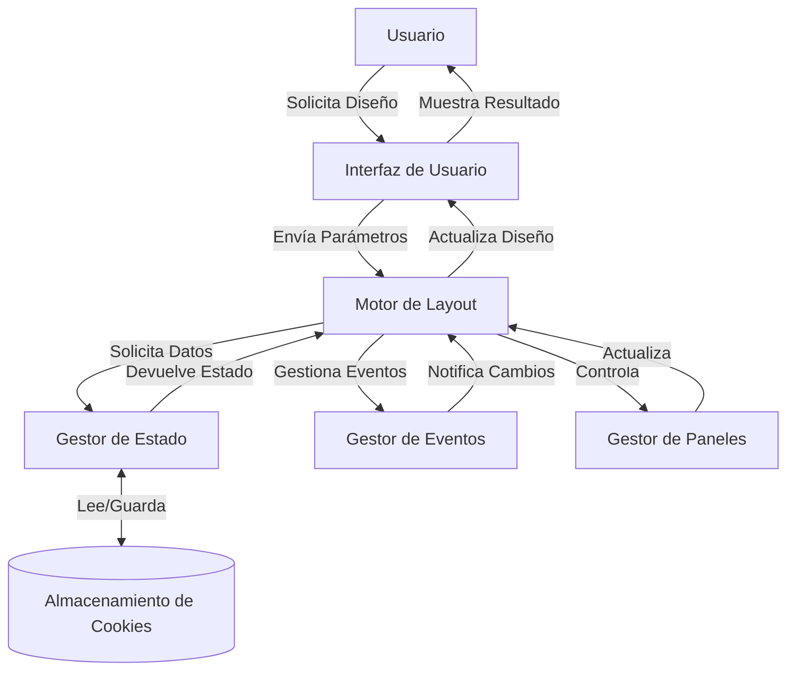

## Module: jquery.layout-latest.min.js

# Análisis Integral del Módulo jQuery Layout

## Nombre del Componente
**jquery.layout-latest.min.js** - Versión 1.3.0 Release Candidate 30.79

## Objetivos Primarios
Este módulo es un plugin de jQuery que proporciona una funcionalidad avanzada de diseño de interfaz de usuario, permitiendo dividir la pantalla en paneles redimensionables (norte, sur, este, oeste y centro). Su propósito principal es crear interfaces de usuario complejas con paneles que pueden ser redimensionados, abiertos, cerrados, deslizados y personalizados dinámicamente.

## Funciones, Métodos y Consultas Críticas
- **Funciones de inicialización**: `layout()` - Inicializa el layout en un contenedor
- **Funciones de manipulación de paneles**:
  - `open()`, `close()`, `toggle()` - Controlan la visibilidad de los paneles
  - `slideOpen()`, `slideClose()`, `slideToggle()` - Controlan la animación de deslizamiento
  - `sizePane()`, `resizeAll()` - Controlan el tamaño de los paneles
  - `show()`, `hide()` - Muestran u ocultan paneles
- **Gestión de estado**:
  - `loadState()`, `readState()`, `saveCookie()` - Permiten guardar y restaurar la configuración
- **Manipulación de botones**:
  - `bindButton()`, `addToggleBtn()`, `addOpenBtn()`, `addCloseBtn()`, `addPinBtn()`

## Variables y Elementos Clave
- **Paneles principales**: `north`, `south`, `east`, `west`, `center`
- **Objetos de estado**:
  - `state` - Almacena el estado actual de cada panel
  - `options` - Configuración de cada panel
- **Elementos DOM**:
  - `panes` - Contenedores de paneles
  - `resizers` - Elementos para redimensionar
  - `togglers` - Botones para abrir/cerrar paneles
- **Configuración**:
  - `spacing_open`, `spacing_closed` - Espaciado entre paneles
  - `minSize`, `maxSize` - Límites de tamaño
  - `slidable`, `resizable`, `closable` - Comportamientos permitidos

## Interdependencias y Relaciones
- **Dependencias externas**:
  - jQuery core
  - jQuery UI (opcional para funcionalidades avanzadas)
- **Plugins internos**:
  - `stateManagement` - Gestión de estado mediante cookies
  - `buttons` - Manejo de botones personalizados
  - `browserZoom` - Adaptación al zoom del navegador
- **Interacción con otros componentes**:
  - Capacidad para crear layouts anidados (layouts dentro de paneles)
  - Integración con sistemas de eventos de jQuery

## Operaciones Core vs. Auxiliares
- **Operaciones Core**:
  - Inicialización del layout (`Aa()`)
  - Redimensionamiento de paneles (`ka()`, `Ca()`)
  - Apertura/cierre de paneles (`ra()`, `ja()`)
  - Gestión de eventos de arrastre y redimensionamiento
- **Operaciones Auxiliares**:
  - Gestión de cookies y estado
  - Manejo de máscaras y efectos visuales
  - Validaciones y cálculos de dimensiones
  - Compatibilidad con navegadores

## Secuencia Operacional
1. **Inicialización**:
   - Análisis de opciones y configuración
   - Creación de la estructura DOM
   - Inicialización de paneles y resizers
2. **Ciclo de vida**:
   - Respuesta a eventos de usuario (redimensionamiento, clic)
   - Cálculo de dimensiones y restricciones
   - Aplicación de cambios visuales
   - Disparo de callbacks
3. **Finalización**:
   - Guardado de estado (si está configurado)
   - Limpieza de recursos al destruir

## Aspectos de Rendimiento y Optimización
- Uso de minificación para reducir el tamaño del archivo
- Implementación de temporizadores para operaciones costosas (`M.set()`)
- Optimizaciones específicas para diferentes navegadores
- Cálculos de dimensiones eficientes para evitar reflows innecesarios
- Uso de caché para dimensiones y estados

## Reusabilidad y Adaptabilidad
- Alta parametrización mediante opciones configurables
- Arquitectura basada en plugins para extender funcionalidad
- Soporte para layouts anidados permitiendo estructuras complejas
- API pública bien definida para interactuar con el layout
- Capacidad para guardar/restaurar estados entre sesiones

## Uso y Contexto
El componente se utiliza típicamente en:
- Aplicaciones web complejas que requieren múltiples paneles
- Interfaces de usuario tipo IDE o dashboard
- Sistemas que necesitan optimizar el espacio de pantalla
- Aplicaciones que requieren layouts adaptables y personalizables

Se implementa mediante:
```javascript
$("#miContenedor").layout({ 
    west: { size: 200 },
    east: { size: 300 }
});
```

## Suposiciones y Limitaciones
- **Suposiciones**:
  - Existencia de un contenedor con posición relativa o absoluta
  - Disponibilidad de jQuery en la página
  - Estructura DOM específica para los paneles
- **Limitaciones**:
  - Complejidad en la configuración para casos avanzados
  - Posibles problemas de rendimiento con muchos layouts anidados
  - Dependencia de jQuery para todas las operaciones
  - Algunas funcionalidades requieren plugins adicionales de jQuery UI

Este plugin es una solución robusta para crear interfaces complejas con paneles redimensionables, ofreciendo una amplia gama de opciones de personalización y una API rica para controlar el comportamiento de los paneles.
## Flow Diagram [via mermaid]

