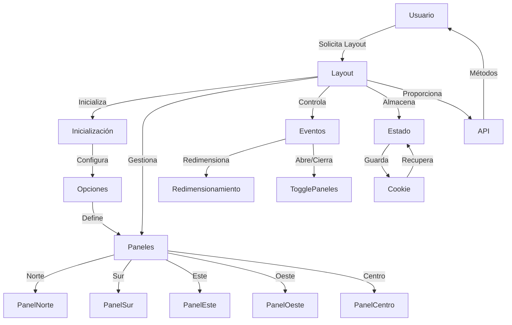

## Module: jquery.layout.js

# Análisis Completo del Módulo jquery.layout.js

## Nombre del Componente
jQuery Layout Plugin (jquery.layout.js)

## Objetivos Primarios
Este módulo es un plugin de jQuery que proporciona capacidades avanzadas de diseño de interfaz de usuario, permitiendo crear layouts complejos con paneles redimensionables, colapsables y deslizables. Su objetivo principal es facilitar la creación de interfaces de usuario tipo "panel" similares a las que se encuentran en aplicaciones de escritorio, pero implementadas en entornos web.

## Funciones, Métodos y Consultas Críticas
- **Inicialización del Layout**: `_create()` - Inicializa el layout y configura todos los paneles.
- **Gestión de Paneles**: `initPanes()`, `addPane()`, `removePane()` - Manejo de la creación y eliminación de paneles.
- **Redimensionamiento**: `sizePane()`, `resizeAll()` - Controlan el tamaño de los paneles.
- **Interacción de Paneles**: `open()`, `close()`, `toggle()`, `slideOpen()`, `slideClose()` - Controlan la visibilidad y estado de los paneles.
- **Gestión de Estado**: `loadState()`, `saveState()`, `readCookie()`, `saveCookie()` - Permiten guardar y restaurar el estado del layout.
- **Manejo de Eventos**: Múltiples callbacks como `onresize_start`, `onopen_end`, etc.

## Variables y Elementos Clave
- **Paneles**: `north`, `south`, `east`, `west`, `center` - Los cinco paneles principales del layout.
- **Estado**: `state` - Objeto que almacena el estado actual de cada panel.
- **Opciones**: `options` - Configuración del layout y sus paneles.
- **Elementos DOM**: `$Ps` (paneles), `$Rs` (redimensionadores), `$Ts` (botones de alternancia).
- **Configuración**: `_c` - Constantes y configuraciones internas.

## Interdependencias y Relaciones
- **jQuery UI**: Depende de jQuery y opcionalmente de jQuery UI para funcionalidades como arrastrar y soltar.
- **Plugins Internos**: Incluye varios plugins integrados:
  - `stateManagement` - Para guardar/restaurar el estado del layout.
  - `buttons` - Para manejar botones personalizados.
  - `browserZoom` - Para manejar el zoom del navegador.
- **Relaciones entre Paneles**: Los paneles tienen relaciones espaciales entre sí, donde el redimensionamiento de uno afecta a los adyacentes.

## Operaciones Principales vs. Auxiliares
- **Operaciones Principales**:
  - Inicialización y configuración del layout.
  - Gestión del tamaño y visibilidad de los paneles.
  - Manejo de eventos de usuario (redimensionar, abrir/cerrar).
- **Operaciones Auxiliares**:
  - Cálculos de dimensiones y posiciones.
  - Gestión de cookies y estado.
  - Manejo de efectos visuales y animaciones.
  - Utilidades para compatibilidad entre navegadores.

## Secuencia de Ejecución
1. **Inicialización**: Se crea el layout con `_create()`.
2. **Configuración**: Se procesan las opciones con `initOptions()`.
3. **Creación de Paneles**: Se inicializan los paneles con `initPanes()`.
4. **Configuración de Manejadores**: Se configuran los redimensionadores y botones con `initHandles()`.
5. **Eventos**: Se vinculan eventos de usuario para interactuar con el layout.
6. **Operación**: El usuario interactúa con el layout, provocando eventos que modifican el estado.
7. **Finalización**: Cuando se destruye el layout, se limpia con `destroy()`.

## Aspectos de Rendimiento
- **Cálculos de Dimensiones**: Operaciones intensivas que pueden afectar el rendimiento.
- **Eventos de Ventana**: El manejo de `resize` puede ser costoso y está optimizado con temporizadores.
- **Animaciones**: Las animaciones de apertura/cierre pueden ser desactivadas para mejorar el rendimiento.
- **Caché de Estado**: Se utiliza para evitar recálculos innecesarios.
- **Optimización de Navegador**: Incluye código específico para manejar peculiaridades de diferentes navegadores.

## Reusabilidad y Adaptabilidad
- **Altamente Configurable**: Numerosas opciones permiten personalizar el comportamiento.
- **API Pública**: Proporciona métodos para interactuar con el layout desde código externo.
- **Eventos Personalizables**: Sistema de callbacks para extender la funcionalidad.
- **Diseño Modular**: Los plugins internos pueden ser habilitados/deshabilitados según necesidades.
- **Layouts Anidados**: Soporta la creación de layouts dentro de paneles.

## Uso y Contexto
El plugin se utiliza típicamente para crear interfaces de usuario complejas en aplicaciones web, especialmente:
- Aplicaciones de administración y dashboards.
- Editores y herramientas de desarrollo.
- Interfaces que requieren múltiples áreas de trabajo.
- Aplicaciones que necesitan aprovechar al máximo el espacio de pantalla.

Se implementa añadiendo el plugin a una página web y aplicándolo a un contenedor HTML:
```javascript
$("#miContenedor").layout({ 
    north: { size: 100 },
    west: { size: 200 },
    center: {} 
});
```

## Suposiciones y Limitaciones
- **Suposiciones**:
  - El contenedor debe tener un tamaño definido o ser de tamaño completo.
  - Se asume que jQuery y opcionalmente jQuery UI están disponibles.
  - El DOM debe estar completamente cargado antes de inicializar.
- **Limitaciones**:
  - Complejidad de configuración para casos de uso avanzados.
  - Posibles problemas de rendimiento en layouts muy complejos.
  - Compatibilidad limitada con diseños responsivos modernos.
  - Dependencia de jQuery, que está siendo menos utilizado en desarrollos modernos.

Este plugin es una herramienta poderosa pero compleja que requiere una comprensión profunda para aprovechar todas sus capacidades.
## Flow Diagram [via mermaid]

