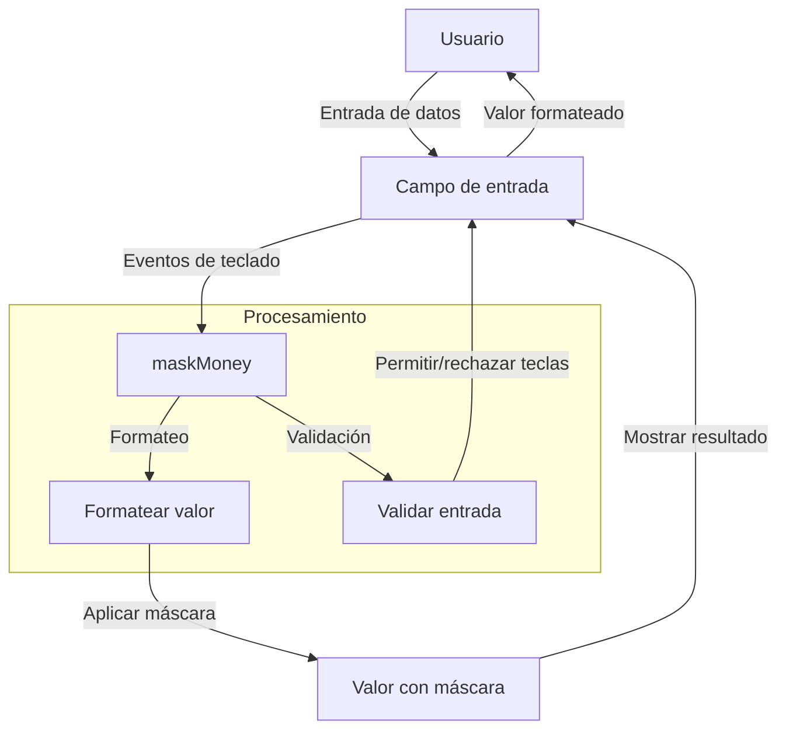

## Module: jquery.maskMoney.js

# Análisis Integral del Módulo jquery.maskMoney.js

## Nombre del Componente
**Plugin jQuery maskMoney (jquery.maskMoney.js)**

## Objetivos Primarios
Este módulo es un plugin de jQuery diseñado para formatear campos de entrada de valores monetarios en tiempo real. Su propósito principal es proporcionar una interfaz de usuario intuitiva para la entrada de valores monetarios, aplicando automáticamente formato con separadores de miles, decimales, símbolos de moneda y permitiendo configuraciones personalizadas.

## Funciones, Métodos y Consultas Críticas
- **maskMoney**: Función principal que inicializa el plugin en elementos seleccionados.
- **keypressEvent**: Maneja eventos de pulsación de teclas para controlar la entrada de datos.
- **keydownEvent**: Gestiona eventos específicos como retroceso y eliminación.
- **focusEvent**: Aplica formato cuando el campo recibe el foco.
- **blurEvent**: Aplica formato cuando el campo pierde el foco.
- **maskAndPosition**: Aplica la máscara y posiciona el cursor correctamente.
- **maskValue**: Función central que formatea el valor según las configuraciones.
- **mask**: Aplica la máscara al valor actual del campo.
- **getDefaultMask**: Genera la máscara predeterminada basada en la precisión configurada.
- **setSymbol**: Añade el símbolo de moneda si está configurado.
- **changeSign**: Cambia el signo del valor (positivo/negativo).

## Variables y Elementos Clave
- **settings**: Objeto de configuración con parámetros como:
  - **symbol**: Símbolo de moneda ('US$' por defecto)
  - **showSymbol**: Indica si se muestra el símbolo
  - **symbolStay**: Determina si el símbolo permanece al perder el foco
  - **thousands**: Separador de miles (',' por defecto)
  - **decimal**: Separador decimal ('.' por defecto)
  - **precision**: Número de decimales (2 por defecto)
  - **defaultZero**: Si se muestra cero por defecto
  - **allowZero**: Si se permite el valor cero
  - **allowNegative**: Si se permiten valores negativos
- **input**: Referencia al elemento de entrada actual
- **dirty**: Bandera que indica si el valor ha sido modificado

## Interdependencias y Relaciones
- Depende de la biblioteca jQuery (extiende $.fn)
- Utiliza métodos auxiliares como setCursorPosition y getInputSelection
- Interactúa con eventos del DOM (keypress, keydown, blur, focus)
- No tiene dependencias externas más allá de jQuery

## Operaciones Principales vs. Auxiliares
**Operaciones Principales:**
- Formateo de valores monetarios (maskValue)
- Manejo de eventos de teclado para controlar la entrada
- Aplicación de formato en tiempo real

**Operaciones Auxiliares:**
- Posicionamiento del cursor
- Manejo de selección de texto
- Validaciones de entrada
- Gestión de eventos específicos del navegador

## Secuencia Operativa/Flujo de Ejecución
1. Inicialización del plugin con configuraciones personalizadas
2. Vinculación de eventos a los elementos de entrada
3. Durante la interacción del usuario:
   - Al presionar teclas: validación y formateo en tiempo real
   - Al obtener foco: aplicación de formato inicial
   - Al perder foco: aplicación de formato final
4. Posibilidad de desactivar el plugin mediante unmaskMoney

## Aspectos de Rendimiento y Optimización
- Manejo eficiente de eventos para evitar procesamiento innecesario
- Optimización para diferentes navegadores (IE, Firefox)
- Procesamiento mínimo durante la entrada de datos
- Posibles mejoras: reducir la complejidad de las funciones maskValue y getInputSelection

## Reusabilidad y Adaptabilidad
- Alta reusabilidad gracias a su diseño como plugin jQuery
- Altamente configurable mediante el objeto settings
- Adaptable a diferentes formatos monetarios internacionales
- Fácil integración en cualquier proyecto que utilice jQuery

## Uso y Contexto
- Se utiliza en formularios web para campos de entrada monetaria
- Aplicable en sistemas financieros, e-commerce, aplicaciones de contabilidad
- Implementación típica: `$('input.currency').maskMoney({...opciones...})`
- Puede aplicarse a cualquier elemento input de tipo texto

## Suposiciones y Limitaciones
- Supone que jQuery está disponible en el entorno
- Limitaciones de compatibilidad con navegadores antiguos
- Asume que el usuario ingresará valores numéricos
- No maneja conversiones de moneda, solo formato visual
- Puede tener problemas con campos pre-rellenados en ciertos formatos
- Requiere configuración específica para adaptarse a diferentes formatos regionales de moneda
## Flow Diagram [via mermaid]

