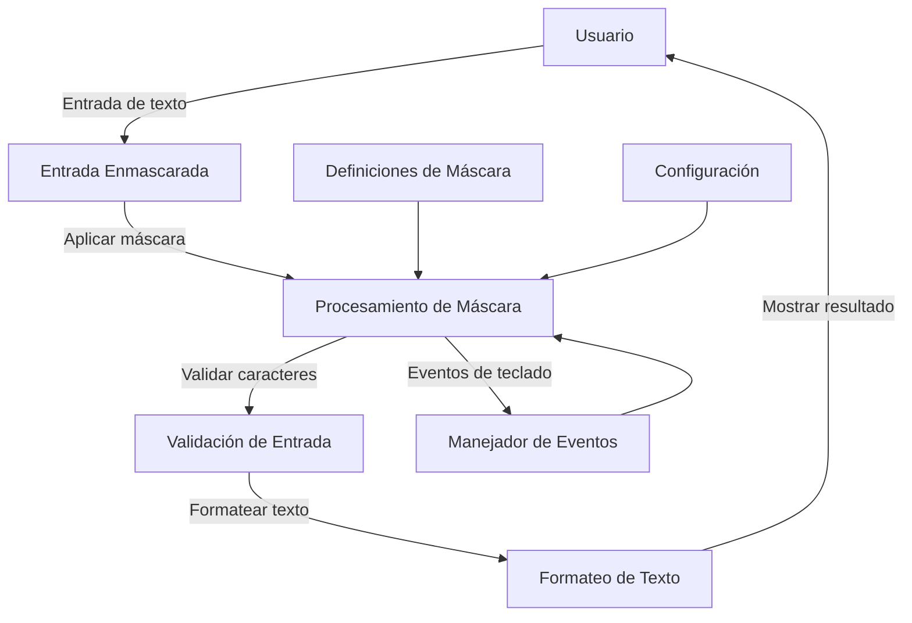

## Module: jquery.maskedinput-1.2.2.js

# Análisis Integral del Módulo jQuery.maskedInput

## Nombre del Componente
**jquery.maskedinput-1.2.2.js** - Plugin de jQuery para entrada de datos con máscara

## Objetivos Primarios
Este módulo es un plugin de jQuery diseñado para implementar máscaras de entrada en campos de formulario. Su propósito principal es controlar y formatear la entrada de datos del usuario según patrones predefinidos, facilitando la captura de información estructurada como números telefónicos, fechas, códigos postales, etc.

## Funciones y Métodos Críticos
- **$.mask**: Objeto que contiene definiciones de caracteres predefinidos.
- **$.fn.caret()**: Función auxiliar para posicionar y obtener la posición del cursor en campos de texto.
- **$.fn.unmask()**: Método para eliminar la máscara de un campo.
- **$.fn.mask()**: Método principal que aplica una máscara a un campo de entrada.
- **Funciones internas clave**:
  - `seekNext()`: Busca la siguiente posición disponible para entrada.
  - `shiftL()`: Desplaza caracteres hacia la izquierda.
  - `shiftR()`: Desplaza caracteres hacia la derecha.
  - `keydownEvent()`: Maneja eventos de teclado.
  - `keypressEvent()`: Procesa la entrada de caracteres.
  - `clearBuffer()`: Limpia el buffer de entrada.
  - `writeBuffer()`: Escribe el buffer en el campo de entrada.
  - `checkVal()`: Valida y ajusta el valor del campo.

## Variables y Elementos Clave
- **pasteEventName**: Determina el evento de pegado según el navegador.
- **iPhone**: Detecta si se está ejecutando en un dispositivo iPhone.
- **definitions**: Objeto con patrones predefinidos ('9' para dígitos, 'a' para letras, '*' para alfanuméricos).
- **tests**: Array de expresiones regulares para validar cada posición de la máscara.
- **buffer**: Array que almacena los caracteres de la máscara y los valores ingresados.
- **firstNonMaskPos**: Primera posición que no es parte de la máscara estática.
- **partialPosition**: Posición que marca el final de la parte obligatoria de la máscara.

## Interdependencias y Relaciones
- Depende de jQuery (referencia a jquery-1.2.6.js).
- Se integra con el sistema de eventos de jQuery.
- Interactúa con el DOM para manipular campos de entrada.
- Compatible con diferentes navegadores, con manejo especial para IE y dispositivos iPhone.

## Operaciones Core vs. Auxiliares
**Operaciones Core**:
- Aplicación de la máscara mediante `$.fn.mask()`.
- Procesamiento de entrada de teclado en `keypressEvent()`.
- Validación de caracteres contra la máscara.

**Operaciones Auxiliares**:
- Manejo de la posición del cursor con `caret()`.
- Detección de navegadores y dispositivos.
- Limpieza y formateo del buffer.
- Manejo de eventos especiales (pegado, borrado, escape).

## Secuencia Operacional
1. Se inicializa el plugin con una máscara específica.
2. Se preparan los arrays de pruebas y buffer basados en la máscara.
3. Se vinculan los manejadores de eventos (focus, blur, keydown, keypress, paste).
4. Al recibir entrada del usuario:
   - Se valida contra la máscara.
   - Se actualiza el buffer.
   - Se reposiciona el cursor.
   - Se actualiza el valor visible del campo.
5. Se manejan casos especiales como borrado, selección y pegado.

## Aspectos de Rendimiento y Optimización
- Uso de caché para los datos del buffer y pruebas mediante `data()`.
- Optimización para diferentes navegadores (especialmente IE).
- Manejo eficiente de eventos de teclado.
- Posibles mejoras: reducir la frecuencia de manipulación del DOM y optimizar las expresiones regulares.

## Reusabilidad y Adaptabilidad
- Alta reusabilidad gracias a la parametrización de la máscara.
- Personalizable mediante opciones como placeholder y callback de completado.
- Fácil integración en cualquier proyecto que use jQuery.
- Adaptable a diferentes tipos de entrada mediante definiciones personalizadas.

## Uso y Contexto
- Se utiliza en formularios web para guiar al usuario en la entrada de datos estructurados.
- Aplicaciones típicas: números telefónicos, fechas, códigos postales, números de tarjetas de crédito.
- Ejemplo de uso: `$("#telefono").mask("(999) 999-9999")`.
- Se integra en el flujo de trabajo de validación de formularios.

## Suposiciones y Limitaciones
- Supone que jQuery está disponible en el entorno.
- Compatible con jQuery 1.2.6 o superior.
- Limitaciones en dispositivos móviles, con manejo especial para iPhone.
- No maneja máscaras dinámicas que cambien según la entrada.
- La versión 1.2.2 puede tener problemas de compatibilidad con navegadores modernos.
- Asume que el usuario interactúa principalmente mediante teclado, con manejo limitado para eventos táctiles.
## Flow Diagram [via mermaid]

