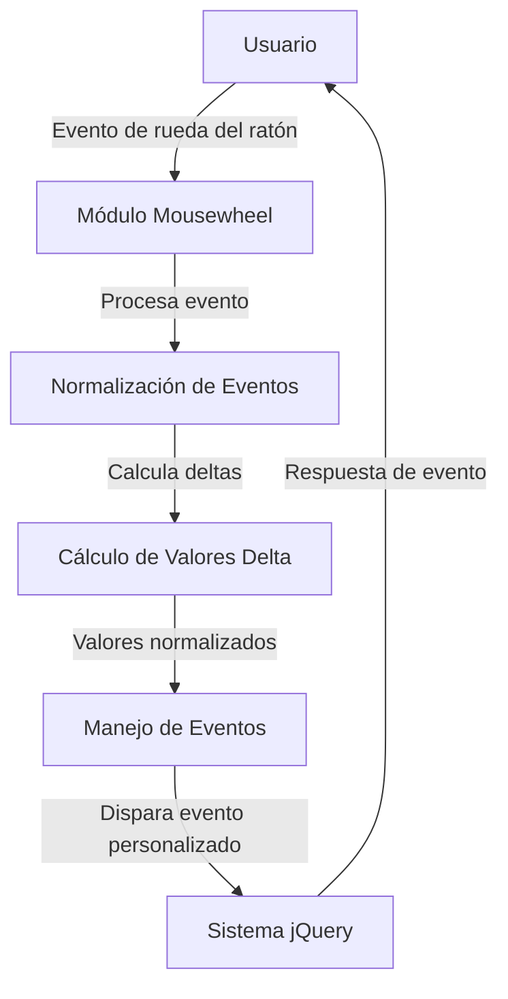

## Module: jquery.mousewheel.min.js

# Análisis Completo del Módulo jQuery.mousewheel.min.js

## Módulo/Componente SQL
**Nombre del Módulo**: jquery.mousewheel.min.js (versión 3.0.4)

## Objetivos Primarios
Este módulo es un plugin de jQuery diseñado para normalizar los eventos de la rueda del ratón (mousewheel) entre diferentes navegadores. Su propósito principal es proporcionar una interfaz consistente para detectar y responder a los eventos de desplazamiento del ratón, independientemente del navegador utilizado.

## Funciones, Métodos y Consultas Críticas
- **b()**: Función principal que maneja los eventos de la rueda del ratón y normaliza sus valores.
- **mousewheel()**: Método de jQuery para vincular controladores de eventos a eventos de rueda del ratón.
- **unmousewheel()**: Método para desvincular controladores de eventos de rueda del ratón.
- **event.special.mousewheel**: Objeto especial de jQuery que define cómo configurar y desmontar los controladores de eventos de rueda del ratón.

## Variables y Elementos Clave
- **a**: Array que contiene los nombres de eventos nativos ("DOMMouseScroll", "mousewheel") que se utilizan en diferentes navegadores.
- **j**: Variable que almacena el valor normalizado del desplazamiento vertical.
- **e**: Variable que almacena el valor normalizado del desplazamiento horizontal.
- **d**: Variable que almacena el valor del desplazamiento vertical (posiblemente redundante con j en algunos casos).

## Interdependencias y Relaciones
- Depende de jQuery (requiere versión 1.2.2 o superior).
- Se integra con el sistema de eventos de jQuery, extendiendo sus capacidades para manejar eventos de rueda del ratón.
- No tiene dependencias externas más allá de jQuery.

## Operaciones Principales vs. Auxiliares
**Operaciones Principales**:
- Normalización de eventos de rueda del ratón entre navegadores.
- Cálculo de valores delta para desplazamientos horizontales y verticales.

**Operaciones Auxiliares**:
- Configuración y desmontaje de controladores de eventos.
- Extensión de la API de jQuery con métodos mousewheel() y unmousewheel().

## Secuencia Operacional/Flujo de Ejecución
1. El plugin se inicializa cuando se carga, extendiendo jQuery con nuevos métodos.
2. Cuando se invoca mousewheel() en un elemento jQuery, se registra un controlador de eventos.
3. Cuando ocurre un evento de rueda del ratón, la función b() intercepta el evento.
4. La función b() normaliza los valores del evento según el navegador.
5. Se calculan los valores delta para desplazamientos horizontales y verticales.
6. Se llama al controlador de eventos registrado con los valores normalizados.

## Aspectos de Rendimiento y Optimización
- El código está minificado para reducir el tamaño y mejorar el tiempo de carga.
- Utiliza detección de características para manejar diferentes implementaciones de navegadores.
- Evita cálculos redundantes al procesar eventos de rueda del ratón.

## Reusabilidad y Adaptabilidad
- Alta reusabilidad como plugin de jQuery que puede incorporarse en cualquier proyecto web.
- Adaptable a diferentes navegadores gracias a su enfoque de normalización.
- Puede utilizarse con cualquier elemento DOM que necesite responder a eventos de rueda del ratón.

## Uso y Contexto
- Se utiliza en interfaces web que requieren interacción avanzada con la rueda del ratón.
- Común en aplicaciones como zoom, desplazamiento personalizado, navegación horizontal, o interfaces de tipo carrusel.
- Ejemplo de uso: `$('#elemento').mousewheel(function(event, delta, deltaX, deltaY) { /* código */ });`

## Suposiciones y Limitaciones
- Supone que jQuery está cargado en la página.
- Puede tener comportamientos diferentes en dispositivos táctiles o en navegadores muy antiguos.
- No maneja eventos de desplazamiento suave (smooth scrolling) nativos de algunos navegadores modernos.
- Está diseñado principalmente para eventos de ratón físico, no necesariamente para trackpads o dispositivos táctiles.
## Flow Diagram [via mermaid]

