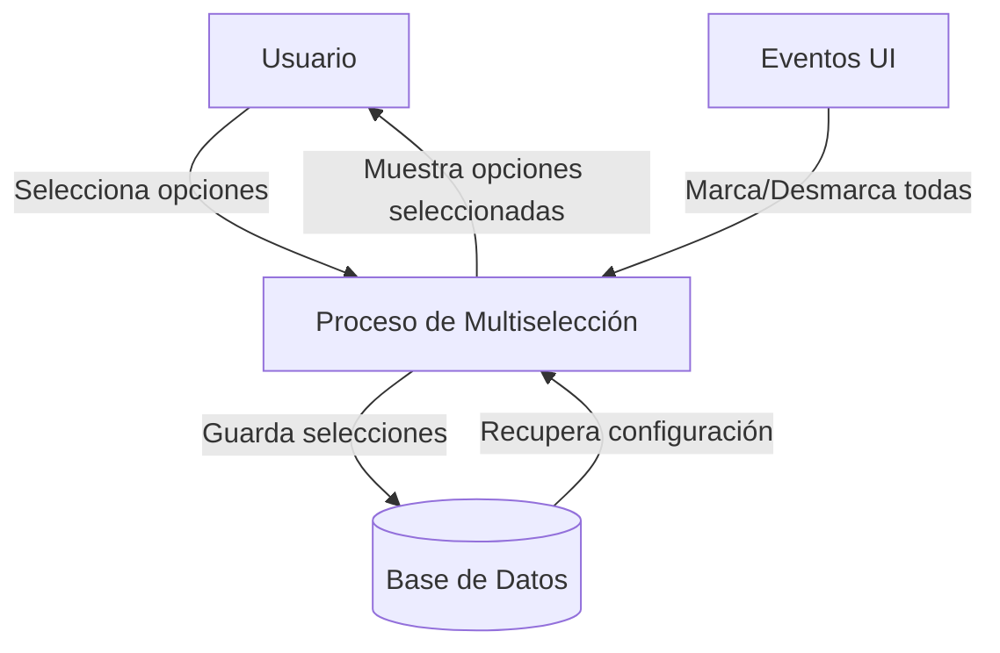
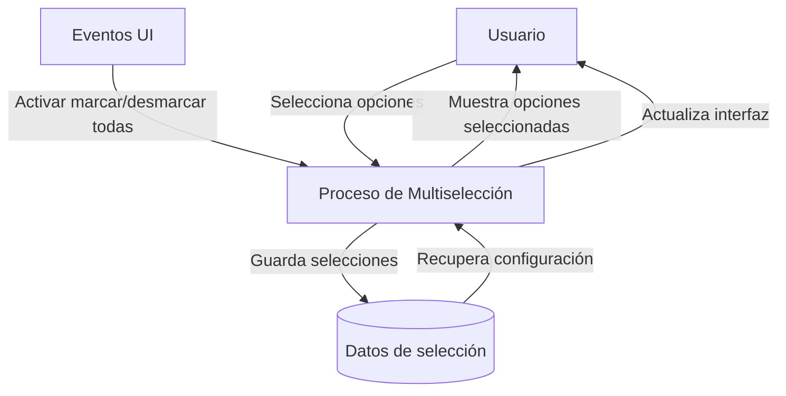

## Module: jquery.multiselect.es.js

# Análisis Integral del Módulo jquery.multiselect.es.js

## Módulo/Componente SQL
**Nombre del Módulo**: jquery.multiselect.es.js

## Objetivos Primarios
Este módulo es una extensión de localización para el plugin jQuery UI multiselect. Su propósito principal es proporcionar traducciones al español para la interfaz de usuario del componente multiselect, permitiendo que las aplicaciones que utilizan este plugin muestren textos en español a los usuarios hispanohablantes.

## Funciones, Métodos y Consultas Críticas
- La función anónima principal `(function ( $ ) { ... })` que encapsula todo el código
- El método `$.extend()` que se utiliza para agregar o sobrescribir propiedades en el objeto de opciones del plugin multiselect

## Variables y Elementos Clave
- `checkAllText`: Texto para la opción de marcar todos los elementos
- `uncheckAllText`: Texto para la opción de desmarcar todos los elementos
- `noneSelectedText`: Texto que se muestra cuando no hay opciones seleccionadas
- `selectedText`: Plantilla de texto para mostrar cuántos elementos están seleccionados

## Interdependencias y Relaciones
- Depende de la biblioteca jQuery core
- Depende del plugin jQuery UI multiselect (`$.ech.multiselect`)
- Se integra con el objeto de opciones del plugin multiselect, extendiendo sus propiedades predeterminadas

## Operaciones Principales vs. Auxiliares
- **Operación principal**: Extensión del objeto de opciones del plugin multiselect con traducciones en español
- No contiene operaciones auxiliares significativas debido a su naturaleza simple y específica

## Secuencia Operacional/Flujo de Ejecución
1. Se define una función anónima que recibe jQuery como parámetro
2. Dentro de esta función, se extiende el objeto de opciones del plugin multiselect con las traducciones en español
3. La función se ejecuta inmediatamente (IIFE - Immediately Invoked Function Expression)

## Aspectos de Rendimiento y Optimización
- El código es muy ligero y no presenta problemas de rendimiento significativos
- La ejecución es inmediata y solo ocurre una vez durante la carga de la página

## Reusabilidad y Adaptabilidad
- El módulo está diseñado específicamente para la localización en español del plugin multiselect
- Podría servir como plantilla para crear localizaciones en otros idiomas
- La estructura es simple y fácil de adaptar para otros plugins que requieran localización

## Uso y Contexto
- Se utiliza en aplicaciones web que implementan el plugin jQuery UI multiselect y necesitan presentar la interfaz en español
- Debe incluirse después de cargar jQuery y el plugin multiselect, pero antes de inicializar los componentes multiselect en la página

## Suposiciones y Limitaciones
- Asume que jQuery y el plugin multiselect ya están cargados en la página
- Hay un posible error tipográfico: `$.ech.multiselect` debería ser `$.ui.multiselect` o similar, dependiendo de la implementación exacta del plugin
- Solo proporciona traducciones para un conjunto limitado de textos; cualquier texto adicional que el plugin pueda utilizar no estaría localizado
- No maneja variaciones regionales del español (por ejemplo, diferencias entre español de España y español de Latinoamérica)
## Flow Diagram [via mermaid]

## Module: jquery.multiselect.es.js

# Análisis Integral del Módulo jquery.multiselect.es.js

## Módulo/Componente SQL
**Nombre del Módulo**: jquery.multiselect.es.js

## Objetivos Primarios
Este módulo es una extensión de localización para el plugin jQuery UI multiselect. Su propósito principal es proporcionar traducciones al español para los textos de la interfaz de usuario del componente multiselect, permitiendo que la interfaz se presente correctamente en español para usuarios hispanohablantes.

## Funciones, Métodos y Consultas Críticas
- La función anónima principal que se ejecuta inmediatamente `(function ( $ ) { ... })( jQuery )` que encapsula la extensión de las opciones del plugin.
- `$.extend()`: Método de jQuery utilizado para extender el objeto de opciones del plugin multiselect con textos en español.

## Variables y Elementos Clave
- `checkAllText`: Texto para la opción de marcar todas las opciones.
- `uncheckAllText`: Texto para la opción de desmarcar todas las opciones.
- `noneSelectedText`: Texto que se muestra cuando no hay opciones seleccionadas.
- `selectedText`: Plantilla de texto que muestra el número de elementos seleccionados.

## Interdependencias y Relaciones
- Depende directamente del plugin jQuery UI multiselect (`$.ech.multiselect`).
- Requiere que jQuery esté cargado en la página antes de este script.
- Se integra con la estructura de opciones existente del plugin multiselect.

## Operaciones Principales vs. Auxiliares
- **Operación Principal**: Extensión del objeto de opciones del plugin con traducciones en español.
- **Operaciones Auxiliares**: No hay operaciones auxiliares significativas en este módulo, ya que su único propósito es proporcionar traducciones.

## Secuencia Operacional/Flujo de Ejecución
1. El script se carga en el contexto de la página web.
2. La función anónima se ejecuta inmediatamente, recibiendo jQuery como parámetro.
3. Se extiende el objeto de opciones del plugin multiselect con las traducciones en español.
4. Las traducciones quedan disponibles para ser utilizadas por el plugin cuando se inicializa con configuración en español.

## Aspectos de Rendimiento y Optimización
- El código es muy ligero y eficiente, consistiendo solo en una extensión de objeto.
- No presenta problemas de rendimiento ya que se ejecuta una sola vez durante la carga.
- La estructura de función autoejecutable evita la contaminación del espacio global de nombres.

## Reusabilidad y Adaptabilidad
- Alta reusabilidad en cualquier proyecto que utilice el plugin jQuery UI multiselect y requiera interfaz en español.
- Fácilmente adaptable para otros idiomas siguiendo el mismo patrón.
- Podría extenderse para incluir más textos si el plugin base añade nuevas opciones de texto.

## Uso y Contexto
- Se utiliza incluyéndolo después de cargar jQuery y el plugin multiselect en páginas web que requieren interfaz en español.
- Típicamente se incluiría en proyectos web internacionales o específicamente dirigidos a audiencias hispanohablantes.
- Debe cargarse antes de inicializar cualquier instancia del plugin multiselect.

## Suposiciones y Limitaciones
- **Suposiciones**:
  - Asume que existe un objeto `$.ech.multiselect.prototype.options` (hay un posible error tipográfico, debería ser `$.ui.multiselect`).
  - Asume que jQuery está disponible globalmente.
  
- **Limitaciones**:
  - Solo proporciona traducciones para un conjunto limitado de textos del plugin.
  - Hay un posible error tipográfico en `$.ech.multiselect` que podría causar que el script no funcione correctamente (debería ser `$.ui.multiselect`).
  - No maneja variaciones regionales del español (es posible que algunos términos varíen según el país).
## Flow Diagram [via mermaid]

