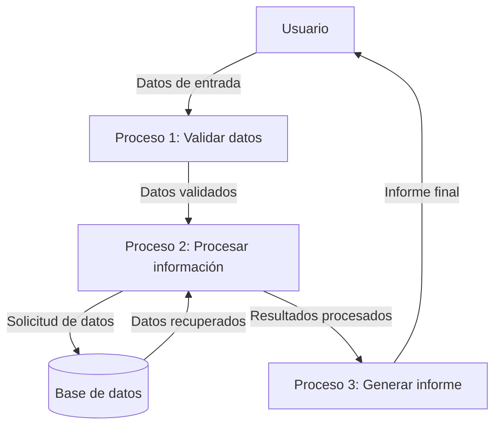

## Module: jquery.multiselect.filter.es.js

# Análisis del Módulo jquery.multiselect.filter.es.js

## Nombre del Módulo/Componente SQL
jquery.multiselect.filter.es.js - Módulo de localización en español para el plugin jQuery UI multiselect filter.

## Objetivos Primarios
El objetivo principal de este código es proporcionar la traducción al español de los textos utilizados en el plugin jQuery UI multiselect filter, permitiendo que la interfaz de usuario se muestre en español para los usuarios hispanohablantes.

## Funciones, Métodos y Consultas Críticas
- `$.extend()`: Método principal utilizado para extender el objeto de opciones del prototipo del plugin con las traducciones en español.

## Variables y Elementos Clave
- `$.ech.multiselectfilter.prototype.options`: Objeto que contiene las opciones predeterminadas del plugin.
- `label`: Texto traducido para la etiqueta del filtro ("Filtro:").
- `placeholder`: Texto traducido para el placeholder del campo de entrada ("Introduzca una palabra").

## Interdependencias y Relaciones
- Depende del plugin jQuery UI multiselect filter (`$.ech.multiselectfilter`).
- Requiere que jQuery esté cargado previamente en la página.
- Se integra con el sistema de internacionalización del plugin multiselect filter.

## Operaciones Principales vs. Auxiliares
- **Operación principal**: Extensión del objeto de opciones con textos en español.
- No contiene operaciones auxiliares significativas.

## Secuencia Operacional/Flujo de Ejecución
1. El código se ejecuta dentro de una función anónima autoinvocada que recibe jQuery como parámetro.
2. Extiende el objeto de opciones del prototipo del plugin con las traducciones en español.
3. Cuando el plugin se inicializa, utilizará estos textos traducidos si este archivo está incluido.

## Aspectos de Rendimiento y Optimización
- El código es muy ligero y no presenta problemas de rendimiento.
- La función anónima autoinvocada evita la contaminación del ámbito global.

## Reusabilidad y Adaptabilidad
- El código sigue un patrón estándar para la internacionalización de plugins jQuery.
- Puede servir como plantilla para crear traducciones a otros idiomas cambiando simplemente los valores de texto.

## Uso y Contexto
- Este archivo debe incluirse después de cargar jQuery y el plugin multiselect filter.
- Se utiliza en aplicaciones web que requieren una interfaz de usuario en español para el componente de selección múltiple con filtro.
- Típicamente se incluiría condicionalmente basado en la preferencia de idioma del usuario.

## Suposiciones y Limitaciones
- Asume que el plugin jQuery UI multiselect filter está correctamente cargado y disponible a través de `$.ech.multiselectfilter`.
- Hay un posible error tipográfico: `$.ech` podría ser un error y debería ser `$.ui` si se trata del plugin oficial de jQuery UI.
- Solo traduce dos cadenas de texto específicas, por lo que cualquier otro texto en el plugin quedaría en el idioma predeterminado.
- No maneja variaciones regionales del español (por ejemplo, diferencias entre español de España y Latinoamérica).
## Flow Diagram [via mermaid]

