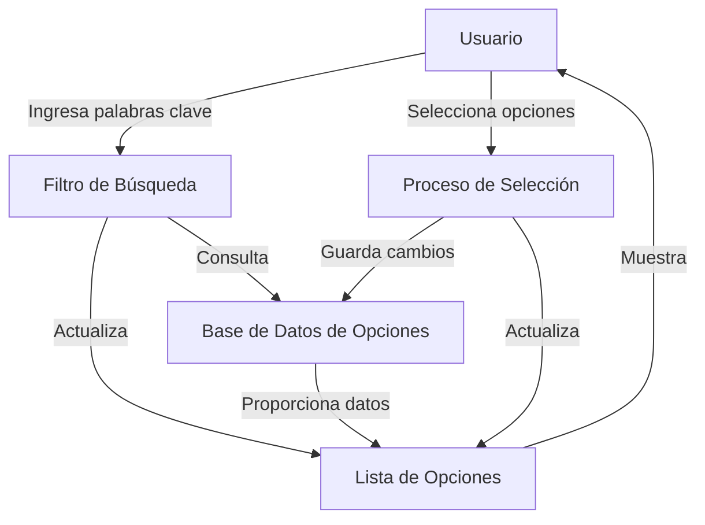
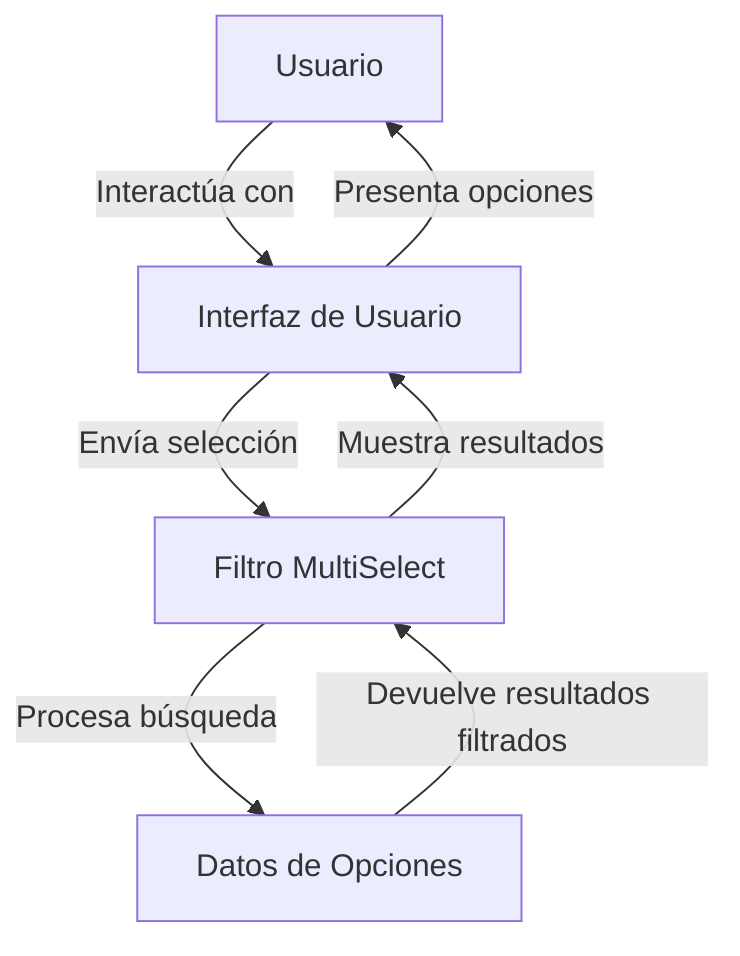

## Module: jquery.multiselect.filter.js

# Análisis Integral del Módulo jQuery MultiSelect Filter

## Módulo/Componente SQL
**Nombre del Módulo**: jquery.multiselect.filter.js

## Objetivos Primarios
Este módulo es un plugin de jQuery UI que extiende el widget MultiSelect, proporcionando funcionalidad de filtrado para listas de selección múltiple. Su propósito principal es permitir a los usuarios filtrar dinámicamente las opciones disponibles en un control de selección múltiple mediante palabras clave, mejorando así la usabilidad en listas extensas.

## Funciones, Métodos y Consultas Críticas
- **_create()**: Método principal que inicializa el widget de filtrado.
- **_handler()**: Gestiona la lógica de filtrado cuando el usuario escribe en el campo de búsqueda.
- **_reset()**: Restablece el filtro a su estado inicial.
- **updateCache()**: Actualiza la caché interna de elementos para optimizar las búsquedas.
- **widget()**: Devuelve el elemento DOM del wrapper del filtro.
- **destroy()**: Limpia y elimina el widget de filtrado.

## Variables y Elementos Clave
- **this.instance**: Referencia a la instancia del widget MultiSelect base.
- **this.header**: Referencia al encabezado del menú MultiSelect.
- **this.wrapper**: Contenedor del campo de filtrado.
- **this.inputs**: Colección de inputs (checkboxes/radios) dentro del MultiSelect.
- **this.input**: El campo de texto para introducir términos de búsqueda.
- **this.rows**: Filas de elementos seleccionables.
- **this.cache**: Caché de contenido de texto para búsquedas rápidas.

## Interdependencias y Relaciones
- Depende directamente del widget jQuery UI MultiSelect.
- Interactúa con el DOM modificando la estructura del widget MultiSelect original.
- Se integra con eventos del documento para responder a actualizaciones del MultiSelect.

## Operaciones Core vs. Auxiliares
**Operaciones Core**:
- Filtrado de opciones basado en texto introducido por el usuario.
- Sobreescritura del método `_toggleChecked` para manejar correctamente los elementos filtrados.

**Operaciones Auxiliares**:
- Gestión de la caché para optimizar búsquedas.
- Manejo de grupos de opciones (optgroups) para mostrarlos/ocultarlos según corresponda.
- Reseteo automático del filtro al cerrar el menú.

## Secuencia Operacional/Flujo de Ejecución
1. Inicialización del widget mediante `_create()`.
2. Creación de la interfaz de filtrado y vinculación de eventos.
3. Cuando el usuario escribe en el campo de filtrado, se dispara `_handler()`.
4. El método `_handler()` compara el término de búsqueda con la caché.
5. Se muestran/ocultan las filas según coincidan con el término de búsqueda.
6. Se ajusta la visibilidad de los optgroups según la visibilidad de sus elementos hijos.

## Aspectos de Rendimiento y Optimización
- Utiliza una caché de contenido para evitar búsquedas repetitivas en el DOM.
- Implementa expresiones regulares para búsquedas eficientes.
- Minimiza las manipulaciones del DOM agrupando operaciones de mostrar/ocultar.
- Evita reconstruir la caché innecesariamente, actualizándola solo cuando cambia el MultiSelect.

## Reusabilidad y Adaptabilidad
- Altamente parametrizable a través de opciones como `label`, `width`, `placeholder` y `autoReset`.
- Se puede aplicar a cualquier instancia de MultiSelect existente.
- Diseñado como un widget independiente que se acopla al MultiSelect principal.

## Uso y Contexto
- Se utiliza en formularios web con listas de selección múltiple extensas.
- Mejora la experiencia de usuario permitiendo encontrar rápidamente opciones específicas.
- Típicamente implementado en interfaces administrativas, formularios de configuración o cualquier escenario donde se necesite seleccionar entre muchas opciones.

## Suposiciones y Limitaciones
- Asume que el widget MultiSelect ya está inicializado y disponible.
- Requiere jQuery y jQuery UI.
- El rendimiento puede degradarse con listas extremadamente grandes.
- La búsqueda es sensible a caracteres especiales (aunque implementa escape para expresiones regulares).
- No soporta búsquedas avanzadas como operadores booleanos o búsqueda por múltiples campos.
## Flow Diagram [via mermaid]

## Module: jquery.multiselect.filter.js

# Análisis Integral del Módulo jQuery MultiSelect Filter

## Módulo/Componente SQL
**Nombre del Módulo**: jquery.multiselect.filter.js

## Objetivos Primarios
Este módulo es un plugin de jQuery UI que extiende el widget MultiSelect, proporcionando funcionalidad de filtrado para listas de selección múltiple. Su propósito principal es permitir a los usuarios filtrar dinámicamente las opciones disponibles en un control de selección múltiple mediante una caja de búsqueda.

## Funciones, Métodos y Consultas Críticas
- **multiselectfilter**: Widget principal que implementa la funcionalidad de filtrado.
- **_create()**: Método de inicialización que configura el filtro y modifica el comportamiento del widget MultiSelect base.
- **_handler()**: Gestiona el filtrado de elementos basado en el texto de búsqueda.
- **updateCache()**: Actualiza la caché de elementos para optimizar las búsquedas.
- **_reset()**: Restablece el filtro a su estado inicial.
- **_toggleChecked()**: Sobrescribe la función interna del widget MultiSelect para manejar correctamente los elementos filtrados.

## Variables y Elementos Clave
- **options**: Configuración del widget (label, width, placeholder, autoReset).
- **instance**: Referencia a la instancia del widget MultiSelect base.
- **header**: Elemento del encabezado donde se coloca el filtro.
- **wrapper**: Contenedor del filtro.
- **inputs**: Referencias a los inputs (checkbox/radio) del MultiSelect.
- **input**: El campo de búsqueda.
- **rows**: Filas de elementos seleccionables.
- **cache**: Caché de texto de los elementos para optimizar la búsqueda.

## Interdependencias y Relaciones
- Depende directamente del widget jQuery UI MultiSelect.
- Se integra modificando el comportamiento interno del widget base, específicamente la función _toggleChecked.
- Se conecta a eventos del documento como "multiselectrefresh" y "multiselectclose".

## Operaciones Core vs. Auxiliares
**Operaciones Core**:
- Filtrado de elementos basado en texto de búsqueda.
- Modificación del comportamiento de selección/deselección para trabajar con elementos filtrados.

**Operaciones Auxiliares**:
- Gestión de caché para optimizar búsquedas.
- Manejo de grupos de opciones (optgroups).
- Restablecimiento automático del filtro.

## Secuencia Operacional/Flujo de Ejecución
1. Inicialización del widget mediante _create().
2. Configuración de la interfaz de usuario del filtro.
3. Sobrescritura de la función _toggleChecked del widget base.
4. Cuando el usuario escribe en el campo de búsqueda:
   - Se captura el evento keyup/click.
   - Se ejecuta _handler() para filtrar elementos.
   - Se muestran/ocultan elementos según coincidan con el término de búsqueda.
   - Se actualizan los optgroups para mostrar/ocultar según corresponda.
5. Al cerrar el widget, se puede restablecer automáticamente el filtro si autoReset está habilitado.

## Aspectos de Rendimiento y Optimización
- Utiliza una caché de texto para evitar búsquedas repetitivas en el DOM.
- Implementa expresiones regulares para búsquedas eficientes.
- Optimiza la visibilidad de optgroups basándose en sus elementos hijos visibles.
- Evita reconstruir toda la lista en cada búsqueda, solo modifica la visibilidad.

## Reusabilidad y Adaptabilidad
- Altamente configurable mediante opciones (etiqueta, ancho, placeholder).
- Se puede aplicar a cualquier instancia del widget MultiSelect.
- Permite personalización mediante eventos y opciones.
- Sigue el patrón de diseño de widgets de jQuery UI, facilitando su integración.

## Uso y Contexto
- Se utiliza para mejorar la usabilidad de controles de selección múltiple con muchas opciones.
- Ideal para formularios con listas extensas donde la búsqueda facilita la selección.
- Se aplica directamente a elementos select que ya han sido convertidos en widgets MultiSelect.
- Ejemplo de uso: `$("#miselect").multiselect().multiselectfilter();`

## Suposiciones y Limitaciones
- Asume que el widget MultiSelect ya está inicializado en el elemento.
- Requiere jQuery y jQuery UI.
- El rendimiento puede degradarse con listas extremadamente grandes.
- La búsqueda es sensible a caracteres especiales (aunque implementa escape para expresiones regulares).
- No soporta búsquedas complejas o con operadores lógicos.
- Está diseñado para trabajar con el DOM y podría tener problemas de rendimiento en aplicaciones con muchos elementos.
## Flow Diagram [via mermaid]

