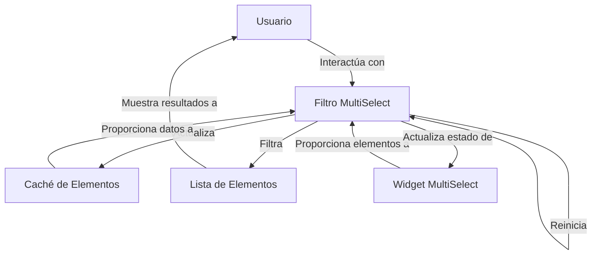

## Module: jquery.multiselect.filter.min.js

# Análisis Integral del Módulo jquery.multiselect.filter.min.js

## Módulo/Componente SQL
**Nombre del Módulo**: jquery.multiselect.filter.min.js

## Objetivos Primarios
Este módulo es un plugin de jQuery UI que extiende el widget MultiSelect, proporcionando funcionalidad de filtrado para listas de selección múltiple. Su propósito principal es permitir a los usuarios filtrar opciones en un menú desplegable de selección múltiple mediante palabras clave, mejorando así la usabilidad en listas extensas.

## Funciones, Métodos y Consultas Críticas
- **multiselectfilter**: Widget principal que implementa la funcionalidad de filtrado.
- **_create()**: Método de inicialización que configura el filtro y sus eventos.
- **_handler()**: Función central que maneja el filtrado basado en la entrada del usuario.
- **_reset()**: Restablece el campo de filtro.
- **updateCache()**: Actualiza la caché de elementos para optimizar el rendimiento del filtrado.
- **widget()**: Devuelve el elemento wrapper del filtro.
- **destroy()**: Limpia y elimina el widget.

## Variables y Elementos Clave
- **this.instance**: Referencia a la instancia del widget MultiSelect.
- **this.header**: El encabezado del menú MultiSelect donde se inserta el filtro.
- **this.wrapper**: El contenedor del filtro.
- **this.inputs**: Todos los inputs (checkbox/radio) dentro del menú.
- **this.input**: El campo de entrada para el filtrado.
- **this.rows**: Las filas de elementos seleccionables.
- **this.cache**: Caché de contenido de elementos para optimizar la búsqueda.

## Interdependencias y Relaciones
- Depende del widget jQuery UI MultiSelect.
- Interactúa con la estructura DOM creada por el widget MultiSelect.
- Modifica el comportamiento del método _toggleChecked del widget MultiSelect.
- Se integra con eventos del documento como 'multiselectrefresh' y 'multiselectclose'.

## Operaciones Principales vs. Auxiliares
**Operaciones Principales**:
- Filtrado de opciones basado en texto ingresado por el usuario.
- Actualización visual de elementos mostrados/ocultos según criterios de filtrado.

**Operaciones Auxiliares**:
- Gestión de caché para optimizar el rendimiento.
- Manejo de grupos de opciones (optgroups).
- Restablecimiento automático del filtro.
- Limpieza de recursos al destruir el widget.

## Secuencia Operacional/Flujo de Ejecución
1. Inicialización del widget mediante _create().
2. Configuración de eventos para el campo de entrada.
3. Creación de caché inicial con updateCache().
4. Al ingresar texto en el filtro, se activa _handler() que:
   - Obtiene el texto de búsqueda.
   - Oculta todas las filas.
   - Muestra solo las que coinciden con el criterio de búsqueda.
   - Actualiza la visibilidad de los grupos de opciones.
5. Al cerrar el menú, se puede restablecer automáticamente el filtro si autoReset está habilitado.

## Aspectos de Rendimiento y Optimización
- Utiliza caché de elementos para evitar búsquedas repetitivas en el DOM.
- Implementa expresiones regulares para búsquedas eficientes.
- Minimiza las operaciones DOM agrupando las actualizaciones visuales.
- El código está minificado para reducir el tamaño de descarga.

## Reusabilidad y Adaptabilidad
- Altamente parametrizable a través de opciones como label, width, placeholder y autoReset.
- Se puede aplicar a cualquier instancia del widget MultiSelect.
- Diseño modular que sigue las convenciones de widgets de jQuery UI.
- Licencia dual (MIT y GPL) que permite su uso en diversos contextos.

## Uso y Contexto
- Se utiliza en formularios web con listas desplegables extensas donde la búsqueda mejora la experiencia del usuario.
- Típicamente implementado en paneles de administración, formularios de configuración o cualquier interfaz que requiera selección de múltiples elementos de una lista grande.
- Se integra con jQuery UI, por lo que es compatible con su ecosistema de temas y widgets.

## Suposiciones y Limitaciones
- Asume la existencia previa de una instancia del widget MultiSelect.
- Requiere jQuery y jQuery UI.
- El rendimiento puede degradarse en listas extremadamente grandes.
- El filtrado es sensible a la estructura HTML generada por el widget MultiSelect; cambios en dicha estructura podrían romper la funcionalidad.
- Al ser código minificado, la depuración puede ser más compleja.
- No implementa filtrado del lado del servidor, por lo que todas las opciones deben estar cargadas en el cliente.
## Flow Diagram [via mermaid]

