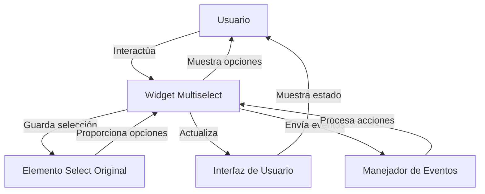

## Module: jquery.multiselect.js

# Análisis Integral del Módulo jquery.multiselect.js

## Nombre del Componente
**jquery.multiselect.js** - Widget de UI para jQuery que implementa un selector múltiple personalizado.

## Objetivos Primarios
Este módulo proporciona un widget de selección múltiple avanzado para jQuery UI, transformando los elementos `<select>` estándar de HTML en menús desplegables interactivos con capacidades de selección múltiple, casillas de verificación y una interfaz de usuario mejorada.

## Funciones, Métodos y Consultas Críticas
- **_create()**: Inicializa el widget, creando la estructura DOM necesaria.
- **refresh()**: Reconstruye los elementos del menú basándose en las opciones del elemento select.
- **update()**: Actualiza el texto del botón según las selecciones actuales.
- **open()**: Abre el menú desplegable.
- **close()**: Cierra el menú desplegable.
- **checkAll()**: Selecciona todas las opciones disponibles.
- **uncheckAll()**: Deselecciona todas las opciones.
- **_toggleChecked()**: Función interna para alternar el estado de selección.
- **_bindEvents()**: Configura todos los manejadores de eventos necesarios.

## Variables y Elementos Clave
- **button**: El botón que reemplaza al elemento select original.
- **menu**: El contenedor del menú desplegable.
- **inputs**: Las casillas de verificación o botones de radio dentro del menú.
- **labels**: Las etiquetas asociadas con cada opción.
- **options**: Objeto de configuración con múltiples parámetros como:
  - **header**: Controla la visualización del encabezado.
  - **height**: Altura del menú desplegable.
  - **multiple**: Determina si se permiten selecciones múltiples.
  - **selectedText**: Formato del texto para opciones seleccionadas.

## Interdependencias y Relaciones
- Depende de **jQuery 1.4.2+** y **jQuery UI 1.8 widget factory**.
- Opcionalmente utiliza los efectos de jQuery UI y la utilidad de posicionamiento.
- Interactúa con el elemento `<select>` original, manteniendo su estado sincronizado.
- Se integra con el sistema de eventos de jQuery para notificar cambios.

## Operaciones Core vs. Auxiliares
**Operaciones Core:**
- Transformación del elemento select en un widget personalizado.
- Manejo de selecciones múltiples y estados de casillas de verificación.
- Sincronización entre la interfaz visual y el elemento select subyacente.

**Operaciones Auxiliares:**
- Efectos visuales para mostrar/ocultar el menú.
- Navegación por teclado dentro del menú.
- Manejo de grupos de opciones (optgroups).
- Actualización del texto del botón según las selecciones.

## Secuencia Operacional/Flujo de Ejecución
1. Inicialización del widget mediante `_create()`.
2. Configuración inicial con `_init()`.
3. Construcción del menú con `refresh()`.
4. Cuando el usuario interactúa:
   - Al hacer clic en el botón, se alterna entre abrir/cerrar el menú.
   - Al seleccionar opciones, se actualizan los estados internos y el elemento select original.
   - Al cerrar el menú, se actualiza el texto del botón para reflejar las selecciones.

## Aspectos de Rendimiento y Optimización
- Utiliza `setTimeout` para manejar problemas específicos con eventos de cambio (issues #14 y #47).
- Implementa caché de elementos DOM para mejorar el rendimiento.
- Podría optimizarse la reconstrucción frecuente del menú en `refresh()` para grandes conjuntos de datos.
- El manejo de eventos podría beneficiarse de delegación para reducir la sobrecarga de memoria.

## Reusabilidad y Adaptabilidad
- Altamente configurable a través de múltiples opciones.
- Permite personalización visual mediante clases CSS.
- Soporta tanto selección única como múltiple.
- Implementa el patrón de widget de jQuery UI, facilitando su integración en proyectos existentes.
- Proporciona métodos públicos para control programático.

## Uso y Contexto
- Se utiliza para mejorar la experiencia de usuario en formularios con selecciones múltiples.
- Ideal para situaciones donde el select estándar de HTML es insuficiente.
- Se aplica típicamente en interfaces administrativas, filtros avanzados o formularios complejos.
- Ejemplo de uso básico:
  ```javascript
  $('select').multiselect({
    header: true,
    height: 200,
    selectedList: 4
  });
  ```

## Suposiciones y Limitaciones
- Asume que jQuery y jQuery UI están correctamente cargados.
- Requiere que el elemento original sea un `<select>`.
- El rendimiento puede degradarse con grandes cantidades de opciones.
- La personalización visual depende de los estilos de jQuery UI.
- No está optimizado para dispositivos móviles o pantallas táctiles.
- Podría tener problemas de accesibilidad en ciertos contextos si no se configura adecuadamente.
## Flow Diagram [via mermaid]

