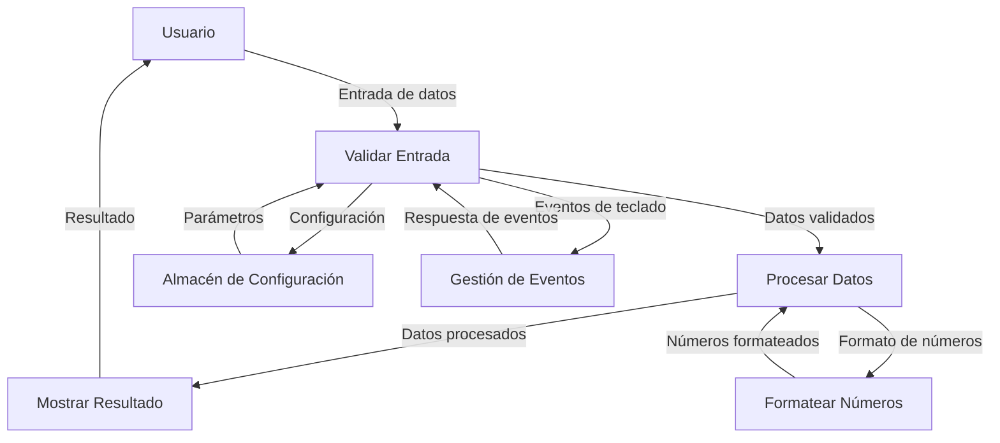

## Module: jquery.numeric.js

# Análisis Integral del Módulo jquery.numeric.js

## Módulo/Componente SQL
**Nombre del Módulo**: jquery.numeric.js

## Objetivos Primarios
Este módulo es un plugin de jQuery diseñado para restringir la entrada de datos en campos de formulario, permitiendo únicamente caracteres numéricos. Su propósito principal es validar y formatear entradas numéricas en tiempo real, asegurando que solo se ingresen valores numéricos válidos, con opciones para configurar separadores decimales y permitir o no valores negativos.

## Funciones, Métodos y Consultas Críticas
- **$.fn.numeric**: Función principal que inicializa el plugin en elementos seleccionados.
- **$.fn.numeric.keypress**: Controla eventos de pulsación de teclas para validar caracteres.
- **$.fn.numeric.keyup**: Procesa y formatea el valor después de cada pulsación.
- **$.fn.numeric.blur**: Valida el formato completo cuando el campo pierde el foco.
- **$.fn.removeNumeric**: Elimina la funcionalidad del plugin de los elementos.
- **$.fn.getSelectionStart**: Obtiene la posición del cursor en el campo.
- **$.fn.setSelection**: Establece la posición del cursor en el campo.

## Variables y Elementos Clave
- **config**: Objeto de configuración que acepta parámetros como:
  - **decimal**: Define el carácter separador decimal (por defecto ".").
  - **negative**: Determina si se permiten valores negativos (por defecto true).
- **callback**: Función que se ejecuta cuando el valor no es válido.
- **key**: Código de la tecla presionada durante la validación.
- **val**: Valor actual del campo que está siendo procesado.
- **carat**: Posición del cursor en el campo.

## Interdependencias y Relaciones
- Depende de la biblioteca jQuery (se implementa como un plugin).
- Se integra con el sistema de eventos del DOM, específicamente keypress, keyup y blur.
- No tiene dependencias directas con otros componentes del sistema más allá de jQuery.

## Operaciones Principales vs. Auxiliares
**Operaciones Principales**:
- Validación de caracteres numéricos durante la entrada de datos.
- Formateo de valores numéricos (añadir ceros iniciales, manejar decimales).
- Control de valores negativos según configuración.

**Operaciones Auxiliares**:
- Manejo de teclas especiales (Ctrl+A, Ctrl+V, etc.).
- Gestión de la posición del cursor.
- Validación final al perder el foco.

## Secuencia Operativa/Flujo de Ejecución
1. Inicialización del plugin con configuración personalizada.
2. Durante la entrada de datos:
   - Validación de cada tecla presionada (keypress).
   - Procesamiento y formateo del valor después de cada cambio (keyup).
   - Manejo especial para teclas de control y navegación.
3. Al perder el foco (blur), validación final del formato completo.
4. Ejecución del callback si el valor no es válido.

## Aspectos de Rendimiento y Optimización
- El código maneja eficientemente la validación en tiempo real sin recargar la página.
- Potencial cuello de botella en el procesamiento de cada pulsación de tecla en campos con muchos caracteres.
- La manipulación repetida del DOM para actualizar el valor y la posición del cursor podría optimizarse.
- No utiliza expresiones regulares durante la validación de teclas, lo que mejora el rendimiento.

## Reusabilidad y Adaptabilidad
- Alta reusabilidad gracias a su diseño como plugin de jQuery.
- Fácilmente adaptable mediante parámetros de configuración (decimal, negative).
- Permite personalización del comportamiento mediante callbacks.
- Puede aplicarse a cualquier elemento de entrada de texto.

## Uso y Contexto
- Se utiliza en formularios web donde se requiere entrada de datos numéricos precisos.
- Aplicable en contextos como calculadoras, formularios financieros, campos de cantidad, etc.
- Se implementa mediante selectores jQuery: `$(".numeric").numeric();`
- Admite configuración personalizada: `$(".numeric").numeric({ decimal: ",", negative: false });`

## Suposiciones y Limitaciones
- Supone que jQuery está disponible en el entorno.
- No funciona correctamente con pegado de texto mediante ratón (solo con Ctrl+V).
- Ctrl+A no funciona como se esperaría, aunque la selección con ratón sí funciona.
- Está diseñado para navegadores que existían entre 2006-2011, podría tener problemas de compatibilidad con navegadores modernos.
- No maneja formatos numéricos complejos como notación científica o separadores de miles.
- No valida el rango de valores, solo el formato.
## Flow Diagram [via mermaid]

